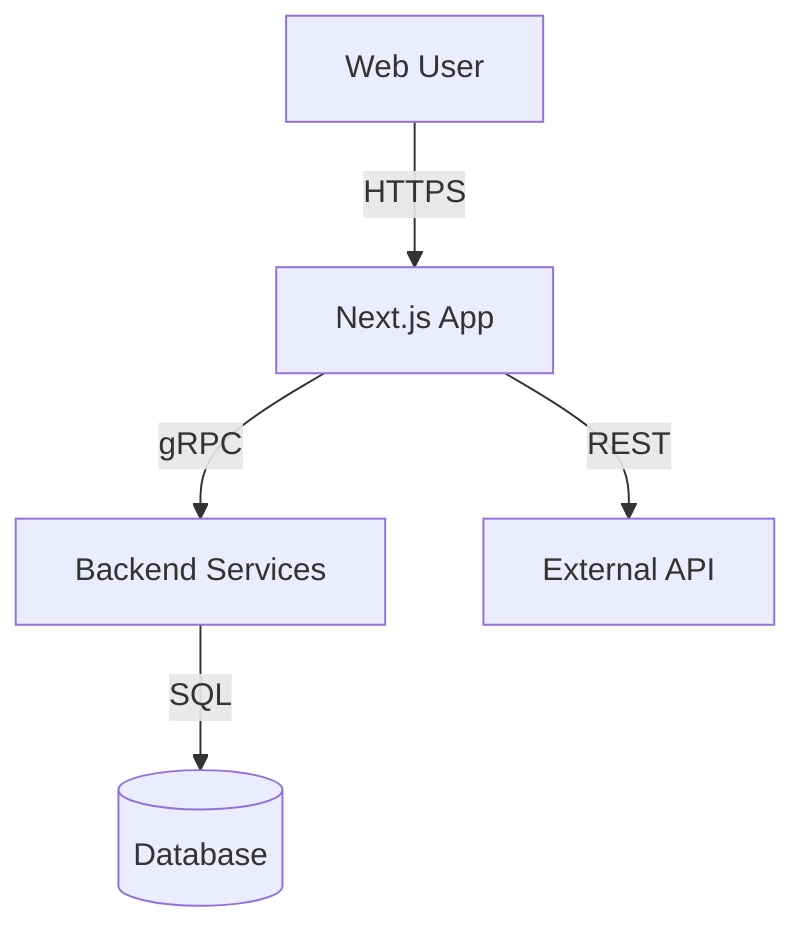
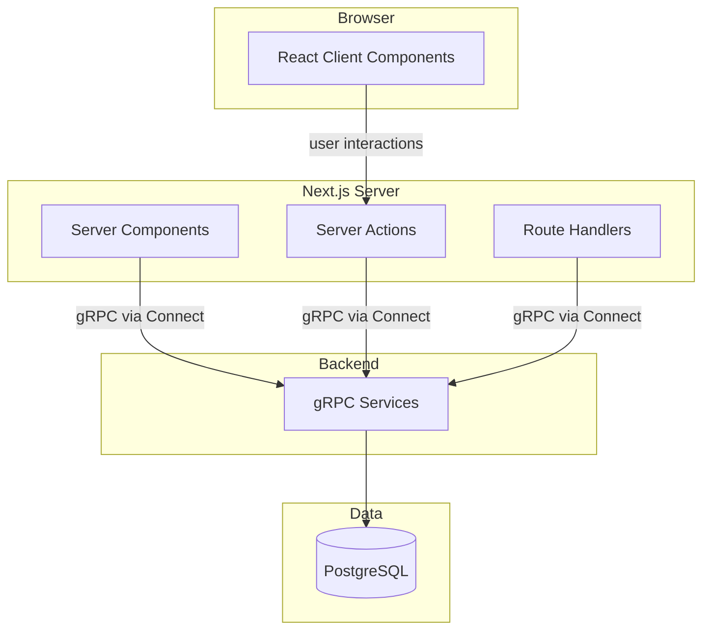
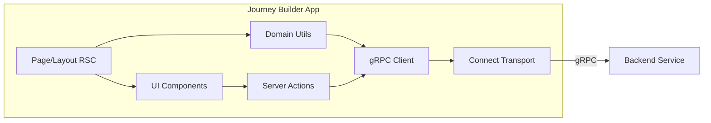
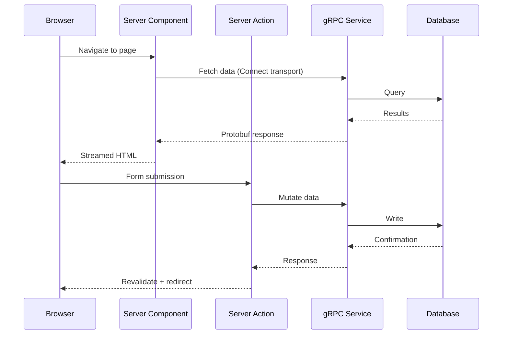
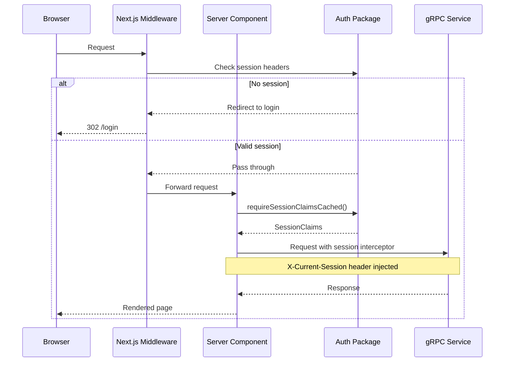
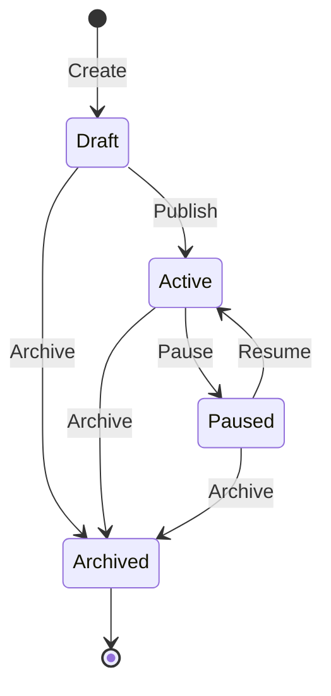
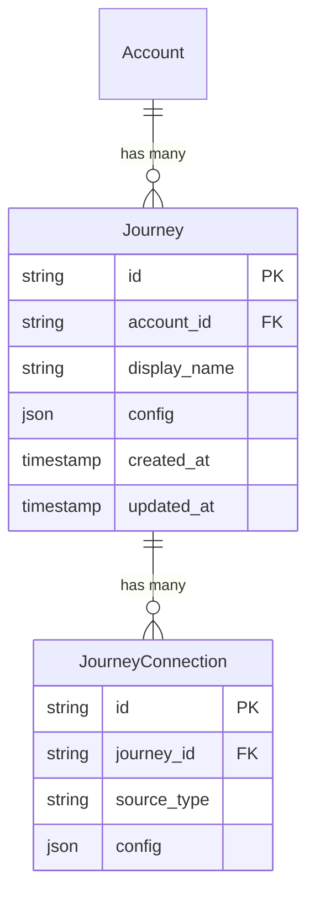

# Architecture Diagrams with Mermaid

Use Mermaid diagrams to communicate architecture decisions. Keep diagrams focused — one concept per diagram.

## C4 Model Levels

### Level 1: System Context — Who uses what

Use for: Initial architecture overview, stakeholder communication, onboarding.

### Level 2: Container — What runs where

Use for: Deployment planning, team boundaries, infrastructure decisions.

### Level 3: Component — What's inside a container

Use for: Feature planning, code organization, dependency analysis.

## Sequence Diagrams — How things flow

### Data Fetching Flow

### Authentication Flow

## State Diagrams — Lifecycle and transitions

Use for: Entity lifecycle, workflow states, feature flags.

## Entity Relationship Diagrams

Use for: Data modeling, schema design, migration planning.

## Guidelines

- One diagram per concept — don't cram everything into one
- Label edges with the protocol or action (gRPC, REST, "validates", "triggers")
- Use subgraphs to show deployment boundaries
- Keep sequence diagrams to the happy path first, then add error flows separately
- Use consistent naming: match component names to actual code (e.g., `gRPC Client` not `API Layer`)
- Include diagrams in design docs, not as standalone files
