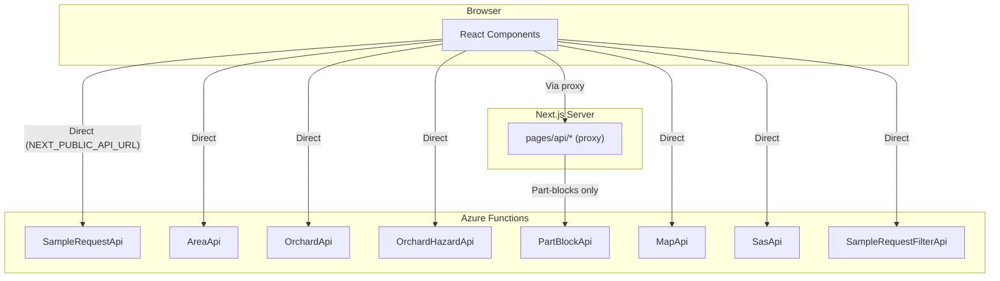

# Zespri MCS - C# Azure Functions API (Complete Reference)

> **Source:** Code-verified from `C:\Projects\Experimental\Z\API Source\Zespri.MCS.Orchard\Apis\`

## Summary

- **Total endpoints:** 31 (27 active, 4 deprecated)
- **Framework:** Azure Functions v4, .NET 6
- **Auth:** `[ZespriAuthorize]` attribute with feature/permission claims
- **ORM:** Entity Framework Core 6 (SQL Server)
- **Base URL:** `NEXT_PUBLIC_API_URL` (e.g. `https://api-dev.zespri.com/internal`)
- **Calling pattern:** UI calls directly via `NEXT_PUBLIC_API_URL` (not proxied through Next.js for most endpoints)

---

## SampleRequestApi.cs (133KB - THE BEAST)

**10 endpoints, 2,420 lines, needs splitting**

### CRUD Operations

| FunctionName | Method | Route | Auth | Description |
|---|---|---|---|---|
| `GetSampleRequests` | GET | `samplerequests/{sampleId}` | `samplerequest/read` | Get single SR with full includes (orchard, variety, area, blocks, allocations) |
| `CreateSampleRequest` | POST | `samplerequests` | `samplerequest/write` | Create one or many SRs. Validates dates, generates S/B numbers, runs post-creation SP |
| `UpdateSampleRequest` | PUT | `samplerequests/{sampleId}` | `samplerequest/write` | Update mutable fields on all SRs sharing sampleId |

### Search / Query

| FunctionName | Method | Route | Auth | Description |
|---|---|---|---|---|
| `SearchSampleRequestResults` | POST | `samplerequests/results` | `samplerequest/read` | Results tab - filtered search with test results (brix, DM, colour, pressure) |
| `SearchSampleRequestReleases` | POST | `samplerequests/releases` | `samplerequest/read` | Releases tab - compromised or Hold/ForRelease SRs |
| `SearchSampleRequestRecentSamples` | POST | `samplerequests/recentSamples` | `samplerequest/read` | Recently cleared/failed with active calc results |

### State Changes

| FunctionName | Method | Route | Auth | Description |
|---|---|---|---|---|
| `SampleRequestsStateChange` | PUT | `samplerequests/state` | `samplerequest/write` | Bulk state transition. Sends SSP/TSP allocation emails. Returns success/error/unauthorized lists |

### Associations

| FunctionName | Method | Route | Auth | Description |
|---|---|---|---|---|
| `GetSampleRequestsAssociations` | POST | `samplerequests/associations` | `associations/read` | Associations view with extensive filtering, display status overrides |
| `UpdateSampleRequestsAssociations` | PUT | `samplerequests/associations/{sampleId}` | `associations/write` | Update TSP/SSP allocations, triggers Associated/Unassociated transitions |

### CSV Upload

| FunctionName | Method | Route | Auth | Description |
|---|---|---|---|---|
| `UploadSampleRequestsCsv` | POST | `samplerequests/upload` | `samplerequest/write` | Bulk create from CSV with per-row validation |

### UI Callers

| Endpoint | Called From |
|----------|-------------|
| `GET samplerequests/{id}` | `Sample/SampleRequestForm/SampleRequestFormLoader` (form load) |
| `POST samplerequests` | `Sample/SampleRequestForm` (form submit) |
| `PUT samplerequests/{id}` | `Sample/SampleRequestForm` (edit submit) |
| `POST samplerequests/results` | `Sample/SampleRequestList` (Results tab search) |
| `POST samplerequests/releases` | `Sample/SampleRequestList` (Releases tab search) |
| `POST samplerequests/recentSamples` | `Sample/SampleRequestList` (Recent tab search) |
| `PUT samplerequests/state` | `Sample/SampleRequestList/TableActions` (bulk state change) |
| `POST samplerequests/associations` | `Sample/Associations` (associations list) |
| `PUT samplerequests/associations/{id}` | `Sample/Associations/AssociationsTableActions` (assign TSP/SSP) |
| `POST samplerequests/upload` | `UploadModal/CsvUploadModal` (CSV upload) |

### Split Recommendation

| Proposed File | Endpoints | Lines (est.) | Rationale |
|---|---|---|---|
| **SampleRequestCrudApi.cs** | Get, Create, Update | ~500 | Core CRUD, shared validation helpers |
| **SampleRequestSearchApi.cs** | Results, Releases, RecentSamples | ~700 | All delegate to shared `SearchSampleRequests` (500+ lines) |
| **SampleRequestAssociationsApi.cs** | GetAssociations, UpdateAssociations | ~350 | Separate auth permission (`associations/*`), own concern |
| **SampleRequestStateApi.cs** | StateChange | ~250 | State machine + bulk notification logic |
| **SampleRequestCsvApi.cs** | UploadCsv | ~300 | CSV-specific validation, inherits CsvApiBase |

**Extract to services:**
- `SampleRequestResultsService.cs` - clearance/pass value computation (~400 lines, no HTTP dependency)
- `SampleRequestValidationService.cs` - shared validation (collection date, packhouse maps, wire-up)

---

## AreaApi.cs (4 endpoints)

| FunctionName | Method | Route | Auth | Description | Caller |
|---|---|---|---|---|---|
| `GetAreas` | GET | `areas` | `areas/read` | Get areas by filters (kpin, season, type, packhouse, variety) | `SamplingArea` component |
| `CreateArea` | POST | `orchards/{kpin}/areas` | `areas/write` | Create maturity area with block associations, dispensation validation | `SamplingAreaForm` |
| `UpdateArea` | PUT | `orchards/{kpin}/areas/{areaId}` | `areas/write` | Update area, manage blocks, dispensation workflow | `SamplingAreaForm` |
| `UploadAreasCsv` | POST | `areas/upload` | `areas/write` | Bulk create areas from CSV | `UploadModal` |

---

## OrchardApi.cs (3 endpoints, 2 deprecated)

| FunctionName | Method | Route | Auth | Description | Status |
|---|---|---|---|---|---|
| `GetOrchards` | GET | `orchards` | `orchardinformation/read` | Returns BadRequest | DEPRECATED (migrated to Node /kpin-list) |
| `GetOrchardsByKpin` | GET | `orchards/{kpin}` | `orchardinformation/read` | Full orchard detail (hazards, areas, blocks, maps) | ACTIVE - called by 10+ components |
| `UpdateOrchards` | PUT | `orchards` | `orchardinformation/write` | Returns BadRequest | DEPRECATED (migrated to Node) |

---

## OrchardHazardApi.cs (3 endpoints)

| FunctionName | Method | Route | Auth | Description | Caller |
|---|---|---|---|---|---|
| `CreateOrchardHazard` | POST | `orchards/{kpin}/hazards` | `hazards/write` | Create hazard, associate blocks, cancel SRs if "Stop Sampling" | `OrchardHazardForm` |
| `UpdateOrchardHazard` | PUT | `orchards/{kpin}/hazards/{id}` | `hazards/write` | Update hazard, manage blocks, trigger SR cancellation | `OrchardHazardForm` |
| `UploadHazardsCsv` | POST | `orchards/hazards/upload` | `hazards/write` | Bulk create hazards from CSV | `UploadModal` |

---

## BlockAssociationApi.cs (1 endpoint)

| FunctionName | Method | Route | Auth | Description | Caller |
|---|---|---|---|---|---|
| `UploadBlockAssociationsCsv` | POST | `orchards/blockassociations/upload` | `areas/write` | Bulk associate blocks with areas via CSV | `UploadModal` |

---

## PartBlockApi.cs (3 endpoints)

| FunctionName | Method | Route | Auth | Description | Caller |
|---|---|---|---|---|---|
| `CreatePartBlock` | POST | `orchards/{kpin}/part-blocks` | `blocks/write` | Create part-block under parent | `PartBlockForm` (via Next.js proxy) |
| `UpdatePartBlock` | PUT | `orchards/{kpin}/part-blocks/{blockId}` | `blocks/write` | Update part-block | `PartBlockForm` (via Next.js proxy) |
| `DeletePartBlock` | DELETE | `orchards/{kpin}/part-blocks/{blockId}` | `blocks/write` | Soft-delete part-block | `Blocks` component (via Next.js proxy) |

---

## MapApi.cs (2 endpoints)

| FunctionName | Method | Route | Auth | Description | Caller |
|---|---|---|---|---|---|
| `CreateMap` | POST | `maps` | `maps/write` | Upload map (image/PDF), extract KPIN from filename, store in Blob | `UploadModal`, `Maps` |
| `UpdateMap` | PUT | `maps/{mapId}` | `maps/write` | Update map status (Active/Inactive) | `Maps` component |

---

## SiteRequirementApi.cs (2 endpoints, 1 deprecated)

| FunctionName | Method | Route | Auth | Description | Status |
|---|---|---|---|---|---|
| `UpdateSiteRequirements` | PUT | `siterequirements/{kpin}` | `accessrequirement/write` | Update site access/biosecurity | DEPRECATED (migrated to Node) |
| `UploadSiteRequirementsCsv` | POST | `orchards/siterequirements/upload` | `accessrequirement/write` | Bulk CSV upload of site requirements | ACTIVE |

---

## FilterApi.cs (1 endpoint, deprecated)

| FunctionName | Method | Route | Auth | Description | Status |
|---|---|---|---|---|---|
| `GetFilters` | GET | `filters` | `[ZespriAuthorize]` | All filter/dropdown options | DEPRECATED (migrated to Node /api/filters) |

---

## SampleRequestFilterApi.cs (1 endpoint)

| FunctionName | Method | Route | Auth | Description | Caller |
|---|---|---|---|---|---|
| `GetSampleRequestFilter` | GET | `samplerequestfilters` | `samplerequest/read` | SR-specific filter options (regions, areas, companies, statuses) | `SearchAndFilterLoader` (direct call) |

---

## SasApi.cs (1 endpoint)

| FunctionName | Method | Route | Auth | Description | Caller |
|---|---|---|---|---|---|
| `GenerateSasToken` | POST | `sas/generate` | `[ZespriAuthorize]` | Generate Azure Blob SAS tokens (account-level for admins, KPIN-scoped for growers) | `Maps`, `UploadModal`, `SampleRequestForm`, `blob-storage helper`, `pages/api/file` |

---

## Calling Patterns

**Most C# endpoints are called DIRECTLY from the browser** (not proxied through Next.js). Only part-block operations go through the Next.js API route proxy.

---

## Deprecated Endpoints (4 total)

| Endpoint | Replacement |
|----------|-------------|
| `GET orchards` | Node.js `/api/kpin-list` |
| `PUT orchards` | Node.js `/api/orchards/[kpin]/info` |
| `GET filters` | Node.js `/api/filters` |
| `PUT siterequirements/{kpin}` | Node.js `/api/site-requirements/[kpin]` |

Pattern: Read-heavy endpoints migrated to Node.js/Prisma for performance. Write-heavy endpoints with complex business logic remain in C#.
