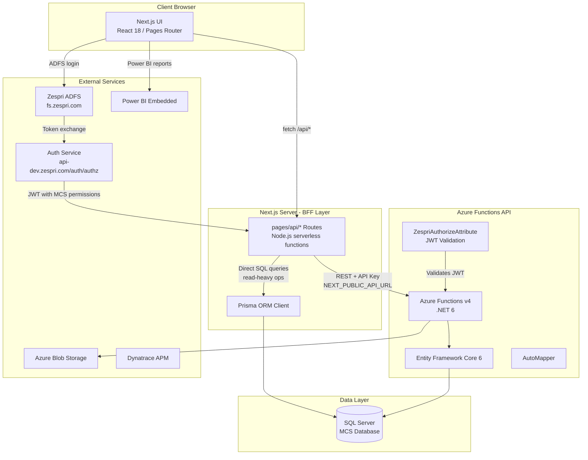
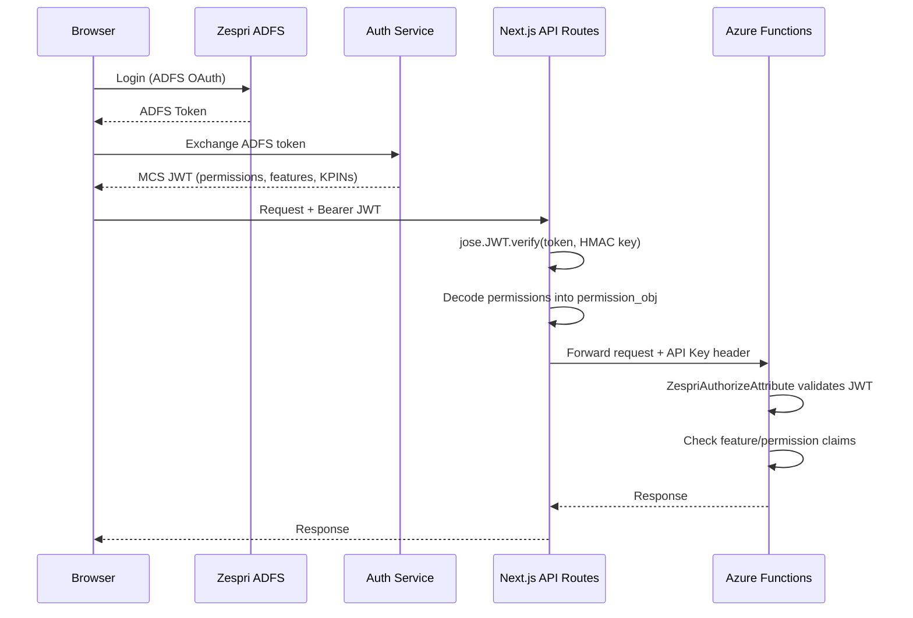
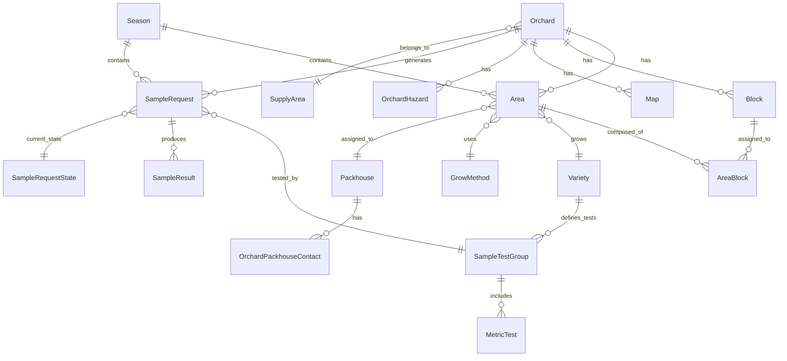
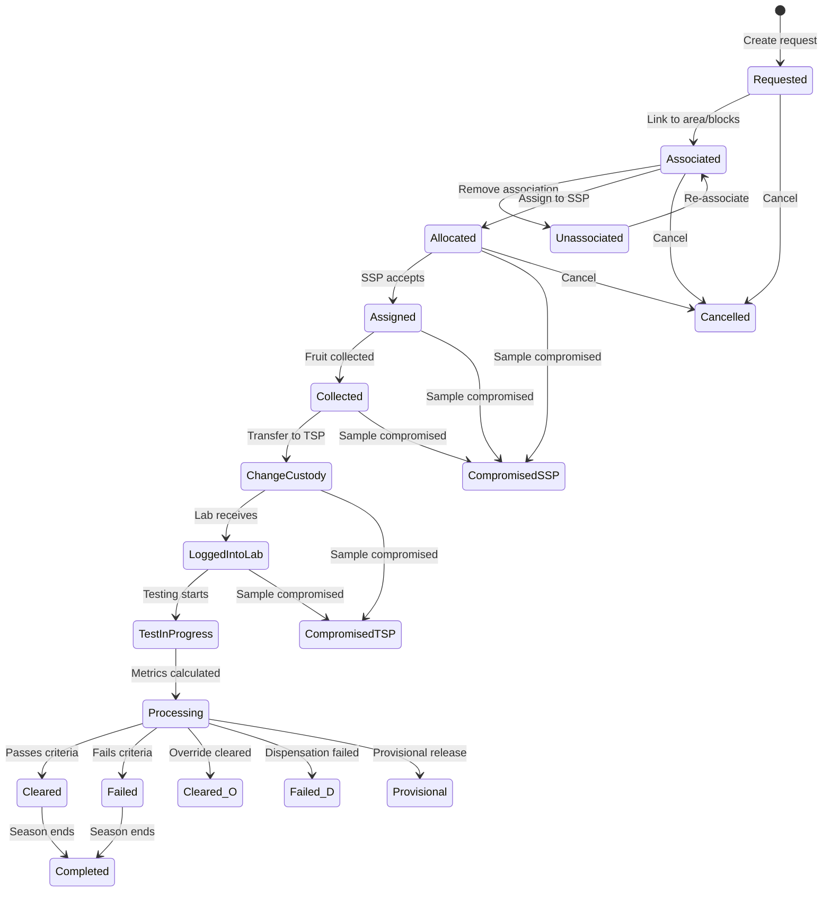
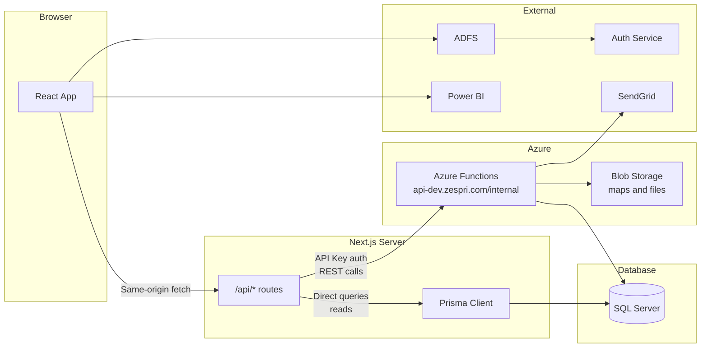

# Zespri MCS - Maturity Clearance System Architecture

> **Source:** Code-verified from actual codebase (May 2026). Cross-referenced against Confluence-sourced docs (May 8 2026). Discrepancies noted inline.

## Overview

The **Maturity Clearance System (MCS)** is a data platform built by Spark NZ for Zespri International (~$3.1B revenue, world's largest kiwifruit marketer). It manages kiwifruit maturity testing and clearance for harvest across New Zealand orchards, tracking the full lifecycle of sample requests from creation through lab testing to clearance/failure decisions.

- **Scale:** 5,000+ users, 100+ tests/day during harvest, $400M+ in grower bonuses calculated annually
- **Domain:** Kiwifruit maturity testing, orchard management, harvest clearance
- **Client:** Zespri International Limited
- **Maintained by:** Spark NZ (Product Engineering)

**Local codebase locations:**
- UI: `C:\Projects\Experimental\Z\Zespri.MCS.UI`
- API: `C:\Projects\Experimental\Z\API Source`

**Azure DevOps repos (Zespri org):**
- `Zespri.MCS.UI` - Frontend
- `Zespri.MCS.APIs` - C# API layer
- `Zespri.MCS.DataAccess` - EF data access
- `Zespri.MCS.DataFactory` - ADF pipeline definitions

---

## System Architecture Diagram



---

## Authentication and Authorization Flow



### JWT Structure (Internal MCS Token)
- `mcsId`: User ID in MCS system
- `is_zespri`: Boolean - Zespri internal user (admin bypass)
- `permissions[]`: Array of `{ role, features: [{name, access}], kpins }`
- `packhouse_ids`: Comma-separated packhouse IDs
- Features: hazards, areas, blocks, samplerequest, maps, orchardinformation, etc.
- Permissions: Read, Write per feature per KPIN

### Roles
- Zespri MCS Administrator User (full access)
- Zespri MCS Support User
- Zespri User
- Sampling Service Provider (SSP)
- Testing Service Provider (TSP)
- Packhouse users (scoped to packhouse_ids)

---

## UI Architecture

### Stack
| Technology | Version | Purpose |
|-----------|---------|---------|
| Next.js | 14 | Framework (Pages Router) |
| React | 18 | UI library |
| TypeScript | 4.9 | Type safety |
| Recoil | 0.7 | State management |
| Prisma | 5.6 | Direct SQL Server ORM (server-side) |
| qubic-lib | 3.0 | Zespri component library |
| SCSS | - | Styling (CSS Modules, camelCase) |
| Nivo | 0.99 | Charts (bar, line, scatterplot) |
| Power BI | - | Embedded reports |
| jose | 2.0 | JWT verification |
| Luxon | 2.5 | Date handling |
| ExcelJS | 4.4 | Excel export |
| Yup | 0.29 | Validation |

### Project Structure
```
Zespri.MCS.UI/
├── pages/                    # Next.js Pages Router
│   ├── _app.tsx             # RecoilRoot + ThemeProvider + Login wrapper
│   ├── index.tsx            # Landing page
│   ├── api/                 # BFF API routes (server-side)
│   │   ├── auth/            # Auth callbacks
│   │   ├── authz/           # Authorization endpoints
│   │   ├── sample-request/  # Sample request CRUD
│   │   ├── areas/           # Area management
│   │   ├── reports/         # Report data
│   │   ├── notifications/   # Notification endpoints
│   │   └── ... (40+ API route folders)
│   ├── samplerequests/      # Sample request list page
│   ├── samplerequest/       # Single sample request [id]
│   ├── orchard/[kpin]/      # Orchard detail by KPIN
│   ├── associations/        # Block-area associations
│   ├── reports/             # Power BI report pages
│   ├── admin/               # Admin pages (test-groups, clearance-criterias)
│   ├── users/               # User management
│   ├── roles/               # Role management
│   └── ... (20+ page folders)
├── src/
│   ├── components/          # React components (PascalCase folders)
│   │   ├── Sample/          # Sample request components
│   │   ├── Orchard/         # Orchard info components
│   │   ├── KpinList/        # KPIN listing
│   │   ├── PowerBiReport/   # Power BI embed wrapper
│   │   ├── Login/           # ADFS login flow
│   │   ├── Banner/          # App header/banner
│   │   └── common/          # Shared UI components
│   ├── hooks/               # Custom React hooks
│   │   ├── use-authorization.ts
│   │   ├── use-has-feature-permission.ts
│   │   ├── use-powerbi-report.ts
│   │   └── use-pagination.ts
│   ├── recoil/              # Recoil atoms/selectors
│   │   ├── auth/            # Auth state
│   │   ├── filters/         # Filter state
│   │   ├── roles/           # Role state
│   │   ├── language/        # i18n state
│   │   ├── sas-tokens/      # Azure SAS token state
│   │   └── toaster/         # Toast notification state
│   ├── helpers/             # Utility functions
│   │   ├── api.ts           # Client-side API wrapper (typed fetch)
│   │   ├── request/         # Server-side request utilities
│   │   │   ├── request.ts   # RequestUtils.secure/insecure (JWT verify + Prisma)
│   │   │   ├── mint-auth-token.ts
│   │   │   └── auth.ts      # Auth types (IJwt, IPermission, EMcsFeature)
│   │   ├── blob-storage/    # Azure Blob helpers
│   │   └── sample-requests.ts
│   ├── api/                 # API client modules
│   │   └── eapi.ts          # Raw SQL queries via Prisma (sample requests)
│   ├── prisma/              # Prisma utilities
│   ├── scss/                # Global styles
│   └── enums.ts             # Shared enums
├── prisma/
│   └── schema.prisma        # 72KB - full DB schema (SQL Server)
├── scripts/
│   └── azure-functions-build.js  # Serverless deployment build
└── swagger/
    └── packhouse.yml         # Packhouse API spec
```

### Key Patterns

**BFF Pattern (pages/api/):**
- `RequestUtils.secure(handler)` - Verifies JWT, injects user + PrismaClient
- `RequestUtils.insecure(handler)` - No auth, injects PrismaClient only
- Handlers receive: `(req, res, body, user, prisma)`
- Returns data or error symbols (BadRequest, NotFound, etc.)

**Client-side API calls:**
- `api.get<T>(url)` / `api.post<T>(url, {body})` - typed fetch wrapper
- All calls go to `/api/*` (same-origin BFF), never directly to Azure Functions
- Type inference from API route handler signatures

**Dual data access:**
- Prisma: Direct SQL for read-heavy operations (sample request lists, filters, complex joins)
- Azure Functions: Write operations, business logic, blob storage, notifications

---

## API Architecture (Azure Functions)

### Stack
| Technology | Version | Purpose |
|-----------|---------|---------|
| .NET | 6.0 | Runtime |
| Azure Functions | v4 | Serverless hosting |
| Entity Framework Core | 6.0.10 | ORM |
| AutoMapper | 12.0.1 | DTO mapping |
| Azure Blob Storage | - | File/map storage |
| JWT (System.IdentityModel) | 6.8.0 | Token validation |

### Solution Structure
```
Zespri.MCS.Orchard.sln
├── Zespri.MCS.Orchard/          # API Functions project
│   ├── Apis/                    # Azure Function endpoints
│   │   ├── SampleRequestApi.cs  # 133KB - main sample request CRUD (massive)
│   │   ├── AreaApi.cs           # 29KB - maturity area management
│   │   ├── OrchardHazardApi.cs  # 16KB - hazard CRUD
│   │   ├── BlockAssociationApi.cs # 16KB - block-area associations
│   │   ├── OrchardApi.cs        # 14KB - orchard info
│   │   ├── SiteRequirementApi.cs # 8KB - site access requirements
│   │   ├── PartBlockApi.cs      # 7.5KB - partial block management
│   │   ├── SampleRequestFilterApi.cs # 6.5KB - filter endpoints
│   │   ├── MapApi.cs            # 6.5KB - orchard maps
│   │   ├── FilterApi.cs         # 4.5KB - general filters
│   │   └── SasApi.cs            # 4.3KB - SAS token generation
│   ├── ZespriOAuth/             # Custom OAuth implementation
│   │   ├── ZespriAuthorizeAttribute.cs  # Function filter for JWT auth
│   │   ├── ZespriJwtTokenValidator.cs
│   │   ├── AccessTokenProvider.cs
│   │   ├── Constants.cs         # Claim names, role constants
│   │   └── Permissions/         # Permission models
│   ├── ViewModels/              # Response DTOs (AutoMapper targets)
│   ├── Helpers/                 # Business logic helpers
│   │   ├── SampleRequestStateHelper.cs  # State machine logic (17KB)
│   │   ├── BlocksService.cs
│   │   ├── SasGenerator.cs     # Azure SAS token generation
│   │   └── Utils.cs
│   ├── CsvMappers/              # CsvHelper mapping classes
│   ├── Notifications/           # Email notification logic
│   ├── CustomResolvers/         # AutoMapper custom resolvers
│   ├── ApiBase.cs               # Base class (DbContext, Mapper, BlobClient)
│   ├── CsvApiBase.cs            # Base for CSV import/export endpoints
│   ├── AutoMapping.cs           # AutoMapper profile (15KB)
│   ├── Enums.cs                 # Domain enums
│   ├── Constants.cs             # App constants
│   └── StartUp.cs              # DI registration
├── Zespri.MCS.DataAccess/       # EF Core data layer
│   ├── MCSContext.cs            # 1MB DbContext (scaffolded, huge)
│   ├── Orchard.cs               # Core entity
│   ├── SampleRequest.cs         # Core entity
│   ├── Block.cs, Area.cs        # Domain entities
│   ├── Vw*.cs                   # SQL View entities (50+ views)
│   ├── Stg*.cs                  # Staging table entities
│   ├── Rep*.cs                  # Reporting entities
│   ├── LoadCrm*.cs              # CRM sync entities
│   ├── Interfaces/              # Entity interfaces
│   └── ...                      # 200+ entity files
├── Zespri.MCS.Utilities/        # Shared utilities
│   ├── Csvs/                    # CSV parsing/writing
│   ├── PdfToImage/              # PDF conversion
│   └── ErrorHandling/           # Error types
└── Tests/
    └── Zespri.MCS.Tests/        # Unit tests
```

### Key Patterns

**Azure Function Pattern:**
```csharp
[FunctionName("GetFilters")]
[ZespriAuthorize]  // JWT validation filter
public async Task<IActionResult> GetFilters(
    [HttpTrigger(AuthorizationLevel.Function, "get", Route = "filters")] 
    HttpRequest req, ILogger log)
```

**Authorization:**
- `[ZespriAuthorize]` - basic auth (any valid token)
- `[ZespriAuthorize("samplerequest/Read,Write")]` - feature+permission check
- Format: `"feature1/perm1,perm2||feature2/perm1"`
- Zespri admin users bypass all permission checks

**Base class provides:**
- `_dbContext` (MCSContext - EF Core)
- `_mapper` (AutoMapper)
- `_blobClient` (Azure Blob)
- Helper methods: GetCurrentSeasonId(), GetOrchardIdFromKpin(), etc.

---

## Domain Model



### Core Entities

| Entity | Description | Key Fields |
|--------|-------------|------------|
| **Orchard** | Physical orchard identified by KPIN | Kpin, Name, Address, GPS, SupplyArea, Country |
| **Block** | Subdivision of orchard (variety/rootstock) | BlockId, OrchardId, Name, PlantedHectares, Variety |
| **Area** | Maturity area (grouping of blocks for testing) | SeasonId, OrchardId, MaturityType, Variety, GrowMethod, Packhouse |
| **SampleRequest** | Request to collect and test fruit samples | BlindedSampleNumber, State, SampleType, CollectionDate |
| **SampleResult** | Lab test results for a sample | Brix, DryMatter, Pressure, Colour, FreshWeight |
| **Hazard** | Orchard hazard (health and safety) | Type, Severity, Description, Blocks affected |
| **Map** | Orchard map image (stored in Blob) | URL, Status, PackhouseId |
| **Packhouse** | Fruit packing facility | FriendlyName, contacts |
| **Season** | Growing season (year-based) | Name, CurrentFlag |
| **Variety** | Kiwifruit variety (Gold, Green, etc.) | Code, Name |

---

## Sample Request Lifecycle



### Status Enum Values
| Status | ID | Description |
|--------|-----|-------------|
| Requested | 1 | Initial creation |
| Associated | 2 | Linked to maturity area |
| Unassociated | 3 | Removed from area |
| Allocated | 4 | Assigned to sampling provider |
| Assigned | 5 | SSP accepted |
| Collected | 6 | Fruit physically collected |
| ChangeCustody | 7 | Transferred to testing provider |
| LoggedIntoLab | 8 | Received at lab |
| TestInProgress | 9 | Lab testing underway |
| CompromisedSSP | 10 | Sample compromised (SSP) |
| CompromisedTSP | 11 | Sample compromised (TSP) |
| TestsCompleted | 12 | All tests done |
| Cleared | 15 | Passes clearance criteria |
| Failed | 16 | Fails clearance criteria |
| Completed | 17 | Final state |
| Cancelled | 18 | Cancelled |
| Processing | 19 | Metrics being calculated |
| Failed_D | 20 | Failed with dispensation |
| Cleared_O | 21 | Override cleared |
| Provisional | 22 | Provisional release |
| Cleared_I | 23 | Cleared (interim) |

---

## Integration Points



### Data Access Split
| Operation | Route | Why |
|-----------|-------|-----|
| Sample request list (SSP/TSP views) | Prisma (raw SQL) | Complex joins, FOR JSON, performance |
| Filter options | Prisma | Simple reads, fast |
| Sample request CRUD | Azure Functions | Business logic, state machine, notifications |
| Orchard/hazard/map CRUD | Azure Functions | Validation, blob storage |
| Area management | Azure Functions | Complex business rules |
| Reports | Power BI Embedded | Pre-built dashboards |
| File upload/download | Azure Functions + Blob | SAS token generation |

### Environment Configuration
| Variable | Purpose |
|----------|---------|
| NEXT_PUBLIC_API_URL | Azure Functions base URL |
| NEXT_PUBLIC_API_KEY | API key for Azure Functions |
| NEXT_PUBLIC_ADFS_INSTANCE | ADFS server URL |
| NEXT_PUBLIC_ADFS_CLIENT_ID | ADFS OAuth client ID |
| NEXT_PUBLIC_AUTH_URL | Auth service for token exchange |
| NEXT_PUBLIC_INTERNAL_API_URL | Self-referencing BFF URL |
| NEXT_PUBLIC_PBI_APP_EMBED_URL | Power BI embed URL |
| DATABASE_URL | SQL Server connection (Prisma) |
| MCS_AUTHZ_TOKEN_SIGN_KEY | HMAC key for JWT verification |
| MCS_AUTHZ_TOKEN_SIGN_KEY_ID | Key ID for JWT verification |

---

---

## Infrastructure (from Confluence, not in codebase)

| Component | Resource | Notes |
|-----------|----------|-------|
| Subscription | ZespriAppWorkload | Zespri-owned Azure |
| Resource Group | rg-maturityclearances | All MCS resources |
| UI Hosting | Azure App Service | Migrated from serverless (FY2026, MCS26-51) |
| API Hosting | Azure Function Apps | C# APIs remain on Functions |
| Database | Azure SQL Database | 4 instances: DEV, TST, PPE, PRD |
| CDN/WAF | Azure Front Door | Entry point for web traffic |
| API Gateway | Azure API Management (APIM) | Must be modified before prod deploys |
| Data Pipelines | Azure Data Factory (ADF) | Scheduled jobs, SFTP exports |
| Blob Storage | stzeststwu2mcsorchmap | Maps container |
| Email | SendGrid | Notification templates |
| SMS | Spark eTXT | SMS notifications |
| Monitoring | Azure Logic Apps | Hourly error summary emails |
| APM | Dynatrace | JS agent injected in _app.tsx |
| DB Access | GlobalProtect VPN or Azure Virtual Desktop | No local databases |

### Environments
| Env | Deployed By | Notes |
|-----|-------------|-------|
| DEV | Developers | api-dev.zespri.com |
| TST | Developers | api-tst.zespri.com |
| PPE | SRE | Pre-production |
| PRD | SRE | Production (CAB process via ServiceNow) |

### External APIs (eAPIs) - consumed by SSPs/TSPs

| eAPI | Purpose | Method |
|------|---------|--------|
| Allocation (eAPI1) | Allocate/de-allocate sample requests | - |
| State Change (eAPI2) | Update sample request state | PUT /mcs/SampleRequest?State={State}&BlindedSampleNumber={id} |
| Hazard | Add new hazards | - |
| Spray Diary / Residue | Create placeholder in Spray Diary | KPIN, BlindedSampleId, ResidueTypeCode, RequestedCollectionDate |

**Note:** eAPI URLs hosted on Azure Function Apps. Changing URLs would cost external users (SSPs/TSPs who call via Postman) money, so they remain on Functions even after UI moved to App Service.

### ADF Pipelines (Data Factory)
| Pipeline | Purpose |
|----------|---------|
| pl_azuresql_mcs_view_to_sftp_FruitResults | Export fruit results to SFTP |
| pl_azuresql_mcs_view_to_sftp_SampleResultsAllSizes | Export sample results to SFTP |
| pl_azuresql_mcs_view_to_sftp_SampleRequest | Export sample requests to SFTP |

---

## Key Observations and Gotchas

### Code-Verified (from codebase)
1. **Massive SampleRequestApi.cs** (133KB) - single file with all sample request logic. High coupling risk.
2. **Dual data access** - Prisma for reads, Azure Functions for writes. Must keep schemas in sync manually.
3. **1MB MCSContext.cs** - scaffolded from DB, includes 200+ entities and 50+ views. Never manually edit.
4. **Raw SQL in Prisma** - `eapi.ts` uses `Prisma.sql` tagged templates with complex FOR JSON queries. SQL Server specific.
5. **qubic-lib** - Zespri's internal component library. Provides Theme, layout components, utilities.
6. **No API versioning** - single version, routes like `/api/filters`, `/api/sample-request/[id]`
7. **Serverless deployment** - custom `azure-functions-build.js` script packages Next.js for Azure Functions hosting.
8. **Permission model** - feature-based (not role-based). Each user has feature+permission+KPIN combinations.
9. **Season-scoped data** - most queries filter by current season. Season rollover is a distinct admin operation.
10. **NZ timezone hardcoded** - `GetLocalTimeForCountry()` always uses "New Zealand Standard Time" with TODO for internationalization.
11. **Prisma schema is 72KB** - mirrors the full SQL Server database including staging tables, CRM sync tables, and reporting views.
12. **CRM sync** - LoadCrm* entities suggest data is synced from Dynamics CRM (orchards, blocks, contacts, packhouses).
13. **Notification system** - 19 notification templates for email alerts (SendGrid) covering sample lifecycle events.
14. **CSV import/export** - CsvApiBase + CsvMappers handle bulk data operations (areas, hazards, site requirements).

### From Confluence (not verified in code)
15. **Calc Engine** - 24 database views must be updated when adding new criteria. Checks inheritance then sample clearance.
16. **ADF checks Maturity Areas every 15 minutes** - automated monitoring.
17. **SAP integration** - TR (Transport Request) messages sent with clearance results for payment calculation.
18. **DB scaffold command:** `dotnet ef dbcontext scaffold "Server=tcp:[connection string]" Microsoft.EntityFrameworkCore.SqlServer`
19. **3 parallel CI agents max** in Zespri DevOps (jobs may queue).
20. **No local databases** - all Zespri-owned, hosted in Azure. Point-in-time restoration available (no manual backups needed since March 2022).

---

## Cross-Reference: Confluence vs Codebase

| Claim (Confluence) | Codebase Evidence | Status |
|--------------------|-------------------|--------|
| Next.js 14 | `"next": "^14.0.0"` in package.json | CONFIRMED |
| React 18 | `"react": "^18.2.0"` in package.json | CONFIRMED |
| Azure Functions v4 (.NET 6) | `<AzureFunctionsVersion>v4</AzureFunctionsVersion>`, `<TargetFramework>net6.0</TargetFramework>` | CONFIRMED |
| Entity Framework Core | `Microsoft.EntityFrameworkCore 6.0.10` in csproj | CONFIRMED |
| Prisma for direct DB access | `@prisma/client ^5.6.0`, 72KB schema.prisma | CONFIRMED |
| Recoil state management | `"recoil": "^0.7.7"` in package.json | CONFIRMED |
| ADFS authentication | `NEXT_PUBLIC_ADFS_INSTANCE=https://fs.zespri.com/` in .env | CONFIRMED |
| "Auth migrated to Azure AD (Jan 2026, P6480)" | Code still uses `fs.zespri.com` (ADFS), not Azure AD endpoints. `adal-angular` dependency present. | DISCREPANCY - code shows ADFS, not Azure AD. May be partially migrated or Confluence is aspirational. |
| SendGrid for email | `@sendgrid/mail ^8.1.6` in package.json | CONFIRMED |
| Power BI embedded reports | `powerbi-client-react ^1.4.0` in package.json | CONFIRMED |
| Azure Blob Storage | `@azure/storage-blob ^12.16.0` in package.json, `CloudBlobClient` in ApiBase.cs | CONFIRMED |
| Dynatrace APM | `@dynatrace/oneagent-sdk ^1.5.0` + JS src in _app.tsx | CONFIRMED |
| AutoMapper for DTO mapping | `AutoMapper 12.0.1` in csproj, `AutoMapping.cs` (15KB) | CONFIRMED |
| "UI migrated to App Service" | `azure-functions-build.js` script still exists, suggesting serverless packaging still in use | UNCLEAR - build script may be legacy or for specific deployment targets |
| Trunk-based branching | No evidence in local code (no .git examined) | UNVERIFIED |
| 4 DB environments (DEV/TST/PPE/PRD) | `.env.dev`, `.env.test`, `.env.ppe`, `.env.prod` all present | CONFIRMED |
| SMS via Spark eTXT | Referenced in Confluence, not found in current codebase dependencies | UNVERIFIED in code |
| jose for JWT | `"jose": "^2.0.7"` in package.json, used in request.ts | CONFIRMED |

---

## Kiwifruit Varieties

| Code | Variety | Notes |
|------|---------|-------|
| GA | Gold3 | Premium gold kiwifruit |
| HE | Green14 | Green variety |
| HW | Hayward | Classic green kiwifruit |
| RS | Red19 | Red variety |
| WK | Wilkins | Phasing out |

---

## Development Workflow

- **Branching:** Trunk-based with Git tags (from Confluence)
- **Environments:** DEV -> TST -> PPE -> PRD
- **DEV/TST:** Deployed by developers
- **PPE/PRD:** Deployed by SRE
- **CAB process:** Required for all production releases (via ServiceNow)
- **ORM refresh:** `dotnet ef dbcontext scaffold "Server=tcp:[conn]" Microsoft.EntityFrameworkCore.SqlServer`
- **UI port:** Dev server runs on port 44326 (`next dev -p 44326`)
- **Build:** `npm run serverless-build` (next build + azure-functions-build.js + test-build.js)
- **Tests:** Jest with React Testing Library, coverage reports generated
- **Linting:** ESLint with TypeScript, Prettier, zero-warning policy (`--max-warnings=0`)
- **Pre-push hook:** `npm run test -- --no-watch && npm run build` (via Husky)
