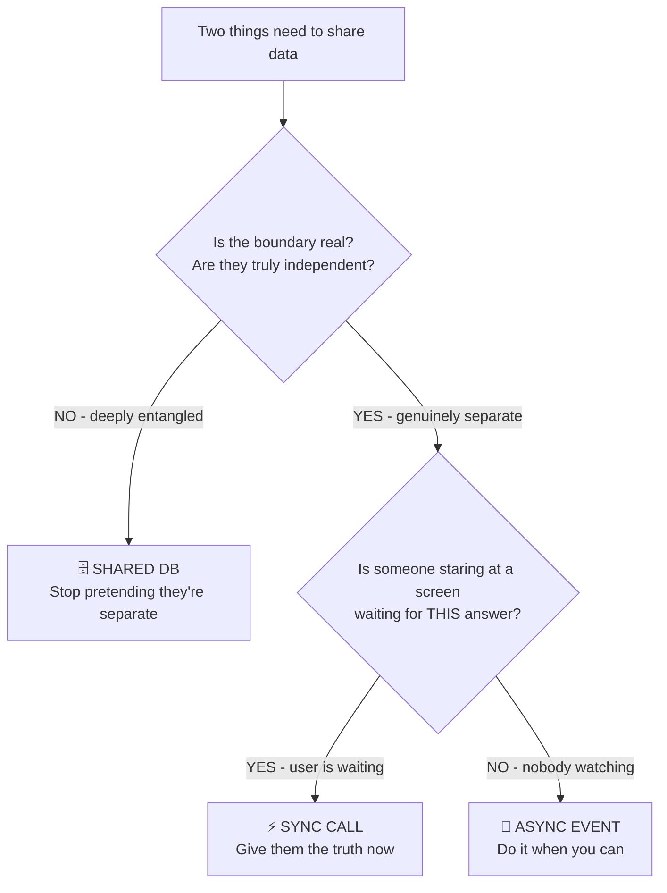
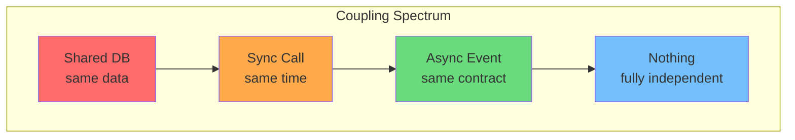

# Mentor Journal

## Learning Profile

### Preferred Methods (ranked by success rate)

*Provisional - based on 1 session. Needs 5+ to be reliable.*

1. Decision trees / flowcharts ("3 questions in order" format)
2. Mermaid diagrams / visual representations (self-identified: "visual person, pictures stick")
3. Real-world analogies (food delivery app, not abstract theory)
4. Contrastive tables (good vs bad, sync vs async side by side)
5. Non-work examples first, bridge to Ubiquity after concept lands

### Weak Channels

*Too early to confirm. Monitoring:*
- Long prose explanations (untested)
- Abstract theory-first (Q1 assessment suggests this won't land - needs concrete anchor)

### Domain-Specific Notes

- Architecture: learns best from "trace a real scenario through the system" + decision trees
- Other domains: not yet assessed

## Knowledge Map

### Frontend (Next.js / React / TypeScript)

| Topic | Score | Last Assessed | Notes |
|-------|-------|---------------|-------|

### Backend (.NET / C# / gRPC)

| Topic | Score | Last Assessed | Notes |
|-------|-------|---------------|-------|

### Infrastructure (Terraform / Docker / CI)

| Topic | Score | Last Assessed | Notes |
|-------|-------|---------------|-------|
| Docker: what a container actually is (vs VM) | ? | — | Has some idea, wants stronger model |
| Docker: images, layers, caching | ? | — | |
| Docker: Dockerfile best practices | ? | — | |
| Docker: networking (bridge, host, overlay) | ? | — | |
| Docker: volumes & persistence | ? | — | |
| Docker Compose: multi-service orchestration | ? | — | Uses it in Ubiquity already |
| Kubernetes: what problem it solves | ? | — | "Keeps appearing but not understood well" |
| Kubernetes: pods, services, deployments | ? | — | Core building blocks |
| Kubernetes: networking & service discovery | ? | — | |
| Kubernetes: scaling (HPA, replicas) | ? | — | |
| Kubernetes: when you need it vs when you don't | ? | — | Critical decision-making |

### Data / Orchestration (Python / Prefect / Polars)

| Topic | Score | Last Assessed | Notes |
|-------|-------|---------------|-------|

### Architecture / Design Patterns

| Topic | Score | Last Assessed | Notes |
|-------|-------|---------------|-------|
| What makes an architecture "good" vs "bad" | 3 | 2026-05-25 | Can articulate: 3 hard decisions, match decisions to system needs. Not yet applying independently to new systems. |
| Architectural styles (monolith, microservices, modular monolith, event-driven) | 3 | 2026-05-25 | Can identify which style Ubiquity/Zespri use and WHY. Knows trade-offs. Corrected "monolith=brittle" misconception. |
| Coupling & cohesion | 3 | 2026-05-25 | Understands coupling spectrum (shared DB → sync → async → nothing). Can reason about when coupling is acceptable. |
| Separation of concerns / boundaries | 3 | 2026-05-25 | Knows the test: "can I change one without touching the other?" Applied to real systems. |
| Data flow & ownership | 3 | 2026-05-25 | One source of truth per business concept. Can identify violations (Zespri dual-access). |
| Communication patterns (sync/async/shared DB) | 3 | 2026-05-25 | Decision tree memorized. Knows when each is appropriate. Needs more drill on edge cases. |
| When to split a monolith | 3 | 2026-05-25 | Knows the real signals vs fake signals. Can argue against premature splitting. |
| Distributed monolith (anti-pattern) | 3 | 2026-05-25 | Can identify and explain why it's worst of both worlds. |
| BFF pattern | 2.5 | 2026-05-25 | Knows what it is and why. Hasn't designed one from scratch. |
| Scalability patterns (horizontal, vertical, caching, queues) | ? | — | Not yet assessed |
| Resilience patterns (retry, circuit breaker, bulkhead) | ? | — | Not yet assessed |
| API design (REST vs gRPC vs GraphQL - when to use what) | ? | — | Has gRPC experience from Ubiquity |
| SOLID principles (applied, not textbook) | ? | — | |
| Domain-Driven Design basics (bounded contexts, aggregates) | ? | — | |

### Bible / History / Apologetics

| Topic | Score | Last Assessed | Notes |
|-------|-------|---------------|-------|
| Textual transmission (can we trust the text?) | 3 | 2026-06-04 | Knows manuscript counts, gap comparison, variant categories. Can defend against "telephone game" and "changed over time" objections. Minor confusion on timeline (copies span centuries, not 30 years). |
| Historical reliability of content | 3 | 2026-06-04 | Knows 8 criteria framework, early dating (creed 2-5yrs), hostile witnesses, embarrassment criterion, martyrdom argument. Can articulate but leaves eyewitness point out under pressure. |
| Problem passages (Mark 16, John 8, 1 John 5:7) | 3 | 2026-06-04 | Knows all 3, why they're flagged, that none are doctrinal, that system catches additions. |
| OT manuscript tradition (Dead Sea Scrolls deep-dive) | 3 | 2026-06-04 | Knows DSS story, Isaiah scroll comparison, 95%+ match over 1000 years, Masoretic rigour. |
| Archaeology and external corroboration | 2.5 | 2026-06-04 | Covered in session (Josephus, Tacitus, Pilate stone, Pool of Bethesda) but hasn't articulated independently yet. |
| Trinity (doctrine + defense) | 3.5 | 2026-06-04 | Knows formula (one being, three persons), being/person distinction, biblical evidence from both testaments. Can identify correct answers to objections but needs practice PROVING them (firstborn drill exposed this). |
| Bible contradictions framework | 3 | 2026-06-04 | Has the decision tree (word, context, genre, plausible resolution). Knows murder/kill distinction. Hasn't been drilled on specific hard cases independently. |
| Creation vs science | 3 | 2026-06-04 | Understands genre argument, literary framework of Gen 1, ANE context. Knows the positions Christians hold. Historical Adam = open question. |
| Christianity vs other religions | 3.5 | 2026-06-04 | Can articulate Christianity's unique evidence-based position (falsifiability, public event, multiple witnesses, invites scrutiny). Absorbed deathmatch results. |
| Theism vs atheism | 3 | 2026-06-04 | Knows the 5 arguments (cosmological, fine-tuning, consciousness, morality, information). Absorbed deathmatch results. Hasn't articulated independently yet. |
| Prayer - what to pray for | 3 | 2026-06-04 | Knows Lord's Prayer template, 6 categories, order matters. Has daily minimum prayer. |

### Protocols / Contracts (Protobuf / Buf / Connect)

| Topic | Score | Last Assessed | Notes |
|-------|-------|---------------|-------|

## Misconceptions

### 1. "Monolith = brittle"

- **What he thinks:** Monoliths are fragile, break easily, microservices are more resilient.
- **What's actually true:** Monoliths are LESS brittle for most operations (no network failures, compiler catches breakages, one deploy fixes everything). Microservices distribute brittleness across the network - the system as a whole is more fragile. A monolith's real costs are: all-or-nothing scaling, locked tech stack, all-or-nothing deploys, team coordination past ~20 devs. None of those are "brittleness."
- **Why it's sticky:** Microservices marketing/hype (2015-2022) drilled "monolith bad" into the industry. Easy to absorb without questioning.
- **Corrected:** 2026-05-25. Recheck in 1 week.

## Sticky Gaps

*Topics that failed 2+ explanation methods. Includes what was tried and what to try next.*

## Queued Gaps

*Auto-detected during normal work. Surface at next mentor session.*

## Spaced Repetition Queue

| Topic | Taught On | Next Check | Check Type |
|-------|-----------|------------|------------|
| Communication decision tree (shared/sync/async) | 2026-05-25 | 2026-05-28 | Snap drill - classify 5 scenarios |
| Monolith ≠ brittle (real trade-offs are scaling/deploy/tech lock) | 2026-05-25 | 2026-06-01 | "What are the actual costs of a monolith?" |
| NT manuscript evidence (counts, gap, comparison to Plato/Caesar) | 2026-06-04 | 2026-06-07 | "Your mate says Bible's been changed - give me the 3-sentence response" |
| Variant categories (70% spelling, 28% synonyms, 2% meaningful, 0% doctrinal) | 2026-06-04 | 2026-06-11 | "400,000 variants sounds scary - why isn't it?" |
| Hostile witnesses (name 3 + what each confirms) | 2026-06-04 | 2026-06-07 | Quick recall - Josephus, Tacitus, Talmud + their contributions |
| Problem passages (name 3, why flagged, why it doesn't matter) | 2026-06-04 | 2026-06-11 | Mark 16, John 8, 1 John 5:7 |
| Full Bible reliability argument (60-second dismantle) | 2026-06-04 | 2026-06-18 | Hit all 3: timeframe, eyewitnesses, comparison |

## Session Log

### 2026-06-04 - Bible Textual Transmission + Content Reliability + Problem Passages

**Mode:** assess + lesson + teach-back (3-part session)
**Method used:** Comparison tables, visual breakdowns (variant pyramid, criteria list), decision trees, teach-back drills
**Landed:** yes across all 3 parts. Comparison tables continue to be the strongest method. Teach-back revealed he articulates timeframe and comparison well but drops the eyewitness argument under pressure.
**Score change:** Textual transmission 2.5→3, Content reliability 0→3, Problem passages 0→3, OT/DSS 2→3, Archaeology 0→2.5
**Profile signal:** Absorbs large amounts of structured information quickly when presented as tables/trees. Conversational teach-back style ("bro get your facts straight") - prefers casual articulation. Needs drilling on hitting ALL points under pressure (tends to lead with strongest point and stop).
**Misconception corrected:** "5,800 copies produced in 30 years" → copies span centuries, 30yr is gap to earliest surviving fragment.
**Teach-back weakness identified:** Under pressure, hits timeframe + comparison but forgets eyewitness access. Queue for drilling.
**Next:** Spaced rep on June 7 (hostile witnesses + manuscript response), June 11 (variants + problem passages), June 18 (full 60-second argument).

---

### 2026-05-25 - Architecture Fundamentals (Lesson 1)

**Mode:** lesson + assessment
**Method used:** Real-world analogy (food delivery app), contrastive comparisons, decision tree, mermaid diagrams, applied to real systems (Ubiquity + Zespri)
**Landed:** yes - decision tree model clicked immediately, applied successfully to both real projects
**Score change:** Architecture fundamentals 1.5→3 (working knowledge - can reason about systems, identify patterns and anti-patterns, not yet designing from scratch)
**Profile signal:** Decision trees / flowcharts land well. Mermaid diagrams strong. Learns fast when applying concepts to systems he already knows. Questions reveal genuine curiosity (good sign). Corrected one misconception (monolith=brittle) cleanly.
**Next:** Drill the 5 scenarios, then assess: scalability patterns, resilience patterns, SOLID, DDD basics

---

#### Key Mental Models Captured

**Architecture = 3 Hard Decisions:**
1. **Boundaries** - Where do you draw lines? Separate things that change independently.
2. **Data Ownership** - One source of truth per business concept.
3. **Communication** - How data crosses boundaries without violating them.

**Good architecture** = those 3 decisions were made well for this system's needs.
**Bad architecture** = any of those 3 are wrong.

**Communication Decision Tree (memorize this):**

```
1. "Are these things so entangled that separating them is a lie?"
      YES → Shared DB. Don't pretend they're separate.

2. "Is a human staring at a screen waiting for THIS answer?"
      YES → Sync call.

3. Neither?
      → Async event.
```





One sentence each:
- **Shared DB:** "We're basically one thing pretending to be two. Stop pretending."
- **Sync:** "Someone is watching. Give them the truth now."
- **Async:** "Nobody is watching. Do it when you can."

**Sync = temporal coupling.** Both services must be alive at the same time.
**Async = no temporal coupling.** Producer drops a message, consumer processes whenever.

**When sync is unavoidable:** Auth, authorization, inventory check, validation against external system, read-before-write, user-facing search.

**When people over-sync (should be async):** Email/SMS, report generation, search index updates, analytics/logging, third-party webhooks.

**The test:** "If this downstream service is down for 60 seconds, is my user stuck with no way forward?" Yes → sync. No → async.

---

#### Open Drill (not yet answered)

Apply shared/sync/async to:
1. Order Service needs restaurant menu prices to calculate total at checkout
2. Analytics Service needs to record that an order was placed
3. Two modules inside backend both need same customer record on every request
4. Driver app needs to know "is there a new order for me?"
5. Customer wants to know "where is my driver right now?"
