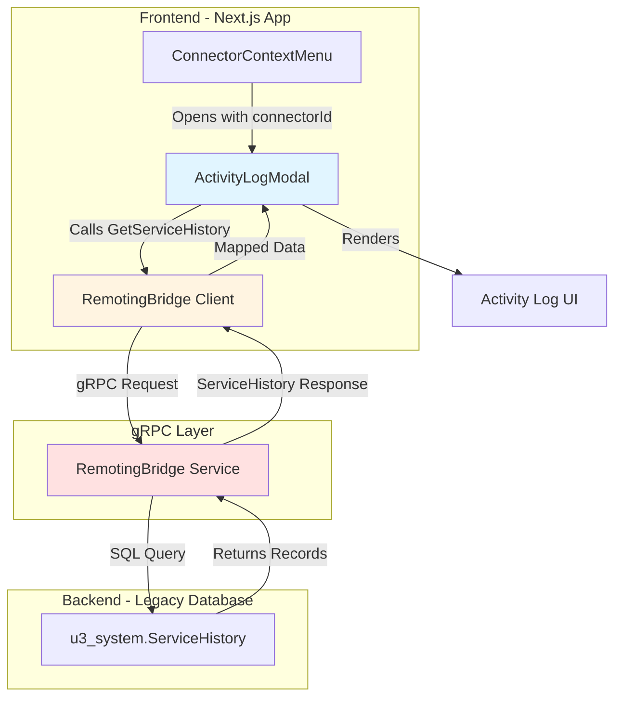
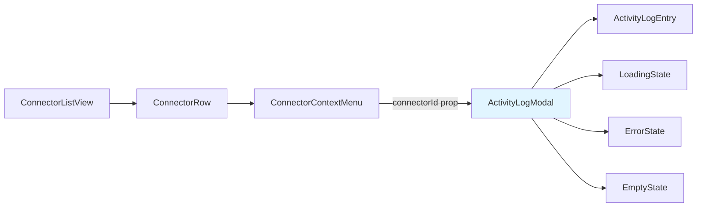
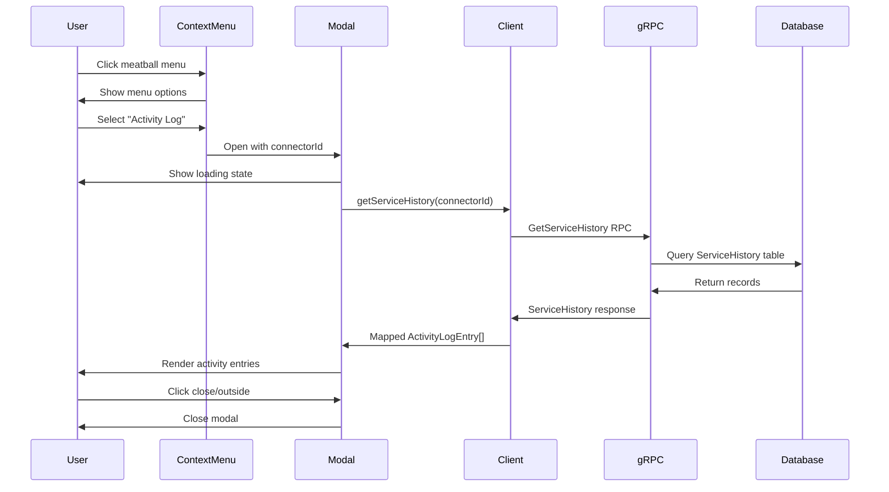

# Design Document: Connector Activity Log

## Overview

The Connector Activity Log feature provides users with a chronological view of lifecycle events for each connector in the system. This feature surfaces existing audit data from the legacy SQL Server database (`u3_system.ServiceHistory`) through a new gRPC endpoint and displays it in a modal interface accessible from the connector list view.

### Key Components

- **ActivityLogModal**: React component that displays the activity log in a modal overlay
- **ConnectorContextMenu**: Enhanced to pass connector UUID and trigger the modal
- **RemotingBridge gRPC Client**: New client for accessing the GetServiceHistory endpoint
- **Data Mapping Layer**: Transforms ServiceHistoryCategory enum values to frontend ActivityType values
- **Proto Package Upgrade**: Upgrade from @qriousnz/ubiquity-protos 2.1.0 to 3.3.0

### User Flow

1. User clicks the meatball menu (three dots) on a connector row
2. Context menu displays with "Connector Settings" and "Activity Log" options
3. User selects "Activity Log"
4. Modal opens with loading state
5. Frontend calls GetServiceHistory gRPC endpoint with connector UUID
6. Backend returns ServiceHistory records sorted by date descending
7. Frontend maps ServiceHistoryCategory to ActivityType and renders entries
8. User views chronological activity with icons, descriptions, and timestamps
9. User closes modal by clicking outside, pressing ESC, or clicking Close button

## Architecture

### High-Level Architecture



### Component Architecture



### Data Flow



## Components and Interfaces

### 1. RemotingBridge gRPC Client

**Location**: `monorepo/apps/database/src/lib/grpc-clients.ts`

**Purpose**: Provides access to the RemotingBridge service for querying ServiceHistory data.

**Implementation**:
```typescript
import { RemotingBridgeService } from "@qriousnz/ubiquity-protos/remoting/v1";

export const remotingBridgeClient = createClient(RemotingBridgeService, transport);
```

**Usage Pattern**: Follows existing pattern used for `accountClient`, `listClient`, and `transactionalListClient`.

### 2. ActivityLogModal Component

**Location**: `monorepo/apps/database/src/domains/connector-list/components/ActivityLogModal.tsx`

**Current State**: Implemented with mock data, needs integration with real gRPC endpoint.

**Props Interface**:
```typescript
interface ActivityLogModalProps {
  connectorId: string;      // UUID of the connector
  connectorName: string;    // Display name for modal header
  open: boolean;            // Modal visibility state
  onOpenChange: (open: boolean) => void;  // State change handler
}
```

**State Management**:
```typescript
interface ActivityLogState {
  entries: ActivityLogEntry[];
  loading: boolean;
  error: string | null;
}
```

**Data Fetching**: Uses React Query (TanStack Query) for data fetching, caching, and error handling.

### 3. ConnectorContextMenu Component

**Location**: `monorepo/apps/database/src/domains/connector-list/components/ConnectorContextMenu.tsx`

**Current Issue**: ActivityLogModal is instantiated without required `connectorId` prop.

**Required Changes**:
1. Pass `connectorId` from connector prop to ActivityLogModal
2. Pass `connectorName` from connector prop to ActivityLogModal
3. Ensure connector data is available when menu is rendered

**Updated Props Usage**:
```typescript
<ActivityLogModal 
  connectorId={connector.id}
  connectorName={connector.connectorName}
  open={activityModalOpen} 
  onOpenChange={setActivityModalOpen} 
/>
```

### 4. Data Type Definitions

**ActivityType Enum** (Frontend):
```typescript
type ActivityType = "edit" | "send" | "created" | "activated" | "deactivated";
```

**ServiceHistoryCategory Enum** (Backend - from proto):
```typescript
enum ServiceHistoryCategory {
  EDIT = 0,
  SEND = 1,
  CREATED = 2,
  ACTIVATED = 3,
  DEACTIVATED = 4,
  DELETED = 5,
}
```

**ActivityLogEntry Interface**:
```typescript
interface ActivityLogEntry {
  id: string;                    // Unique identifier for the entry
  activityType: ActivityType;    // Mapped from ServiceHistoryCategory
  modifiedBy: string;            // Display name or email of user
  date: string;                  // ISO 8601 timestamp
  text?: string;                 // Optional text for "send" events
}
```

**GetServiceHistory Request**:
```typescript
interface GetServiceHistoryRequest {
  itemId: string;                // Connector UUID
  orderBy?: string;              // "date DESC" for reverse chronological
  limit?: number;                // Optional pagination limit
}
```

**GetServiceHistory Response**:
```typescript
interface ServiceHistoryRecord {
  id: string;
  itemId: string;
  category: ServiceHistoryCategory;
  modifiedBy: string;            // User UUID
  modifiedByDisplayName?: string;
  modifiedByEmail?: string;
  date: string;                  // ISO 8601 timestamp
  text?: string;                 // Additional context for some events
}

interface GetServiceHistoryResponse {
  records: ServiceHistoryRecord[];
}
```

## Data Models

### ServiceHistory Table Schema

The legacy `u3_system.ServiceHistory` table contains the following relevant fields:

| Field | Type | Description |
|-------|------|-------------|
| id | uniqueidentifier | Primary key |
| item_id | uniqueidentifier | Foreign key to connector UUID |
| category | int | ServiceHistoryCategory enum value |
| modified_by | uniqueidentifier | User UUID who performed action |
| date | datetime | Timestamp of the event |
| text | nvarchar(max) | Optional additional context |

### Data Mapping Strategy

**ServiceHistoryCategory to ActivityType Mapping**:

| ServiceHistoryCategory | ActivityType | Display Format |
|------------------------|--------------|----------------|
| CREATED (2) | "created" | "[user] created [connector name]" |
| ACTIVATED (3) | "activated" | "[user] changed status to activated" |
| DEACTIVATED (4) | "deactivated" | "[user] changed status to deactivated" |
| EDIT (0) | "edit" | "[user] edited [connector name]" |
| SEND (1) | "send" | "[user] sent [connector name]" or use text field |
| DELETED (5) | N/A | Filtered out (deleted connectors not shown) |

**User Display Name Resolution**:

Priority order for displaying user information:
1. `modifiedByDisplayName` (if present)
2. `modifiedByEmail` (if displayName missing)
3. "Unknown User" (if both missing)

This handles edge cases where users have been deleted or data is incomplete.

### Proto Package Upgrade Strategy

**Current Version**: @qriousnz/ubiquity-protos 2.1.0
**Target Version**: @qriousnz/ubiquity-protos 3.3.0

**Packages Requiring Upgrade**:
1. `monorepo/apps/database/package.json`
2. `monorepo/apps/journey-builder/package.json`
3. `monorepo/packages/auth/package.json`
4. `monorepo/packages/navbar/package.json`

**Upgrade Process**:
1. Update all four package.json files simultaneously
2. Run `bun install` to update lockfile
3. Verify no breaking changes in existing imports
4. Test existing gRPC client functionality
5. Add new RemotingBridge client import

**Risk Mitigation**:
- Proto version 3.3.0 is backward compatible with 2.1.0 for existing services
- New RemotingBridge service is additive (doesn't affect existing code)
- Type checking will catch any breaking changes during build

