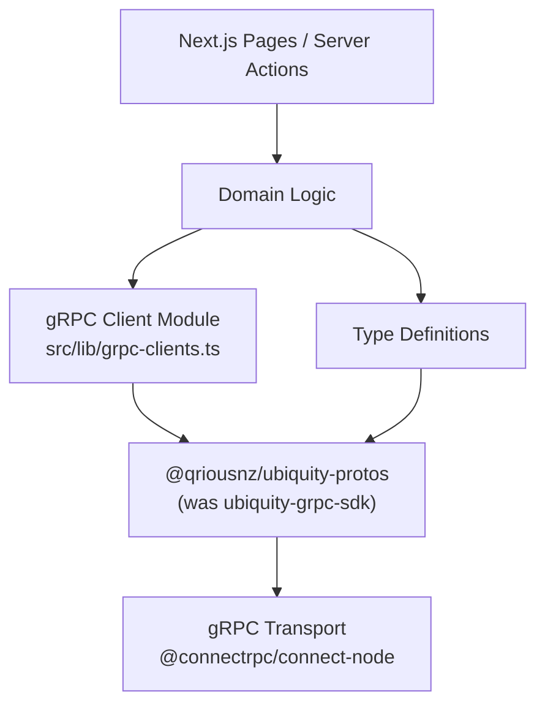

# Design Document: Migrate Database gRPC Protos

## Overview

This design covers the migration of the database app (`monorepo/apps/database`) from the deprecated `@qriousnz/ubiquity-grpc-sdk` package to `@qriousnz/ubiquity-protos@2.1.0`. The journey-builder app has already been successfully migrated and serves as the reference implementation.

The migration is a mechanical find-and-replace of import paths across 9 files (8 source + 1 test), plus dependency management changes in `package.json` and `next.config.js`. No API surface changes are expected — the new package re-exports the same service descriptors and protobuf types under a different package name with identical subpath structure.

### Key Design Decisions

1. **Direct import path substitution**: The new package mirrors the old SDK's subpath exports (`/list/v1`, `/system/v1`), so migration is a 1:1 path replacement with no structural changes.
2. **Preserve import styles**: `ColumnType` is used as both a `type` import and a `value` import across different files. Each file's existing import style (e.g., `import type { ColumnType }` vs `import { ColumnType }`) must be preserved exactly.
3. **Match journey-builder configuration**: The `transpilePackages` entry in `next.config.js` must include `@qriousnz/ubiquity-protos`, matching the journey-builder's configuration.
4. **Clean build verification**: Stale `.next/` cache and `tsconfig.tsbuildinfo` must be deleted before build verification to avoid false positives from cached artifacts.

## Architecture

The migration does not alter the application architecture. The existing layered structure remains:



The only change is the package that provides service descriptors and protobuf types. The `@connectrpc/connect` and `@connectrpc/connect-node` packages remain unchanged and continue to handle transport.

## Components and Interfaces

### Files Requiring Migration

The migration touches 9 files across two import path categories:

#### List Service Imports (`/list/v1`)

| File | Imports | Import Style |
|------|---------|-------------|
| `src/lib/grpc-clients.ts` | `ListService`, `TransactionalListService` | value import |
| `src/types/ubiquityColumnTypes.ts` | `ColumnType` | value import (used as runtime enum keys) |
| `src/types/dropdown.types.ts` | `ColumnType` | type-only import |
| `src/domains/add-connector/types/transformation.types.ts` | `ColumnType` | type-only import |
| `src/domains/add-connector/components/transformations/TransformationRegistry.ts` | `ColumnType` | type-only import |
| `src/domains/accounts/utils/account-table-data.ts` | `ColumnInfo`, `ColumnType` | mixed (`type ColumnInfo`, value `ColumnType`) |
| `src/domains/add-connector/components/transformations/definitions/FixedValueTransformation.tsx` | `ColumnType` | value import (used in runtime comparisons) |
| `src/domains/add-connector/components/transformations/definitions/SendDateTimeTransformation.tsx` | `ColumnType` | value import (used in runtime array) |

#### System Service Imports (`/system/v1`)

| File | Imports | Import Style |
|------|---------|-------------|
| `src/lib/grpc-clients.ts` | `AccountService` | value import |

#### Test File

| File | Imports | Import Style |
|------|---------|-------------|
| `__tests__/unit/src/domains/add-connector/components/transformations/definitions/FixedValueTransformation.test.ts` | `ColumnType` | value import |

### Configuration Changes

#### `package.json`
- Remove: `"@qriousnz/ubiquity-grpc-sdk": "^1.176.0-release.2253"` from `dependencies`
- Add: `"@qriousnz/ubiquity-protos": "2.1.0"` to `dependencies`

#### `next.config.js`
- Add `"@qriousnz/ubiquity-protos"` to the `transpilePackages` array, matching the journey-builder's configuration:
```js
transpilePackages: [
  "@monorepo/packages-http-client",
  "@monorepo/packages-schemas",
  "@qriousnz/ubiquity-protos",
],
```

### Import Transformation Rules

Each import statement is transformed by replacing the package name only:

```
// Before
import { X } from "@qriousnz/ubiquity-grpc-sdk/list/v1";
import type { X } from "@qriousnz/ubiquity-grpc-sdk/list/v1";
import { X } from "@qriousnz/ubiquity-grpc-sdk/system/v1";

// After
import { X } from "@qriousnz/ubiquity-protos/list/v1";
import type { X } from "@qriousnz/ubiquity-protos/list/v1";
import { X } from "@qriousnz/ubiquity-protos/system/v1";
```

No changes to imported symbol names, no changes to how those symbols are used in the rest of each file.

## Data Models

No data model changes. The protobuf types (`ColumnType`, `ColumnInfo`, `ListService`, `TransactionalListService`, `AccountService`) are structurally identical between the old SDK and the new protos package. The new package is a re-export of the same generated protobuf code under a new package name.

The `ColumnType` enum values used at runtime (e.g., `ColumnType.TEXT`, `ColumnType.INTEGER`, `ColumnType.REAL`, `ColumnType.DATE`, `ColumnType.DATE_TIME`, `ColumnType.FILE_UPLOAD`, etc.) remain identical.

## Correctness Properties

*A property is a characteristic or behavior that should hold true across all valid executions of a system — essentially, a formal statement about what the system should do. Properties serve as the bridge between human-readable specifications and machine-verifiable correctness guarantees.*

This migration is primarily a mechanical transformation (find-and-replace of import paths). Most acceptance criteria are specific example checks on individual files rather than universal properties over generated inputs. The one true property is the absence of old SDK references across all files.

### Property 1: No residual old SDK imports

*For any* TypeScript or TSX file in the database app's `src/` and `__tests__/` directories, the file shall not contain any import statement referencing `@qriousnz/ubiquity-grpc-sdk`.

**Validates: Requirements 1.2**

### Property 2: All migrated files import from the new package

*For any* file in the set of 9 files requiring migration, the file shall contain at least one import statement referencing `@qriousnz/ubiquity-protos` with the correct subpath (`/list/v1` or `/system/v1`).

**Validates: Requirements 3.1, 3.2, 3.3, 3.4, 3.5, 3.6, 3.7, 3.8, 4.1, 5.1**

## Error Handling

This migration does not introduce new error handling paths. The existing error handling in `account-table-data.ts` (try/catch around gRPC calls) and the gRPC transport's interceptor chain remain unchanged.

Potential failure modes during migration:
- **Missing export from new package**: If `@qriousnz/ubiquity-protos` does not export a symbol that the old SDK did, the TypeScript compiler will catch this at build time (Requirement 6.3).
- **Enum value mismatch**: If `ColumnType` enum values differ between packages, runtime tests will fail (Requirement 6.4). The `FixedValueTransformation.test.ts` exercises `ColumnType.TEXT`, `ColumnType.INTEGER`, and `ColumnType.REAL` at runtime.
- **Stale build cache**: The `.next/` directory may cache old module resolutions. Requirement 6.1 mandates cleaning these before verification.

## Testing Strategy

### Dual Testing Approach

This migration uses both unit tests and property-based tests for verification:

- **Unit tests**: Verify specific examples — each file has the correct import path, `package.json` has the right dependency, `next.config.js` has the transpilePackages entry, and the existing `FixedValueTransformation.test.ts` passes unchanged.
- **Property tests**: Verify universal properties — no file in the entire codebase references the old SDK.

### Property-Based Testing

**Library**: [fast-check](https://github.com/dubzzz/fast-check) (JavaScript/TypeScript PBT library)

**Configuration**: Minimum 100 iterations per property test.

**Property tests to implement**:

1. **Feature: migrate-database-grpc-protos, Property 1: No residual old SDK imports**
   - Generate random file paths from the database app's `src/` and `__tests__/` directories
   - For each file, assert it does not contain `@qriousnz/ubiquity-grpc-sdk`
   - This can be implemented by collecting all `.ts`/`.tsx` files and using `fc.constantFrom()` to sample from them

2. **Feature: migrate-database-grpc-protos, Property 2: All migrated files import from the new package**
   - For each file in the known set of 9 migration targets, assert it contains an import from `@qriousnz/ubiquity-protos`
   - Use `fc.constantFrom()` over the 9 file paths

### Unit Tests

- Verify `package.json` does not list `@qriousnz/ubiquity-grpc-sdk` in dependencies
- Verify `package.json` lists `@qriousnz/ubiquity-protos` at version `2.1.0`
- Verify `next.config.js` `transpilePackages` includes `@qriousnz/ubiquity-protos`
- Run existing `FixedValueTransformation.test.ts` to confirm runtime ColumnType enum compatibility
- Run `bun run build` and `bun run typecheck` as integration verification

### Build Verification Procedure

1. Delete `.next/` directory and `tsconfig.tsbuildinfo`
2. Run `bun install` and verify `bun.lock` has no `ubiquity-grpc-sdk` references
3. Run `bun run typecheck` — must pass with zero errors
4. Run `bun run build` — must complete successfully
5. Run `bun test __tests__/unit` — all existing tests must pass
