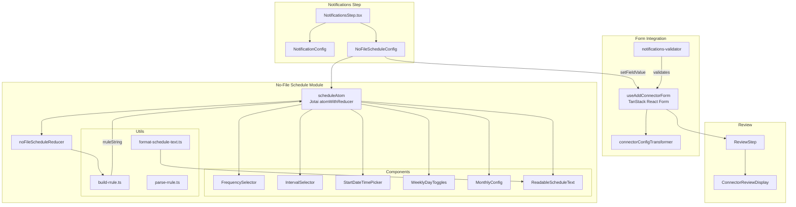
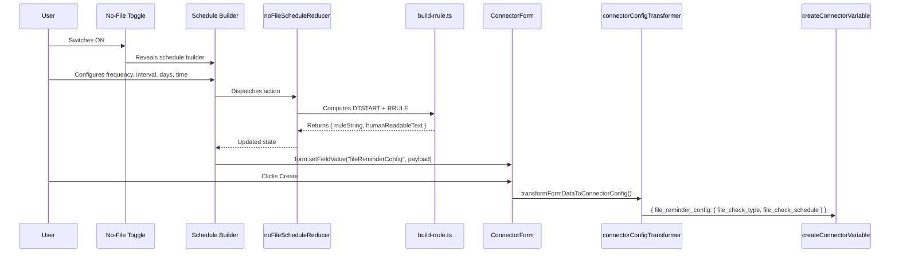

# Design Document: No-File Notification Schedule UI

## Overview

This design adds a schedule builder UI to the connector wizard's Notifications step, enabling users to configure when the system checks for missing files and sends alerts. The builder supports four frequency types (Hourly, Daily, Weekly, Monthly) and serialises user selections into an RRULE string payload (`file_reminder_config`) that flows through the existing `createConnectorVariable` gRPC endpoint — no new backend work required.

The implementation creates a new, clean RRULE builder rather than extending the existing `rrule-generator/` (which has known bugs: fragile regex post-processing, unconditional `byhour`/`byminute` that breaks hourly, unnecessary key sorting). The new builder uses Jotai's `atomWithReducer` for state management and constructs `DTSTART` manually as a string, using the `rrule` library only for the `RRULE` line, avoiding all regex post-processing.

### Key Design Decisions

1. **New builder, not a fork** — avoids inheriting existing `rrule-generator` bugs (fragile `untilRegexCheck`, `sortKeysAlphabetically`, unconditional `byhour`/`byminute`)
2. **Luxon DateTime for state** — consistent with Database app patterns, avoids timezone bugs
3. **Manual DTSTART construction** — eliminates fragile regex post-processing; format `DTSTART;TZID=Pacific/Auckland:YYYYMMDDTHHmmss` directly from Luxon
4. **Conditional byhour/byminute** — omit for hourly frequency (hourly + byhour is semantically wrong)
5. **No UNTIL / no EndConfig** — schedule runs indefinitely, simplifying the builder
6. **Extend existing notifications-validator** — schedule validation is part of the Notifications step, not a separate step
7. **Jotai `atomWithReducer` for state** — the schedule state is tightly coupled (changing frequency cascades resets to interval, weekdays, rruleString, humanReadableText in one dispatch). `useReducer` + Context was initially considered and would work equivalently, but the team prefers Jotai for consistency across the codebase. `atomWithReducer` provides the same reducer pattern without Context/Provider boilerplate — components access state via `useAtom(scheduleAtom)` directly. The reducer logic and tests remain identical either way.

## Architecture



### Data Flow



## Components and Interfaces

### New Files

All new files live under:
`monorepo/apps/database/src/domains/add-connector/components/config/no-file-schedule/`

```
no-file-schedule/
├── NoFileScheduleConfig.tsx          # Toggle + conditional builder wrapper
├── atoms.ts                           # Jotai atomWithReducer + derived atoms
├── reducer.ts                         # State reducer with RRULE recomputation
├── types.ts                           # NoFileFrequency, State, Action types
├── constants.ts                       # Interval ranges, frequency options, day labels
├── utils/
│   ├── build-rrule.ts                 # DTSTART builder + RRULE builder (no regex)
│   ├── format-schedule-text.ts        # Human-readable text generator
│   └── parse-rrule.ts                 # For future edit mode (RRULE string → state)
└── components/
    ├── FrequencySelector.tsx           # Radio toggle group (Hourly|Daily|Weekly|Monthly)
    ├── IntervalSelector.tsx            # Dropdown with frequency-specific range
    ├── StartDateTimePicker.tsx         # Date picker + time picker
    ├── WeeklyDayToggles.tsx            # Day-of-week multi-toggle (Mon–Sun)
    ├── MonthlyConfig.tsx               # Pattern toggle (Day|Date) + sub-configs
    └── ReadableScheduleText.tsx        # Preview text display
```

### Existing Files to Modify

| File | Change |
|------|--------|
| `connector-wizard.types.ts` | Add `fileReminderConfig?: FileReminderConfig \| null` to `ConnectorFormData` |
| `useAddConnectorForm.ts` | Add `fileReminderConfig: null` to `defaultValues` |
| `NotificationsStep.tsx` | Import and render `NoFileScheduleConfig` below `NotificationConfig` |
| `connectorConfigTransformer.ts` | Replace hardcoded `file_reminder_config: null` with conditional pass-through from `formData.fileReminderConfig` |
| `notifications-validator.ts` | Add schedule validation rules when toggle is on |
| `ConnectorReviewDisplay.tsx` | Add "No File Notification Schedule" section |
| `ReviewStep.tsx` | Pass `fileReminderConfig` prop through |

### Component Interfaces

```typescript
// NoFileScheduleConfig.tsx — Top-level wrapper
interface NoFileScheduleConfigProps {
  form: ReturnType<typeof useAddConnectorForm>["form"];
  getStepErrors?: () => Array<{ field?: string; message: string }>;
}

// FrequencySelector.tsx — Radio toggle group
interface FrequencySelectorProps {
  value: NoFileFrequency;
  onChange: (frequency: NoFileFrequency) => void;
}

// IntervalSelector.tsx — Dropdown with frequency-specific range
interface IntervalSelectorProps {
  frequency: NoFileFrequency;
  value: number;
  onChange: (interval: number) => void;
}

// StartDateTimePicker.tsx — Date + time pickers
interface StartDateTimePickerProps {
  date: DateTime;
  onDateChange: (date: DateTime) => void;
  onTimeChange: (time: DateTime) => void;
  minDate?: DateTime;
}

// WeeklyDayToggles.tsx — Day-of-week multi-toggle
interface WeeklyDayTogglesProps {
  selectedDays: DayAbbreviation[];
  onChange: (days: DayAbbreviation[]) => void;
}

// MonthlyConfig.tsx — Pattern toggle + sub-configs
interface MonthlyConfigProps {
  pattern: "Day" | "Date";
  onPatternChange: (pattern: "Day" | "Date") => void;
  ordinal?: number;
  weekday?: DayAbbreviation | "weekday" | "weekend";
  onOrdinalChange: (ordinal: number) => void;
  onWeekdayChange: (weekday: DayAbbreviation | "weekday" | "weekend") => void;
  selectedDays: number[];
  onDaysChange: (days: number[]) => void;
  interval: number;
  onIntervalChange: (interval: number) => void;
  atTime: DateTime;
  onTimeChange: (time: DateTime) => void;
}

// ReadableScheduleText.tsx — Preview text
interface ReadableScheduleTextProps {
  text: string;
}
```

### Jotai atomWithReducer Pattern

The schedule state is managed by a Jotai `atomWithReducer` atom. Components access state and dispatch via `useAtom(scheduleAtom)`. A derived atom (`scheduleFormSyncAtom`) handles syncing the computed RRULE to the parent TanStack form via `form.setFieldValue("fileReminderConfig", ...)`.

```typescript
// atoms.ts
import { atomWithReducer } from 'jotai/utils';

export const scheduleAtom = atomWithReducer(getInitialState(), noFileScheduleReducer);
// Components use: const [state, dispatch] = useAtom(scheduleAtom);
```

### build-rrule.ts — RRULE Construction (No Regex)

The core design difference from the existing `rrule-generator`:

1. **DTSTART** is constructed manually from Luxon DateTime — no regex replacement
2. **RRULE line** uses the `rrule` library but strips any DTSTART it adds
3. **byhour/byminute** are conditionally included (omitted for hourly)
4. **No UNTIL** — no sentinel date, no `untilRegexCheck`

```typescript
function buildDtstart(dt: DateTime): string {
  return `DTSTART;TZID=Pacific/Auckland:${dt.toFormat("yyyyMMdd'T'HHmmss")}`;
}

function buildRRuleLine(state: NoFileScheduleState): string {
  const options: Partial<Options> = {
    freq: frequencyMap[state.frequency],
    interval: state.interval,
  };

  if (state.frequency !== "hourly") {
    options.byhour = [state.startDate.hour];
    options.byminute = [state.startDate.minute];
  }

  if (state.frequency === "weekly") {
    options.byweekday = state.selectedWeekdays.map(day => DAYS_OF_WEEK[day]);
  }

  if (state.frequency === "monthly") {
    if (state.monthlyPattern === "Date") {
      options.bymonthday = state.selectedMonthDays;
    } else {
      options.bysetpos = [state.monthlyOrdinal ?? 1];
      options.byweekday = [DAYS_OF_WEEK[state.monthlyWeekday ?? "MO"]];
    }
  }

  const rule = new RRule(options);
  return rule.toString().replace(/^DTSTART.*\n/, "");
}

export function buildRRule(state: NoFileScheduleState): string {
  return `${buildDtstart(state.startDate)}\n${buildRRuleLine(state)}`;
}
```

### format-schedule-text.ts — Human-Readable Text

Generates preview text like:
- "Every 2 hours starting Jan 15, 2025 at 09:00"
- "Every day at 14:30 starting Jan 15, 2025"
- "Every 2 weeks on Monday, Wednesday at 09:00 starting Jan 15, 2025"
- "Every month on the first Monday at 09:00 starting Jan 15, 2025"
- "Every 3 months on the 1st, 15th at 09:00 starting Jan 15, 2025"

### parse-rrule.ts — Future Edit Mode

Parses an RRULE string back into `NoFileScheduleState`. Needed for future edit mode when loading an existing connector's schedule. Uses the `rrule` library's `RRule.fromString()` and maps back to state shape.

## Data Models

### State Shape

```typescript
type NoFileFrequency = "hourly" | "daily" | "weekly" | "monthly";

type DayAbbreviation = "MO" | "TU" | "WE" | "TH" | "FR" | "SA" | "SU";

type NoFileScheduleState = {
  enabled: boolean;
  frequency: NoFileFrequency;
  interval: number;
  startDate: DateTime;              // Luxon DateTime in Pacific/Auckland
  selectedWeekdays: DayAbbreviation[];
  monthlyPattern: "Day" | "Date";
  selectedMonthDays: number[];      // 1-31
  monthlyOrdinal: number;           // 1=first, 2=second, 3=third, 4=fourth, -1=last
  monthlyWeekday: DayAbbreviation | "weekday" | "weekend";
  rruleString: string;
  humanReadableText: string;
};
```

### Action Types

```typescript
type NoFileScheduleAction =
  | { type: "SET_ENABLED"; payload: boolean }
  | { type: "SET_FREQUENCY"; payload: NoFileFrequency }
  | { type: "SET_INTERVAL"; payload: number }
  | { type: "SET_START_DATE"; payload: DateTime }
  | { type: "SET_START_TIME"; payload: DateTime }
  | { type: "SET_SELECTED_WEEKDAYS"; payload: DayAbbreviation[] }
  | { type: "SET_MONTHLY_PATTERN"; payload: "Day" | "Date" }
  | { type: "SET_SELECTED_MONTH_DAYS"; payload: number[] }
  | { type: "SET_MONTHLY_ORDINAL"; payload: number }
  | { type: "SET_MONTHLY_WEEKDAY"; payload: DayAbbreviation | "weekday" | "weekend" }
  | { type: "RESET" };
```

### Reducer Behaviour

The `SET_FREQUENCY` action resets all frequency-specific fields to defaults while preserving `startDate`:

| Field | Hourly Default | Daily Default | Weekly Default | Monthly Default |
|-------|---------------|---------------|----------------|-----------------|
| interval | 1 | 1 | 1 | 1 |
| selectedWeekdays | [] | [] | ["MO"] | [] |
| monthlyPattern | — | — | — | "Day" |
| selectedMonthDays | [] | [] | [] | [1] |
| monthlyOrdinal | — | — | — | 1 (first) |
| monthlyWeekday | — | — | — | "MO" |

### Constants

```typescript
const INTERVAL_RANGES: Record<NoFileFrequency, { min: number; max: number }> = {
  hourly:  { min: 1, max: 23 },
  daily:   { min: 1, max: 6 },
  weekly:  { min: 1, max: 10 },
  monthly: { min: 1, max: 12 },
};

const FREQUENCY_OPTIONS: { value: NoFileFrequency; label: string }[] = [
  { value: "hourly", label: "Hourly" },
  { value: "daily", label: "Daily" },
  { value: "weekly", label: "Weekly" },
  { value: "monthly", label: "Monthly" },
];

const ORDINAL_OPTIONS = [
  { value: 1, label: "first" },
  { value: 2, label: "second" },
  { value: 3, label: "third" },
  { value: 4, label: "fourth" },
  { value: -1, label: "last" },
];

const MONTHLY_DAY_WEEKDAY_OPTIONS = [
  { value: "MO", label: "Monday" },
  { value: "TU", label: "Tuesday" },
  { value: "WE", label: "Wednesday" },
  { value: "TH", label: "Thursday" },
  { value: "FR", label: "Friday" },
  { value: "SA", label: "Saturday" },
  { value: "SU", label: "Sunday" },
  { value: "weekday", label: "weekday" },
  { value: "weekend", label: "weekend day" },
];
```

### Form Data Extension

```typescript
// Added to ConnectorFormData in connector-wizard.types.ts
interface ConnectorFormData {
  // ... existing fields ...
  fileReminderConfig?: {
    file_check_type: string;
    file_check_schedule: string;
  } | null;
}
```

### Payload Shape (Backend Contract)

```typescript
// Matches FileReminderCheckConfigSchema from @monorepo/packages-schemas
{
  file_check_type: "since_start_of_day" | "since_most_recent_monday",
  file_check_schedule: string  // Full RRULE string with DTSTART;TZID=Pacific/Auckland
}
```

### Transformer Logic

In `connectorConfigTransformer.ts`, the hardcoded `file_reminder_config: null` is replaced:

```typescript
file_reminder_config: formData.fileReminderConfig ?? null,
```

### Validation Rules (notifications-validator.ts extension)

When `fileReminderConfig` is present (toggle is on):
- `file_check_schedule` must be a non-empty string
- `file_check_schedule` must contain `DTSTART;TZID=Pacific/Auckland`
- `file_check_schedule` must contain one of `FREQ=HOURLY`, `FREQ=DAILY`, `FREQ=WEEKLY`, `FREQ=MONTHLY`
- `file_check_schedule` must NOT contain `FREQ=MINUTELY`
- Start date must not be in the past
- Weekly: at least one weekday selected
- Monthly Date: at least one day selected

When `fileReminderConfig` is null/undefined (toggle is off): no schedule validation.

## Correctness Properties

*A property is a characteristic or behavior that should hold true across all valid executions of a system — essentially, a formal statement about what the system should do. Properties serve as the bridge between human-readable specifications and machine-verifiable correctness guarantees.*

### Property 1: Toggle off clears schedule state

*For any* `NoFileScheduleState` where `enabled` is true and fields have been configured, dispatching `SET_ENABLED(false)` should result in `fileReminderConfig` being set to `null` on the form, clearing all schedule-related state.

**Validates: Requirements 1.3**

### Property 2: Time rounding to nearest hour

*For any* Luxon `DateTime`, rounding to the nearest hour should produce a `DateTime` where `minute === 0` and `second === 0`, and the hour is the closest hour to the original time (rounding up at 30 minutes).

**Validates: Requirements 2.3**

### Property 3: Past date validation rejection

*For any* `DateTime` that is before `DateTime.now()` in the `Pacific/Auckland` timezone, the schedule validation should produce an error for the start date field.

**Validates: Requirements 2.4, 9.6**

### Property 4: RRULE generation validity

*For any* valid `NoFileScheduleState`, the generated RRULE string must:
- Contain `DTSTART;TZID=Pacific/Auckland:` followed by a valid datetime in `YYYYMMDDTHHmmss` format
- Contain exactly one of `FREQ=HOURLY`, `FREQ=DAILY`, `FREQ=WEEKLY`, or `FREQ=MONTHLY`
- Never contain `FREQ=MINUTELY` or any other frequency
- When frequency is `hourly`, must NOT contain `BYHOUR` or `BYMINUTE`
- When frequency is `weekly`, must contain `BYDAY` with valid day abbreviations
- When frequency is `monthly` with Date pattern, must contain `BYMONTHDAY`
- When frequency is `monthly` with Day pattern, must contain `BYSETPOS` and `BYDAY`

**Validates: Requirements 10.2, 10.3**

### Property 5: RRULE serialisation round-trip

*For any* valid `NoFileScheduleState`, calling `buildRRule(state)` to produce an RRULE string and then `parseRRule(rruleString)` to reconstruct the state should produce an equivalent schedule configuration (same frequency, interval, selected weekdays, monthly pattern, selected month days, ordinal, weekday, and start date/time).

**Validates: Requirements 10.6**

### Property 6: Frequency switch resets fields but preserves startDate

*For any* `NoFileScheduleState` with arbitrary configured values and *for any* target frequency, dispatching `SET_FREQUENCY(targetFrequency)` should:
- Reset `interval` to 1
- Reset `selectedWeekdays` to the target frequency's default (e.g., `["MO"]` for weekly, `[]` otherwise)
- Reset `monthlyPattern` to `"Day"` for monthly, clear for others
- Reset `selectedMonthDays` to `[1]` for monthly, `[]` for others
- Reset `monthlyOrdinal` to `1` for monthly
- Reset `monthlyWeekday` to `"MO"` for monthly
- Preserve the original `startDate` unchanged

**Validates: Requirements 3.4, 11.1, 11.2, 11.3, 11.4, 11.5**

### Property 7: Transformer conditional pass-through

*For any* `ConnectorFormData`, if `fileReminderConfig` is set (non-null), then `transformFormDataToConnectorConfig()` should include it as `file_reminder_config` in the output. If `fileReminderConfig` is null or undefined, then `file_reminder_config` in the output should be `null`.

**Validates: Requirements 10.4, 10.5**

### Property 8: Validation blocks progression when fields incomplete

*For any* frequency type and *for any* schedule state where a required field is missing or invalid (e.g., no weekday selected for weekly, no month day selected for monthly Date, missing start date), the `validateNotifications` function should return `isValid: false` with at least one error referencing the incomplete field.

**Validates: Requirements 9.1**

### Property 9: Human-readable text contains schedule details

*For any* valid `NoFileScheduleState`, the generated human-readable text should contain:
- The frequency type name (or interval + frequency unit if interval > 1)
- The selected days (for weekly: day names; for monthly Date: day numbers)
- The scheduled time in HH:mm format (for non-hourly frequencies)

**Validates: Requirements 12.3**

## Error Handling

### Validation Errors

| Scenario | Error Message | Field |
|----------|--------------|-------|
| Toggle on, no start date | "Start date is required" | `fileReminderConfig.startDate` |
| Start date in the past | "Start date must not be in the past" | `fileReminderConfig.startDate` |
| Weekly, no days selected | "At least one day must be selected" | `fileReminderConfig.selectedWeekdays` |
| Monthly Date, no days selected | "At least one day of the month must be selected" | `fileReminderConfig.selectedMonthDays` |
| Invalid RRULE generated | "Invalid schedule configuration" | `fileReminderConfig.file_check_schedule` |

### Edge Cases

- **Last day prevention**: When only one weekday (weekly) or one month day (monthly Date) is selected, the UI prevents deselection by ignoring the toggle action. The reducer checks `selectedWeekdays.length > 1` or `selectedMonthDays.length > 1` before allowing removal.
- **Day 31 in short months**: The Day_Of_Month_Chips allows selection of day 31. The RRULE spec handles this correctly — if a month doesn't have day 31, that occurrence is simply skipped. No UI warning needed.
- **Timezone consistency**: All DateTime operations use `Pacific/Auckland` via Luxon. The DTSTART is constructed with `TZID=Pacific/Auckland` — no UTC conversion needed in the builder.
- **Hourly + byhour conflict**: The builder explicitly omits `byhour` and `byminute` for hourly frequency to avoid the semantic conflict present in the existing rrule-generator.

### Reducer Error Prevention

The reducer enforces invariants:
- `interval` is clamped to the frequency's valid range (`INTERVAL_RANGES[frequency]`)
- `selectedWeekdays` always has at least one element when frequency is weekly
- `selectedMonthDays` always has at least one element when monthly Date pattern is active
- `monthlyOrdinal` defaults to 1 if undefined when monthly Day pattern is active

## Testing Strategy

### Dual Testing Approach

This feature requires both unit tests and property-based tests:

- **Unit tests**: Verify specific examples, edge cases, UI rendering, and integration points
- **Property tests**: Verify universal properties across all valid inputs using randomised generation

### Property-Based Testing Configuration

- **Library**: [fast-check](https://github.com/dubzzz/fast-check) — the standard PBT library for TypeScript/JavaScript
- **Minimum iterations**: 100 per property test
- **Test runner**: Bun test (existing project test runner)
- **Tag format**: Each property test must include a comment referencing the design property:
  ```
  // Feature: no-file-notification-schedule-ui, Property N: <property text>
  ```
- **Each correctness property must be implemented by a single property-based test**

### Unit Test Coverage

Unit tests should cover:

1. **Component rendering**: Toggle visibility, frequency-specific field sets, default values
2. **Reducer actions**: Each action type produces correct state transitions
3. **Constants**: Interval ranges, frequency options, ordinal options match requirements
4. **Validation**: Specific error scenarios (past date, empty weekdays, empty month days)
5. **Transformer**: Correct payload shape for both toggle-on and toggle-off cases
6. **Review display**: Schedule summary section visibility and content
7. **Edge cases**: Last-day prevention, day 31 handling, hourly byhour omission

### Property Test Coverage

Each correctness property (P1–P9) maps to one property-based test:

| Property | Generator Strategy |
|----------|-------------------|
| P1: Toggle off clears state | Generate arbitrary `NoFileScheduleState` with `enabled: true` |
| P2: Time rounding | Generate arbitrary `DateTime` values |
| P3: Past date rejection | Generate `DateTime` values before `now()` |
| P4: RRULE validity | Generate arbitrary valid `NoFileScheduleState` across all frequencies |
| P5: Round-trip | Generate arbitrary valid `NoFileScheduleState`, build then parse |
| P6: Frequency reset | Generate arbitrary state + target frequency pair |
| P7: Transformer pass-through | Generate `ConnectorFormData` with/without `fileReminderConfig` |
| P8: Validation blocking | Generate states with strategically missing required fields |
| P9: Human-readable text | Generate arbitrary valid `NoFileScheduleState` |

### Generator Design

A custom `fast-check` `Arbitrary<NoFileScheduleState>` generator should:
- Pick frequency from `["hourly", "daily", "weekly", "monthly"]`
- Generate interval within the frequency's valid range
- Generate `startDate` as a future `DateTime` in `Pacific/Auckland`
- For weekly: generate 1–7 unique weekdays
- For monthly Day: generate ordinal from `[1,2,3,4,-1]` and weekday
- For monthly Date: generate 1–31 unique days from 1–31
- Compute `rruleString` and `humanReadableText` via the actual utility functions

