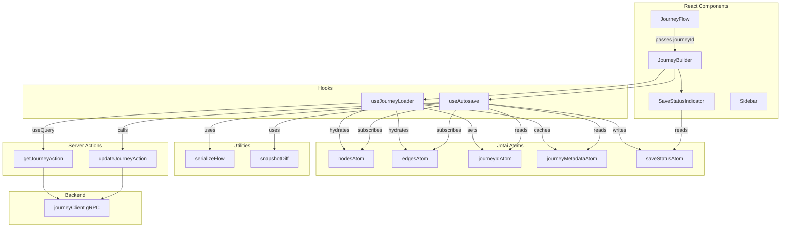

# Design Document: Journey Canvas Autosave

## Overview

This design adds automatic server persistence to the Journey Builder canvas. Currently, the only "save" mechanism downloads a JSON file locally via `saveFlow()`. This feature replaces that with a debounced autosave system that serializes canvas state, diffs it against the last-saved snapshot, and persists changes to the backend via the existing `journeyClient.updateJourney()` gRPC endpoint. On mount, the canvas loads previously saved data from the server.

The system is built around a custom `useAutosave` hook that subscribes to Jotai atoms (`nodesAtom`, `edgesAtom`), debounces changes (2s trailing), diffs serialized snapshots, and manages a single-in-flight save queue with exponential backoff retry. TanStack Query's `useQuery` handles the initial load. A `SaveStatusIndicator` component reflects the current save state (idle, saving, saved, error) on the canvas.

The manual save button is retained in the sidebar — it triggers an immediate save (bypassing debounce) using the same server action. The `saveFlow` JSON-download function is removed. On save failure, an error toast notification is displayed using the existing `sonner` toast library.

## Architecture



### Data Flow

1. **Load**: `useJourneyLoader` calls `getJourneyAction` via `useQuery` → hydrates atoms + caches metadata
2. **Edit**: User edits canvas → React Flow dispatches changes → action atoms update `nodesAtom`/`edgesAtom`
3. **Detect**: `useAutosave` subscribes to atoms → debounces 2s → serializes → diffs snapshot
4. **Save**: If diff detected → calls `updateJourneyAction` (single in-flight, queued) → retries on failure
5. **Display**: `saveStatusAtom` drives `SaveStatusIndicator` (idle → saving → saved → error)

## Components and Interfaces

### New Atoms (`state/global-flow-atoms.ts`)

```typescript
// Journey identity — set on mount by useJourneyLoader
export const journeyIdAtom = atom<string | null>(null);

// Cached server metadata for read-modify-write pattern
export interface JourneyMetadata {
  displayName: string;
  status: JourneyStatus;
}
export const journeyMetadataAtom = atom<JourneyMetadata | null>(null);

// Save status for UI indicator
export type SaveStatus = "idle" | "saving" | "saved" | "error";
export const saveStatusAtom = atom<SaveStatus>("idle");
```

### `serializeFlow(nodes, edges)` — Pure Utility (`utils/serialize-flow.ts`)

Extracts a clean `FlowData` from React Flow nodes/edges, stripping transient properties.

```typescript
export function serializeFlow(
  nodes: Node<SpecificNodeData>[],
  edges: Edge[]
): FlowData {
  return {
    nodes: nodes.map(({ id, position, data, type }) => {
      const { icon, measured, selected, dragging, ...cleanData } = data as Record<string, unknown>;
      return { id, position, data: cleanData, type } as SerializedNode;
    }),
    edges: edges.map(({ id, source, target, sourceHandle, targetHandle, type }) => ({
      id, source, target, sourceHandle, targetHandle, type,
    })),
  };
}
```

Key constraints:
- Strips `icon` (React component), `measured`, `selected`, `dragging`
- Output must be safe for `JSON.stringify` — no `undefined`, class instances, BigInt, Date, NaN, Infinity
- Reused by both autosave and any future export

### `createSnapshot(flowData)` / `snapshotsEqual(a, b)` — Diffing (`utils/snapshot.ts`)

```typescript
export function createSnapshot(flowData: FlowData): string {
  return JSON.stringify(flowData);
}

export function snapshotsEqual(a: string, b: string): boolean {
  return a === b;
}
```

Simple string comparison of JSON-serialized FlowData. This is intentionally naive — structural equality via string comparison is sufficient because `serializeFlow` produces deterministic output (same property order from destructuring).

### `useJourneyLoader(journeyId)` — Load Hook (`hooks/use-journey-loader.ts`)

```typescript
export function useJourneyLoader(journeyId: string) {
  const setNodes = useSetAtom(setNodesAtom);
  const setEdges = useSetAtom(setEdgesAtom);
  const setJourneyId = useSetAtom(journeyIdAtom);
  const setMetadata = useSetAtom(journeyMetadataAtom);

  const query = useQuery({
    queryKey: ["journey", journeyId],
    queryFn: () => getJourneyAction(journeyId),
    staleTime: Infinity,       // Don't refetch — autosave is the writer
    refetchOnWindowFocus: false,
  });

  useEffect(() => {
    setJourneyId(journeyId);
  }, [journeyId, setJourneyId]);

  useEffect(() => {
    if (!query.data) return;
    const journey = query.data;

    setMetadata({ displayName: journey.displayName, status: journey.status });

    if (journey.config) {
      const flowData = journey.config as unknown as FlowData;
      // Deserialize: rehydrate nodes with icons via createNodeData
      const hydratedNodes = flowData.nodes.map((node) => ({
        ...node,
        data: createNodeData(node.type as NodeType, node.data),
      }));
      setNodes(hydratedNodes);
      setEdges(flowData.edges);
    }
    // If no config, leave default start/end nodes from JourneyBuilder's useEffect
  }, [query.data, setNodes, setEdges, setMetadata]);

  return query; // Expose isLoading, isError for UI
}
```

Design decisions:
- `staleTime: Infinity` — the client is the sole writer, no need to refetch
- Falls back to default start/end nodes (already created by JourneyBuilder's existing `useEffect`) when no saved config exists
- Caches `displayName` and `status` in `journeyMetadataAtom` for the read-modify-write update pattern

### `useAutosave()` — Core Autosave Hook (`hooks/use-autosave.ts`)

```typescript
export function useAutosave() {
  const nodes = useAtomValue(nodesAtom);
  const edges = useAtomValue(edgesAtom);
  const journeyId = useAtomValue(journeyIdAtom);
  const metadata = useAtomValue(journeyMetadataAtom);
  const setSaveStatus = useSetAtom(saveStatusAtom);

  const lastSavedSnapshotRef = useRef<string | null>(null);
  const saveInFlightRef = useRef(false);
  const pendingSnapshotRef = useRef<string | null>(null);
  const debounceTimerRef = useRef<ReturnType<typeof setTimeout> | null>(null);
  const retryCountRef = useRef(0);

  // ... debounce + diff + save logic
}
```

Internal flow:
1. Subscribe to `nodesAtom` / `edgesAtom` via `useAtomValue`
2. On change → reset 2s debounce timer
3. On timer expiry → `serializeFlow` → `createSnapshot` → compare with `lastSavedSnapshotRef`
4. If different → set status `"saving"` → call `updateJourneyAction`
5. Single in-flight: if save running, store snapshot in `pendingSnapshotRef`
6. On success → update `lastSavedSnapshotRef`, set status `"saved"`, start 3s fade timer
7. On failure → retry with exponential backoff (1s, 2s, 4s), max 3 attempts
8. After 3 failures → set status `"error"`, expose `retry()` function
9. `beforeunload` handler registered when current snapshot ≠ last saved

### `updateJourneyAction(journeyId, flowData, metadata)` — Server Action

```typescript
// domains/journeys/actions/update-journey.ts
"use server";

export async function updateJourneyAction(
  journeyId: string,
  config: FlowData,
  displayName: string,
  status: JourneyStatus
): Promise<void> {
  await requireSessionInfoCached();
  await journeyClient.updateJourney({
    id: journeyId,
    displayName,
    config: config as unknown as JsonObject,
    status,
  });
}
```

### `getJourneyAction(journeyId)` — Server Action

```typescript
// domains/journeys/actions/get-journey.ts
"use server";

export async function getJourneyAction(journeyId: string) {
  await requireSessionInfoCached();
  const journey = await journeyClient.getJourney({ id: journeyId });
  return {
    id: journey.id,
    displayName: journey.displayName,
    config: journey.config,
    status: journey.status,
  };
}
```

### `SaveStatusIndicator` — UI Component (`components/save-status-indicator.tsx`)

Reads `saveStatusAtom` and renders:
- `"idle"` → nothing (hidden)
- `"saving"` → spinner + "Saving..."
- `"saved"` → checkmark + "Saved" (fades after 3s)
- `"error"` → triggers a toast notification via `sonner` with red warning icon, "Save Failed" heading, and "Please retry" message

Positioned in the canvas overlay area, near the existing "Editing: {journeyId}" badge.

### Save Button in Sidebar

The Save button is retained and updated:
- Reads `saveStatusAtom` to show a rotating loader/spinner beside the "Save" text while saving is in progress
- On click: triggers an immediate save (bypasses the 2s debounce) by calling the `useAutosave` hook's `saveNow()` function
- After a failed save, clicking Save resets the retry counter and attempts a fresh save

### Error Toast Notification

On save failure (after all retries exhausted), display a toast using the existing `sonner` library:
```
┌─────────────────────────────┐
│ ⚠️ (red)  Save Failed       │
│           Please retry       │
└─────────────────────────────┘
```
Uses `toast.error()` from sonner, which is already used throughout the app (see list page).

### Component Integration Changes

**`JourneyFlow.tsx`**: Pass `journeyId` to `JourneyBuilder` as a prop.

**`JourneyBuilder.tsx`**:
- Accept `journeyId` prop
- Call `useJourneyLoader(journeyId)` — loads saved data on mount
- Call `useAutosave()` — starts monitoring after load, exposes `saveNow()` and `retry()`
- Render `<SaveStatusIndicator />` in the overlay
- Pass `saveNow` to `<Sidebar />` as the `onSave` prop (replaces JSON download with server save)

**`Sidebar.tsx`**: Keep `onSave` prop. Update Save button to show a rotating loader beside "Save" text when `saveStatusAtom` is `"saving"`.

**`flow-utils.ts`**: Remove `saveFlow()` function. Keep `loadFlow()` if still needed for file import.

## Data Models

### FlowData (existing, unchanged)

```typescript
interface FlowData {
  nodes: SerializedNode[];  // Node without icon, measured, selected, dragging
  edges: SerializedEdge[];  // Edge with only id, source, target, sourceHandle, targetHandle, type
}
```

### SerializedNode (existing, unchanged)

```typescript
type SerializedNode = {
  id: string;
  position: { x: number; y: number };
  data: Omit<SpecificNodeData, "icon">;
  type?: string;
};
```

### SerializedEdge (new type for clarity)

```typescript
type SerializedEdge = {
  id: string;
  source: string;
  target: string;
  sourceHandle?: string | null;
  targetHandle?: string | null;
  type?: string;
};
```

### JourneyMetadata (new)

```typescript
interface JourneyMetadata {
  displayName: string;
  status: JourneyStatus; // from generated proto enum
}
```

### SaveStatus (new)

```typescript
type SaveStatus = "idle" | "saving" | "saved" | "error";
```

### UpdateJourneyRequest (existing proto, for reference)

```typescript
{
  id: string;
  displayName: string;
  config?: JsonObject;  // google.protobuf.Struct — FlowData cast to JsonObject
  status: JourneyStatus;
}
```


## Correctness Properties

*A property is a characteristic or behavior that should hold true across all valid executions of a system — essentially, a formal statement about what the system should do. Properties serve as the bridge between human-readable specifications and machine-verifiable correctness guarantees.*

### Property 1: Serialization strips transient properties

*For any* array of React Flow nodes (with arbitrary `icon`, `measured`, `selected`, `dragging` values) and any array of edges (with arbitrary extra properties), `serializeFlow` should produce a `FlowData` where every node contains only `id`, `position`, `data`, and `type`, and every edge contains only `id`, `source`, `target`, `sourceHandle`, `targetHandle`, and `type`. No node in the output should have `icon`, `measured`, `selected`, or `dragging` in its `data`.

**Validates: Requirements 1.1, 1.2, 1.3**

### Property 2: Serialization round-trip

*For any* valid canvas state (nodes and edges), serializing via `serializeFlow`, then `JSON.stringify`, then `JSON.parse` should produce an object structurally deep-equal to the original `serializeFlow` output. This implies the serialized output contains no `undefined`, class instances, BigInt, Date, NaN, or Infinity values.

**Validates: Requirements 1.4, 1.5**

### Property 3: Snapshot diff correctness

*For any* two FlowData objects A and B, `snapshotsEqual(createSnapshot(A), createSnapshot(B))` returns `true` if and only if A and B are structurally identical. Equivalently: the same FlowData serialized twice produces equal snapshots, and any meaningful change (node added, node data edited, edge added/removed) produces unequal snapshots.

**Validates: Requirements 5.3, 5.4, 5.5**

### Property 4: Debounce coalesces rapid changes

*For any* sequence of N canvas changes arriving within the 2-second debounce window, the autosave system should trigger at most one save operation after the debounce timer expires, not N saves.

**Validates: Requirements 5.2**

### Property 5: Single in-flight save with queuing

*For any* sequence of save triggers, at most one save request is in-flight at any time. If changes occur during an in-flight save, they are queued and a new save is initiated after the current one completes.

**Validates: Requirements 5.6, 5.7**

### Property 6: Last-saved snapshot updated on success

*For any* successful save of FlowData F, the last-saved snapshot should equal `createSnapshot(F)`. A subsequent evaluation with the same canvas state should detect no diff and skip saving.

**Validates: Requirements 5.8**

### Property 7: Retry count invariant

*For any* failing save operation, the autosave system should attempt exactly 3 total attempts (1 initial + 2 retries) before giving up and setting the save status to `"error"`.

**Validates: Requirements 6.1, 6.3**

### Property 8: beforeunload registered iff unsaved changes

*For any* autosave state, the `beforeunload` event handler is registered if and only if the current snapshot differs from the last-saved snapshot. When snapshots are equal, no handler is registered.

**Validates: Requirements 7.1, 7.2**

### Property 9: Full-replacement update includes all fields

*For any* call to `updateJourneyAction`, the request sent to `journeyClient.updateJourney()` must include `id`, `displayName`, `config` (FlowData), and `status` — none may be omitted or undefined.

**Validates: Requirements 3.1**

## Error Handling

### Load Errors

| Scenario | Handling |
|---|---|
| `getJourneyAction` network failure | TanStack Query surfaces `isError` — `useJourneyLoader` returns error state. JourneyBuilder renders an error message instead of the canvas. |
| Journey not found (404/NOT_FOUND) | Same as above — error state displayed. User can navigate back to journey list. |
| Invalid/corrupt config in response | `loadFlow` deserialization falls back gracefully — if `config` is present but malformed, catch and fall back to default start/end nodes. Log warning. |

### Save Errors

| Scenario | Handling |
|---|---|
| `updateJourneyAction` network failure | Retry with exponential backoff: 1s → 2s → 4s. After 3 total attempts, set `saveStatusAtom` to `"error"`. |
| gRPC error (server-side) | Same retry logic. Error message propagated from server action. |
| All retries exhausted | `SaveStatusIndicator` shows "Save failed" with retry button. `beforeunload` handler remains active to prevent data loss. |
| Manual retry after failure | Resets retry counter, attempts save with current canvas state. |
| Tab close with unsaved changes | `beforeunload` triggers browser confirmation dialog. Jotai atoms preserve local state in memory — if user cancels close, no data is lost. |

### Edge Cases

| Scenario | Handling |
|---|---|
| Save triggered before metadata loaded | `useAutosave` checks that `journeyId` and `metadata` are non-null before saving. Skips save if not ready. |
| Rapid component mount/unmount | Debounce timer and in-flight save are cleaned up in `useEffect` cleanup. `beforeunload` handler removed on unmount. |
| Empty canvas (no nodes/edges) | `serializeFlow` handles empty arrays. Snapshot diff still works — saves empty state if it differs from last saved. |
| Concurrent browser tabs | Not handled — last write wins. This is acceptable for single-user journey editing. |

## Testing Strategy

### Testing Framework

- **Unit/example tests**: `bun:test` (already configured in the project)
- **Property-based tests**: `fast-check` library (to be added as a dev dependency)
- **Test location**: `monorepo/apps/journey-builder/__tests__/unit/`

### Property-Based Testing Configuration

- Each property test runs a minimum of 100 iterations
- Each test is tagged with a comment referencing the design property:
  `// Feature: journey-canvas-autosave, Property N: <property text>`
- Each correctness property is implemented by a single property-based test
- `fast-check` is used for arbitrary generation — no hand-rolled PBT framework

### Test Plan

#### Property Tests (via `fast-check`)

| Test | Property | What it generates |
|---|---|---|
| Serialization strips transient props | Property 1 | Random nodes with `icon`, `measured`, `selected`, `dragging` + random edges with extra props |
| Serialization round-trip | Property 2 | Random valid FlowData (nodes + edges) |
| Snapshot diff correctness | Property 3 | Pairs of FlowData — some identical, some with mutations |
| Debounce coalesces changes | Property 4 | Random sequences of rapid atom changes |
| Single in-flight with queuing | Property 5 | Random sequences of save triggers with varying async timing |
| Last-saved snapshot on success | Property 6 | Random FlowData saved successfully |
| Retry count invariant | Property 7 | Failing save operations with random error types |
| beforeunload iff unsaved | Property 8 | Random pairs of current/last-saved snapshots |
| Full-replacement update fields | Property 9 | Random FlowData + metadata combinations |

#### Unit Tests (specific examples and edge cases)

| Test | Validates | Description |
|---|---|---|
| Serialize empty canvas | Req 1.1-1.3 | Empty nodes/edges arrays produce valid FlowData |
| Serialize node with all transient props | Req 1.1 | Node with icon, measured, selected, dragging — all stripped |
| Load journey with saved config | Req 2.2 | Mock getJourneyAction returns FlowData → atoms hydrated |
| Load journey with no config | Req 2.3 | Mock returns null config → default start/end nodes |
| Load journey caches metadata | Req 2.4 | displayName and status stored in journeyMetadataAtom |
| Load journey failure | Req 2.6 | Mock getJourneyAction throws → error state |
| Save action success | Req 3.3 | Mock gRPC success → no error thrown |
| Save action failure propagation | Req 3.4 | Mock gRPC failure → error propagated |
| Status indicator states | Req 4.1-4.5 | Each SaveStatus value renders correct UI |
| Retry button triggers save | Req 4.6 | Click retry → save attempted |
| Exponential backoff timing | Req 6.2 | Verify delays are 1s, 2s, 4s |
| Manual retry resets counter | Req 6.4 | After 3 failures, manual retry resets and tries again |
| beforeunload cleanup on unmount | Req 7.3 | Hook unmount removes event listener |

### Test File Organization

```
__tests__/unit/
├── utils/
│   ├── serialize-flow.test.ts          # Property 1, 2 + unit tests
│   └── snapshot.test.ts                # Property 3 + unit tests
├── hooks/
│   ├── use-autosave.test.ts            # Property 4, 5, 6, 7, 8 + unit tests
│   └── use-journey-loader.test.ts      # Unit tests for load behavior
├── domains/journeys/actions/
│   ├── update-journey.test.ts          # Property 9 + unit tests
│   └── get-journey.test.ts             # Unit tests for load action
└── components/
    └── save-status-indicator.test.ts   # Unit tests for UI states
```
