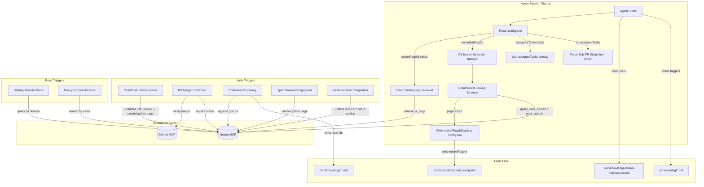
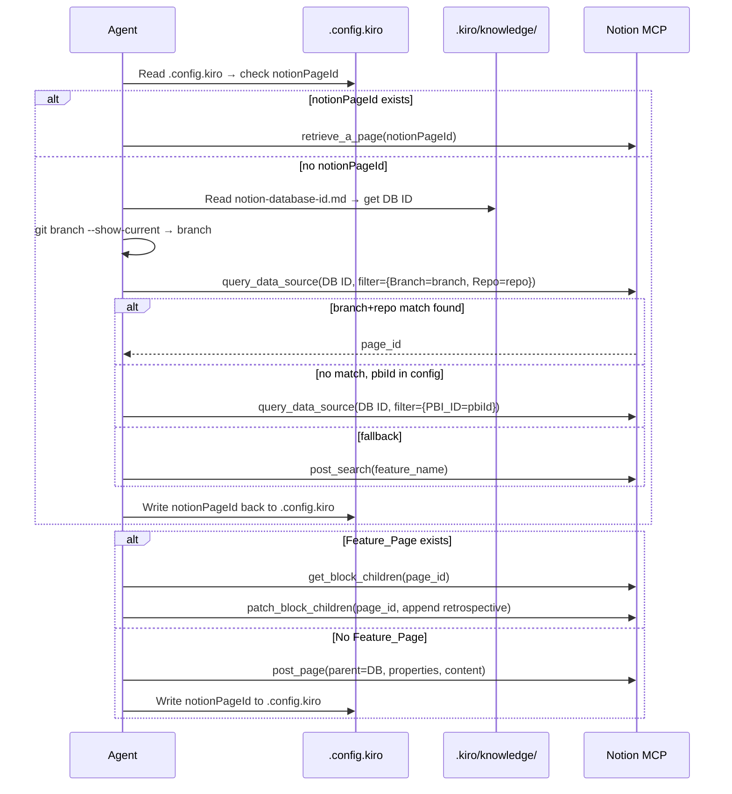
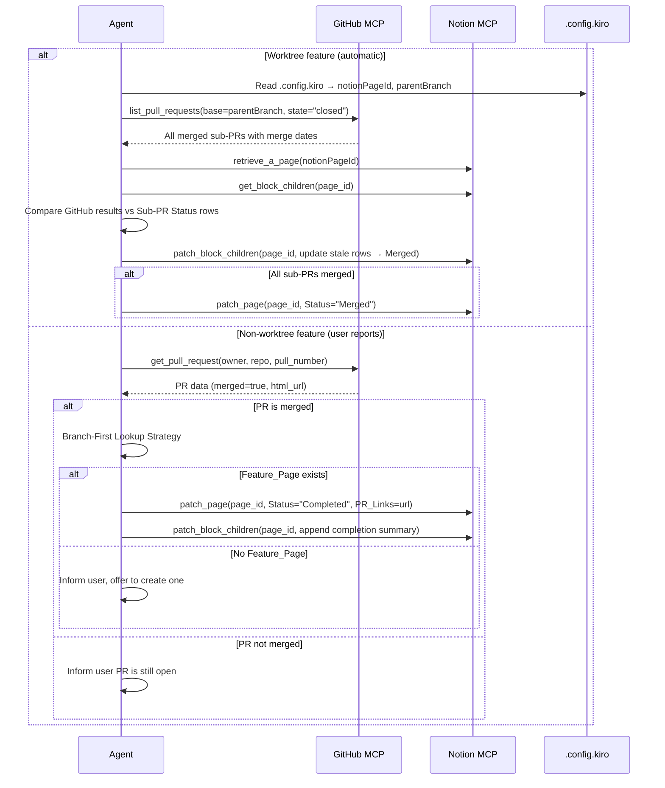
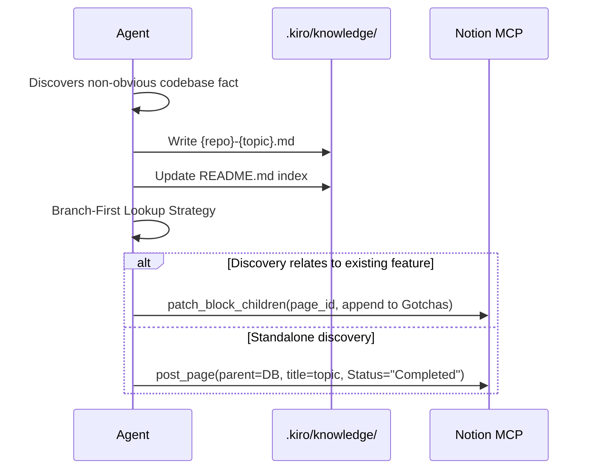
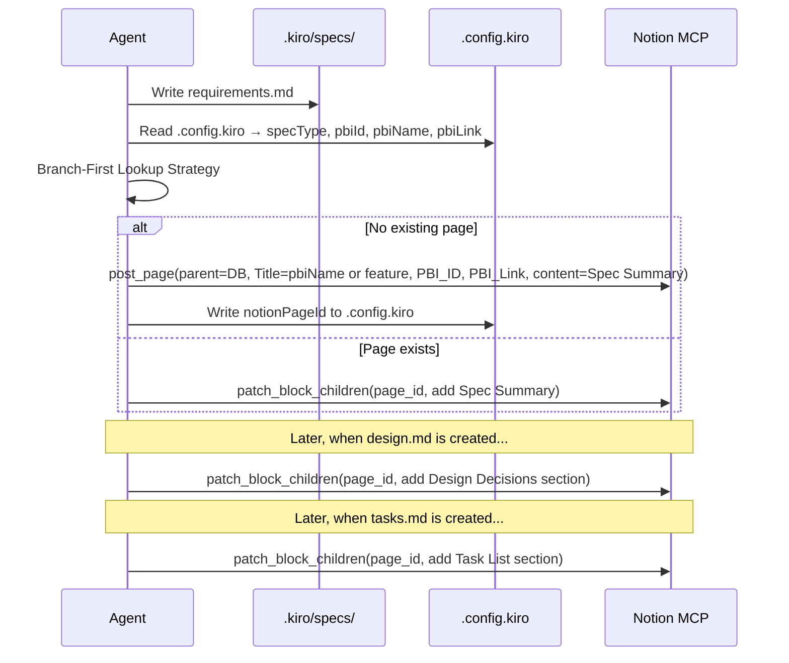
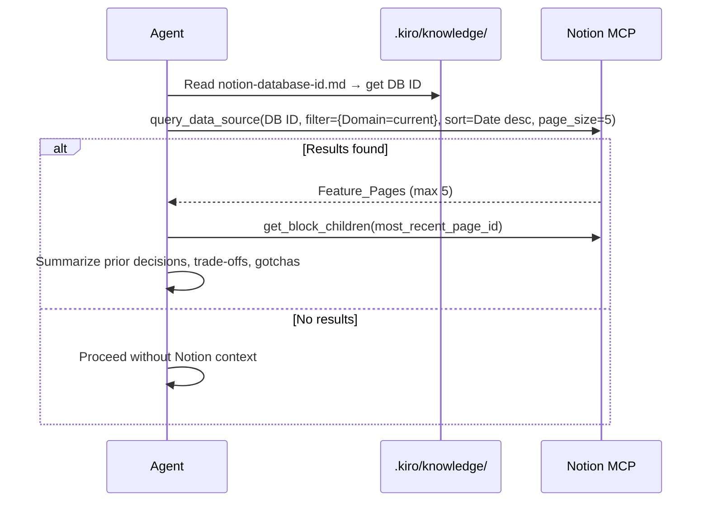
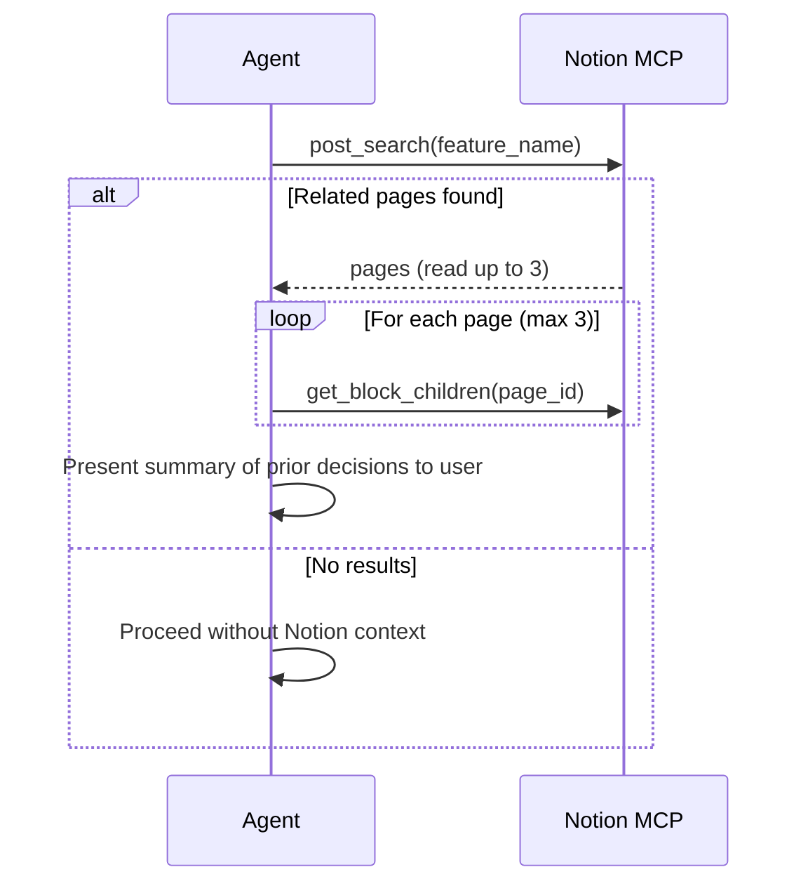
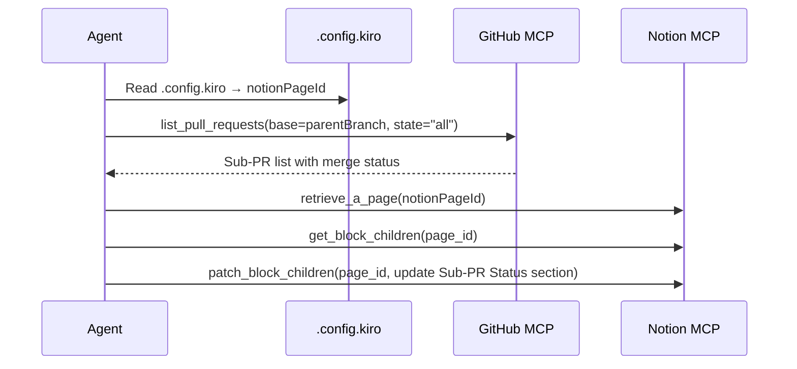
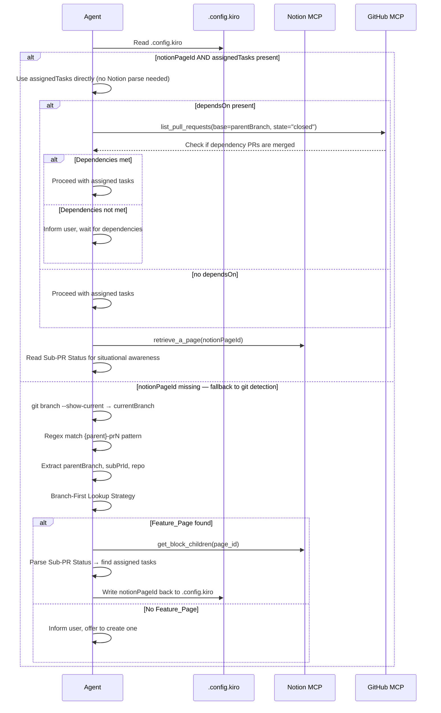
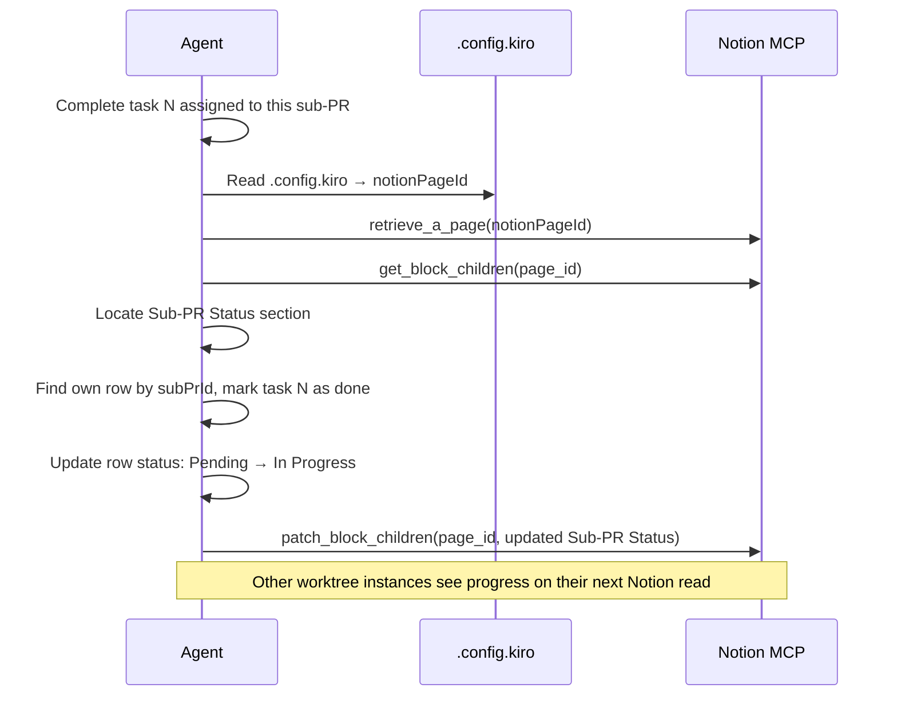

# Design Document: Notion Knowledge Base

## Overview

This feature establishes Notion as a persistent engineering knowledge base for the Ubiquity platform. It is an **agent infrastructure feature** — there is no application code. The deliverables are:

1. A Notion database ("Engineering Decisions") created via Notion MCP tools with 10 properties (including PBI tracking)
2. A local cache file (`.kiro/knowledge/notion-database-id.md`) storing the database ID
3. Updates to three steering/guide files adding Notion integration instructions
4. A standardized Feature Page content template for all entries
5. A `.config.kiro` schema that serves as the single source of truth for each worktree instance

The system operates on a **trigger-based model**: agents write to Notion at specific moments (post-push retrospective, PR merge, codebase discovery, spec creation/progression, worktree task completion) and read from Notion at specific moments (starting domain work, designing features, worktree instance startup). Notion is never bulk-read — access is always filtered and targeted.

### Design Rationale

- **`.config.kiro` as single source of truth**: Each worktree instance reads `.config.kiro` first for `notionPageId`, `assignedTasks`, `dependsOn`, and PBI info. This eliminates the need to search Notion or parse plan files on startup. The config is generated during worktree creation and contains everything the agent needs to operate independently.
- **Branch-First Lookup with `notionPageId` caching**: The 4-step lookup strategy (notionPageId → branch+repo → PBI_ID → name search) ensures duplicate pages are never created. Once a page is found or created, its ID is written back to `.config.kiro` so future sessions skip all search steps entirely.
- **PBI integration for cross-repo traceability**: Azure DevOps PBI identifiers stored in both `.config.kiro` and the Notion database enable filtering all work related to a single PBI across repos. PBI name is used as the page title when available, making Notion browsable by planned work items.
- **Notion as coordination layer, GitHub as ground truth**: Notion stores human-readable summaries, status, and serves as the live coordination layer for parallel worktree instances. GitHub MCP tools are the authoritative source for PR merge status. This avoids stale data in Notion being treated as fact for merge decisions.
- **Local cache for database ID**: Avoids a Notion search on every session. The ID is stable once created.
- **Trigger-based access**: Keeps agent sessions fast by only touching Notion when a specific condition is met, never at session start (except for worktree self-identification, which is a targeted single-page lookup via cached `notionPageId`).
- **Steering file integration**: Write/read triggers are embedded in existing steering files so agents follow them automatically — no new steering files needed.

## Architecture



### Trigger Flow: Post-Push Retrospective (Write)



### Trigger Flow: PR Merge Completion (Write)



### Trigger Flow: Codebase Discovery (Write)



### Trigger Flow: Spec Created/Progressed (Write)



### Trigger Flow: Pre-Work Domain Search (Read)



### Trigger Flow: Feature Design Search (Read)



### Trigger Flow: Worktree Sub-PR Status (Write)



### Trigger Flow: Worktree Startup via .config.kiro (Read + Identify)

When a Kiro instance starts inside a worktree, it reads `.config.kiro` first for all needed metadata.



### Trigger Flow: Worktree Instance Task Completion (Write)




## Components and Interfaces

### Component 1: Notion Database Schema (Engineering Decisions)

Created via `mcp_notion_API_create_a_data_source` with the following property definitions:

| Property Name | Notion API Type | Configuration | Description |
|---|---|---|---|
| Title | `title` | (default title property) | Feature or task name — uses PBI name when available (e.g., "PBI-1234: Add searchbar") |
| Repo | `select` | Options: `Ubiquity-WebApps`, `QT-Ubi-UbiquityBackend`, `ubiquity-protos`, `Ubiquity-Connectors-Prefect`, `Ubiquity-Diagram` | Which repository the work belongs to |
| Type | `select` | Options: `feature`, `task`, `bugfix`, `refactor` | Spec type classification |
| Domain | `rich_text` | — | Functional area (e.g., `add-connector`, `journey-builder`, `accounts`) |
| Branch | `rich_text` | — | Git branch name |
| Status | `select` | Options: `Spec`, `Todo`, `In Progress`, `In Review`, `Merged`, `Released`, `Completed`, `Abandoned` | Current state of work (see Kanban flow in guide-evolution.md) |
| Date | `date` | — | When work started |
| PR_Links | `url` | — | Link to the primary pull request |
| PBI_ID | `rich_text` | — | Azure DevOps PBI identifier (e.g., "1234" or "PBI-1234") |
| PBI_Link | `url` | — | Link to the Azure DevOps work item page |

The `create_a_data_source` call structure:

```json
{
  "parent": { "page_id": "<workspace-root-page-id>" },
  "title": [{ "text": { "content": "Engineering Decisions" } }],
  "properties": {
    "Title": { "title": {} },
    "Repo": {
      "select": {
        "options": [
          { "name": "Ubiquity-WebApps", "color": "blue" },
          { "name": "QT-Ubi-UbiquityBackend", "color": "green" },
          { "name": "ubiquity-protos", "color": "purple" },
          { "name": "Ubiquity-Connectors-Prefect", "color": "orange" },
          { "name": "Ubiquity-Diagram", "color": "yellow" }
        ]
      }
    },
    "Type": {
      "select": {
        "options": [
          { "name": "feature", "color": "blue" },
          { "name": "task", "color": "gray" },
          { "name": "bugfix", "color": "red" },
          { "name": "refactor", "color": "purple" }
        ]
      }
    },
    "Domain": { "rich_text": {} },
    "Branch": { "rich_text": {} },
    "Status": {
      "select": {
        "options": [
          { "name": "Spec", "color": "blue" },
          { "name": "Todo", "color": "gray" },
          { "name": "In Progress", "color": "yellow" },
          { "name": "In Review", "color": "orange" },
          { "name": "Merged", "color": "green" },
          { "name": "Released", "color": "green" },
          { "name": "Completed", "color": "green" },
          { "name": "Abandoned", "color": "red" }
        ]
      }
    },
    "Date": { "date": {} },
    "PR_Links": { "url": {} },
    "PBI_ID": { "rich_text": {} },
    "PBI_Link": { "url": {} }
  }
}
```

**Design Decision**: `Domain`, `Branch`, and `PBI_ID` use `rich_text` because their values are open-ended and unpredictable. `Repo` and `Type` use `select` because they have a fixed, known set of values. `PR_Links` and `PBI_Link` use `url` for clickable links and validation. For features with multiple PRs (worktree), the primary/integration PR goes in the property and sub-PR links go in the page content body. `PBI_ID` uses `rich_text` rather than `number` because PBI identifiers may include prefixes like "PBI-" and the field is used for exact-match filtering in the lookup strategy.

### Component 2: Feature Page Content Template

Every Feature_Page created in the Engineering_Decisions_Database follows this content structure. Sections are added as Notion blocks via `patch_block_children`.

```
## PBI
{Only present when a PBI is associated with this feature}
PBI ID: {pbiId}
PBI Name: {pbiName}
PBI Link: {pbiLink}

## What We Built
{Brief description of the feature/task and its scope}

## Why This Approach
{Rationale for the chosen approach over alternatives}

## Trade-offs
{Known trade-offs accepted in this implementation}

## Gotchas Discovered
{Non-obvious behaviors, edge cases, or surprises found during implementation}

## Decisions Made
{Key technical decisions with brief justification}

## Spec Summary
{Concise summary of requirements — key user stories and acceptance criteria highlights}
{Only present for spec-tracked features — added when requirements.md is created}

## Design Decisions
{Key architectural choices, component structure, data flow from design.md}
{Only present for spec-tracked features — added when design.md is created}

## Task List
{Each task with description and status from tasks.md}
{Only present for spec-tracked features — added when tasks.md is created}

## Spec Files
{Relative paths of all spec files present in .kiro/specs/{feature-name}/}
{Only present for spec-tracked features}

## Files Changed
{Key source files created or modified during implementation}
{Populated incrementally as tasks are completed}

## Sub-PR Status
{Only present for worktree-based features}
{Serves as the live coordination layer — each worktree instance reads and writes this section}
| Sub-PR Branch | Sub-PR ID | Tasks | Completed Tasks | Status | Merge Date |
|---|---|---|---|---|---|
| {branch}-pr1 | pr1 | 1, 2 | 1, 2 | Merged | 2025-01-15 |
| {branch}-pr2 | pr2 | 3, 4 | 3 | In Progress | — |
| {branch}-pr3 | pr3 | 5, 6 | — | Pending | — |
```

**Design Decision**: The PBI section is placed first because it provides immediate context about what planned work item this feature relates to. The first five core sections (What We Built through Decisions Made) are always present — they're populated during post-push retrospectives. The remaining sections (Spec Summary through Sub-PR Status) are conditional and added only when relevant triggers fire.

**Design Decision**: Sub-PR Status uses a table format in the page body rather than a separate Notion database because the data is small (typically 3-7 sub-PRs), tightly coupled to the parent feature, and doesn't need independent querying. The "Sub-PR ID" column lets worktree instances locate their row by matching the `-prN` suffix from their branch name. The "Completed Tasks" column tracks individual task completions in real time.

### Component 3: Database ID Cache File

File: `.kiro/knowledge/notion-database-id.md`

```markdown
# Notion Engineering Decisions Database

Database ID: `<uuid-from-notion-api-response>`

Created: <ISO date>
Workspace: Ubiquity

Used by agents to query and create pages in the Engineering Decisions database.
Read this file instead of searching Notion for the database on every session.
```

The agent reads this file at the start of any Notion operation. If the file doesn't exist, the agent creates the database first (Requirement 1), then writes this file.

**Index entry** added to `.kiro/knowledge/README.md`:
```
- `notion-database-id.md` — Notion Engineering Decisions database UUID for agent queries | Tags: notion, knowledge-base, database-id
```

### Component 4: Steering File Changes

#### 4a. `guide-evolution.md` — Notion Sync Section

Added after the existing "Codebase Discoveries (Knowledge Base)" section:

```markdown
### Notion Knowledge Base Sync

Agents have access to a Notion Engineering Decisions database for persistent cross-session knowledge.

#### Write Triggers

- **Post-Push Retrospective**: After completing the retrospective (per `git-add-commit-push.md`), use the Branch-First Lookup Strategy (Req 14) to find or create the Feature_Page. Append retrospective findings to the relevant sections. If no page exists, create one with Status "In Progress".
- **PR Merge**: When the user reports a PR merge, verify via GitHub MCP `get_pull_request`, then update the Feature_Page Status to "Completed" and add the PR link. If no page exists, offer to create one.
- **Codebase Discovery**: When adding a discovery to `.kiro/knowledge/`, also append it to the relevant Feature_Page's Gotchas Discovered section in Notion. If the discovery is standalone (not tied to a feature), create a new page with Status "Completed".
- **Spec Tracking**: When a spec's `requirements.md` is created, create a Notion page with the feature name (or PBI name if available), repo, spec type, and PBI fields. When `design.md` or `tasks.md` are created, update the page with summaries. As tasks complete, update the Files Changed section.

#### Read Triggers

- **Starting Domain Work**: Before beginning tasks in a domain, query the Engineering Decisions database filtered by that domain. Read the most recent page (max 5 results) and summarize prior decisions, trade-offs, and gotchas.
- **Designing New Feature**: When starting a new feature design, search Notion by feature name. Read up to 3 related pages and present relevant prior decisions to the user.

#### Lean Access Rules

- NEVER read all pages at session start
- ALWAYS filter queries by feature name or domain — no unfiltered queries
- Read the database ID from `.kiro/knowledge/notion-database-id.md` — don't search for the database
- Use `notionPageId` from `.config.kiro` when available — skip search entirely
- Limit to 5 results for domain queries, 3 pages for feature design searches
- Only query when a specific trigger fires
```

#### 4b. `git-add-commit-push.md` — Post-Push Notion Step

Added as step 5 to the existing Post-Push Retrospective section:

```markdown
5. **Notion sync** — Use the Branch-First Lookup Strategy to find or create the Feature_Page for the current feature. Append retrospective findings. If `.config.kiro` has a `notionPageId`, use it directly. Otherwise, read the database ID from `.kiro/knowledge/notion-database-id.md` and search by branch+repo first.
```

#### 4c. `parallel-worktree-strategy.md` — Notion Status Tracking, Self-Identification & Config Schema

Added as a new section after "Dependency Check (preTaskExecution)":

```markdown
## Notion Status Tracking

The parent feature's Notion page serves as the high-level status view for worktree-based features.

### When to Update Notion

- **After each sub-PR merge**: When the user reports a sub-PR merge (or the agent discovers it via GitHub MCP during dependency checks), update the parent Feature_Page's "Sub-PR Status" section with the merged sub-PR branch, tasks completed, and merge date.
- **All sub-PRs merged**: When all sub-PRs from the worktree plan are merged, update the Feature_Page Status property to "Completed".

### Ground Truth

GitHub MCP remains the ground truth for "can I start working?" dependency checks. Notion is the display layer only — never block work based on Notion status.

### Sub-PR Status Format

The Feature_Page includes a "Sub-PR Status" section:

| Sub-PR Branch | Sub-PR ID | Tasks | Completed Tasks | Status | Merge Date |
|---|---|---|---|---|---|
| {branch}-pr1 | pr1 | 1, 2 | 1, 2 | Merged | 2025-01-15 |
| {branch}-pr2 | pr2 | 3, 4 | — | Pending | — |

## Worktree Self-Identification

When a Kiro instance starts inside a worktree, it MUST read `.config.kiro` first for all needed metadata.

### Detection Steps (Priority Order)

1. Read `.kiro/specs/{feature-name}/.config.kiro`
2. If `notionPageId` AND `assignedTasks` are present → use them directly, skip git detection
3. If `dependsOn` is present → check dependency merge status via GitHub MCP before starting tasks
4. If `.config.kiro` is missing or incomplete → fall back to git branch detection:
   a. Run `git branch --show-current` to get the current branch name
   b. Read the workspace folder name
   c. Test the branch against the pattern `{parent-branch}-prN`:
      - Regex: `^(.+)-pr(\d+)$`
      - If NO match → standard session, skip self-identification
      - If match → worktree session, continue
   d. Derive the parent branch: strip the `-prN` suffix
   e. Derive the repo: strip any `-prN` suffix from the folder name
   f. Use Branch-First Lookup Strategy to find the parent Feature_Page
   g. If found → read Sub-PR Status → extract assigned tasks → write `notionPageId` back to `.config.kiro`
   h. If not found → inform user, offer to create one

### Per-Instance Behavior

- Each instance reads `.config.kiro` at startup for its `assignedTasks` and `notionPageId`
- Each instance writes ONLY to its own row in Sub-PR Status when completing tasks
- Each instance updates its row status: Pending → In Progress as tasks complete
- Instances never modify other instances' rows

### Task Completion Updates

After completing each assigned task, the worktree instance MUST:
1. Read `notionPageId` from `.config.kiro`
2. Retrieve the parent Feature_Page from Notion
3. Read the "Sub-PR Status" section
4. Mark the completed task in the "Completed Tasks" column of its row
5. Update its row status to "In Progress" (if not already)
6. Write the updated section back via `patch_block_children`

## Worktree Config Schema (.config.kiro)

The `.config.kiro` file is the single source of truth for each worktree instance.

### Main Worktree Config

Generated when the base branch and initial Notion Feature_Page are created:

```json
{
  "specType": "feature",
  "workflowType": "requirements-first",
  "branch": "feature/searchbar",
  "notionPageId": "abc123-def456",
  "repo": "Ubiquity-WebApps",
  "pbiId": "PBI-1234",
  "pbiName": "Add searchbar to connector list",
  "pbiLink": "https://dev.azure.com/org/project/_workitems/edit/1234"
}
```

PBI fields are omitted when no PBI is provided.

### Per-Worktree Config

Generated when individual worktrees are created. Contains all main config fields plus sub-PR specific fields:

```json
{
  "specType": "feature",
  "workflowType": "requirements-first",
  "branch": "feature/searchbar-pr2",
  "parentBranch": "feature/searchbar",
  "subPrId": "pr2",
  "notionPageId": "abc123-def456",
  "repo": "Ubiquity-WebApps",
  "pbiId": "PBI-1234",
  "pbiName": "Add searchbar to connector list",
  "pbiLink": "https://dev.azure.com/org/project/_workitems/edit/1234",
  "assignedTasks": [3, 4],
  "dependsOn": ["pr1"]
}
```

### Field Reference

| Field | Main | Per-Worktree | Description |
|---|---|---|---|
| specType | ✓ | ✓ | Spec type: feature, task, bugfix, refactor |
| workflowType | ✓ | ✓ | Workflow: requirements-first, design-first |
| branch | ✓ | ✓ | Main: parent branch. Worktree: sub-branch name |
| notionPageId | ✓ | ✓ | Notion Feature_Page ID for direct lookup |
| repo | ✓ | ✓ | Repository name (e.g., Ubiquity-WebApps) |
| pbiId | ✓* | ✓* | Azure DevOps PBI identifier (*if PBI provided) |
| pbiName | ✓* | ✓* | PBI human-readable name (*if PBI provided) |
| pbiLink | ✓* | ✓* | Azure DevOps work item URL (*if PBI provided) |
| parentBranch | — | ✓ | Integration branch all sub-PRs merge into |
| subPrId | — | ✓ | Sub-PR identifier (e.g., "pr1", "pr2") |
| assignedTasks | — | ✓ | Array of task numbers for this worktree |
| dependsOn | — | ✓ | Array of sub-PR IDs that must merge first |

### Generation Timing

- **Main config**: Written when the parallel-worktree-strategy creates the base branch and initial Notion Feature_Page
- **Per-worktree configs**: Generated during `git worktree add` step, copied to each worktree's `.kiro/specs/{feature}/` directory with sub-PR specific fields populated from `worktree-plan.md`
- **notionPageId backfill**: Written back to `.config.kiro` whenever the Branch-First Lookup Strategy successfully locates or creates a Feature_Page
```

### Component 5: Worktree Self-Identification Logic

When a Kiro agent session starts, it determines whether it's running inside a worktree and, if so, reads its assigned tasks. The primary path reads `.config.kiro` directly; the fallback path uses git branch detection.

#### Detection Algorithm (Priority Order)

```
1. Read .kiro/specs/{feature-name}/.config.kiro
2. If notionPageId exists → use it for direct Notion page retrieval (Req 13.1, 16.3)
3. If assignedTasks exists → use it as the definitive task list (Req 13.10, 16.5)
4. If dependsOn exists → check dependency merge status before starting (Req 16.4, 16.7)
5. If .config.kiro is missing or lacks notionPageId:
   a. Run `git branch --show-current` → currentBranch (Req 13.2)
   b. Read workspace folder name → folderName
   c. Test currentBranch against regex: /^(.+)-pr(\d+)$/
      - If NO match → standard session. Skip self-identification. (Req 13.8)
      - If match → worktree session. Continue.
   d. Extract parentBranch = match group 1
   e. Extract subPrId = "pr" + match group 2
   f. Derive repo: strip -prN suffix from folderName (Req 13.9)
   g. Execute Branch-First Lookup Strategy (Req 14) to find parent Feature_Page
   h. If page found → read Sub-PR Status → find row matching subPrId → extract assigned tasks
   i. Write notionPageId back to .config.kiro (Req 14.11)
   j. If no page found → inform user, offer to create one (Req 13.7)
```

#### Branch Pattern Matching

The regex `^(.+)-pr(\d+)$` is intentionally greedy on the first group so that branch names with hyphens (e.g., `feature/connector-redesign-pr2`) correctly extract `feature/connector-redesign` as the parent branch and `2` as the PR number.

Edge cases:
- `feature/x-pr1` → parent: `feature/x`, sub-PR: `pr1` ✓
- `fix/auth-flow-pr12` → parent: `fix/auth-flow`, sub-PR: `pr12` ✓
- `feature/connector-redesign` → no match → standard session ✓
- `main` → no match → standard session ✓
- `feature/pr-review-tool-pr3` → parent: `feature/pr-review-tool`, sub-PR: `pr3` ✓

#### Folder Name to Repo Mapping

Worktree directories are created as siblings of the main repo (per `parallel-worktree-strategy.md`), with names like `Ubiquity-WebApps-pr1`, `Ubiquity-WebApps-pr2`, etc. The mapping strips the `-prN` suffix to recover the canonical repo name:

| Folder Name | Stripped | Repo Select Value |
|---|---|---|
| `Ubiquity-WebApps` | (no change) | `Ubiquity-WebApps` |
| `Ubiquity-WebApps-pr1` | `Ubiquity-WebApps` | `Ubiquity-WebApps` |
| `QT-Ubi-UbiquityBackend` | (no change) | `QT-Ubi-UbiquityBackend` |
| `QT-Ubi-UbiquityBackend-pr3` | `QT-Ubi-UbiquityBackend` | `QT-Ubi-UbiquityBackend` |

The stripped folder name must exactly match one of the `Repo` select options in the database schema. If it doesn't match, the agent informs the user and skips self-identification.

#### Per-Instance Read/Write Behavior

Each worktree instance operates independently on the shared Feature_Page:

- **Read (startup)**: Instance reads `.config.kiro` for `assignedTasks` and `notionPageId`. If `assignedTasks` is present, no Notion parsing is needed for task assignment. The instance may still read the full "Sub-PR Status" section for situational awareness of other sub-PRs.
- **Write (task completion)**: Instance updates only its own row in the "Sub-PR Status" section — marking individual tasks as done and updating its status from "Pending" to "In Progress". It never modifies other instances' rows.
- **Concurrency**: Since each instance writes only to its own row and Notion block updates are atomic at the block level, concurrent writes from different instances don't conflict. The worst case is a stale read (instance A doesn't see instance B's latest update until its next Notion query), which is acceptable for a coordination layer.

### Component 6: Feature Page Lookup Strategy (Branch-First Search)

The 4-step lookup algorithm ensures duplicate pages are never created. Once a page is found or created, its `notionPageId` is cached in `.config.kiro` so future sessions use the direct path.

#### Algorithm

```
Step 1: Direct lookup via notionPageId
  - Read .config.kiro → check for notionPageId field
  - If present → call retrieve_a_page(notionPageId)
  - If page exists → DONE (use this page)
  - If page doesn't exist (deleted/stale) → continue to Step 2

Step 2: Branch + Repo query
  - Get current branch: git branch --show-current
  - Derive repo from workspace folder name (strip -prN suffix)
  - Read DB ID from .kiro/knowledge/notion-database-id.md
  - Call query_data_source(DB ID, filter={Branch=currentBranch AND Repo=repo})
  - If match found → write notionPageId to .config.kiro → DONE

Step 3: PBI_ID query (only if pbiId exists in .config.kiro)
  - Read pbiId from .config.kiro
  - Call query_data_source(DB ID, filter={PBI_ID=pbiId})
  - If match found → write notionPageId to .config.kiro → DONE

Step 4: Name-based fallback search
  - Call post_search(feature_name)
  - If match found → write notionPageId to .config.kiro → DONE

Step 5: Create new page
  - Only reached when ALL search steps return no results
  - Create new Feature_Page with all available properties (including PBI fields)
  - Write notionPageId to .config.kiro
```

#### Notion Query for Branch + Repo (Step 2)

```json
{
  "data_source_id": "<db-id-from-cache>",
  "filter": {
    "and": [
      {
        "property": "Branch",
        "rich_text": { "equals": "feature/connector-redesign" }
      },
      {
        "property": "Repo",
        "select": { "equals": "Ubiquity-WebApps" }
      }
    ]
  },
  "page_size": 1
}
```

**Design Decision**: The query uses `equals` (not `contains`) for Branch to avoid false matches when one branch name is a prefix of another (e.g., `feature/auth` vs `feature/auth-v2`). `page_size: 1` because there should be exactly one Feature_Page per branch+repo combination.

#### Notion Query for PBI_ID (Step 3)

```json
{
  "data_source_id": "<db-id-from-cache>",
  "filter": {
    "property": "PBI_ID",
    "rich_text": { "equals": "PBI-1234" }
  },
  "page_size": 1
}
```

#### notionPageId Caching

After any successful lookup or page creation, the agent writes the `notionPageId` back to `.config.kiro`:

```json
{
  "specType": "feature",
  "workflowType": "requirements-first",
  "branch": "feature/searchbar",
  "notionPageId": "abc123-def456-ghi789",
  "repo": "Ubiquity-WebApps"
}
```

This ensures all subsequent sessions for this feature use the direct lookup path (Step 1), avoiding any Notion search overhead.

### Component 7: Worktree Config Schema

The `.config.kiro` file schema differs between the main worktree and per-worktree instances. This component defines the full schema, generation timing, and validation rules.

#### Main Worktree Config Schema

Generated when the parallel-worktree-strategy creates the base branch and initial Notion Feature_Page:

```typescript
// Conceptual model — not runtime code
interface MainWorktreeConfig {
  specType: "feature" | "task" | "bugfix" | "refactor";
  workflowType: "requirements-first" | "design-first";
  branch: string;           // Parent/integration branch (e.g., "feature/searchbar")
  notionPageId?: string;    // Notion page ID — written after page creation/lookup
  repo: string;             // Repository name (e.g., "Ubiquity-WebApps")
  pbiId?: string;           // Azure DevOps PBI ID (e.g., "PBI-1234") — omitted if no PBI
  pbiName?: string;         // PBI human-readable name — omitted if no PBI
  pbiLink?: string;         // Azure DevOps work item URL — omitted if no PBI
}
```

#### Per-Worktree Config Schema

Generated during worktree creation. Extends main config with sub-PR specific fields:

```typescript
// Conceptual model — not runtime code
interface PerWorktreeConfig extends MainWorktreeConfig {
  parentBranch: string;     // Integration branch (e.g., "feature/searchbar")
  subPrId: string;          // Sub-PR identifier (e.g., "pr1", "pr2")
  branch: string;           // Overridden: sub-branch name (e.g., "feature/searchbar-pr2")
  assignedTasks: number[];  // Task numbers from worktree-plan.md (e.g., [3, 4])
  dependsOn: string[];      // Sub-PR IDs that must merge first (e.g., ["pr1"])
}
```

#### Generation During Worktree Creation

The parallel-worktree-strategy generates configs as follows:

1. **Create base branch** → create Notion Feature_Page → write main `.config.kiro` with `notionPageId`
2. **For each worktree** (`git worktree add`):
   a. Read main `.config.kiro` as the base
   b. Add `parentBranch` (copy of main `branch`)
   c. Set `branch` to the sub-branch name (e.g., `feature/searchbar-pr2`)
   d. Set `subPrId` from the worktree plan (e.g., `pr2`)
   e. Set `assignedTasks` from the worktree plan task assignments
   f. Set `dependsOn` from the worktree plan dependency graph
   g. Write the per-worktree `.config.kiro` to the worktree's `.kiro/specs/{feature}/` directory

#### Validation Rules

- `specType` must be one of: `feature`, `task`, `bugfix`, `refactor`
- `branch` must be a non-empty string
- `assignedTasks` must be a non-empty array of positive integers (per-worktree only)
- `dependsOn` must be an array of strings matching `prN` pattern (per-worktree only, may be empty for foundation tasks)
- `notionPageId` is optional at creation time but should be populated after first Notion interaction
- PBI fields are all-or-nothing: if `pbiId` is present, `pbiName` should also be present; `pbiLink` is optional


## Data Models

### Notion Database Record (Feature_Page Properties)

Each Feature_Page in the Engineering_Decisions_Database has these properties set via `mcp_notion_API_post_page` or `mcp_notion_API_patch_page`:

```typescript
// Conceptual model — not runtime code. Maps to Notion API property values.
interface FeaturePageProperties {
  // Title property (Notion title type)
  // Uses PBI name when available (e.g., "PBI-1234: Add searchbar to connector list")
  Title: string;

  // Select properties
  Repo: "Ubiquity-WebApps" | "QT-Ubi-UbiquityBackend" | "ubiquity-protos"
      | "Ubiquity-Connectors-Prefect" | "Ubiquity-Diagram";
  Type: "feature" | "task" | "bugfix" | "refactor";
  Status: "Spec" | "Todo" | "In Progress" | "In Review" | "Merged" | "Released" | "Completed" | "Abandoned";

  // Rich text properties
  Domain: string;    // e.g., "add-connector", "connector-list"
  Branch: string;    // e.g., "feature/connector-activity-log"
  PBI_ID: string;    // e.g., "PBI-1234" — empty string if no PBI

  // Date property
  Date: string;      // ISO 8601 date, e.g., "2025-07-15"

  // URL properties
  PR_Links: string;  // e.g., "https://github.com/user/repo/pull/42"
  PBI_Link: string;  // e.g., "https://dev.azure.com/org/project/_workitems/edit/1234"
}
```

### Notion API Call Patterns

**Creating a page with PBI info** (`mcp_notion_API_post_page`):
```json
{
  "parent": { "database_id": "<db-id-from-cache>" },
  "properties": {
    "Title": { "title": [{ "text": { "content": "PBI-1234: Add searchbar to connector list" } }] },
    "Repo": { "select": { "name": "Ubiquity-WebApps" } },
    "Type": { "select": { "name": "feature" } },
    "Domain": { "rich_text": [{ "text": { "content": "connector-list" } }] },
    "Branch": { "rich_text": [{ "text": { "content": "feature/connector-activity-log" } }] },
    "Status": { "select": { "name": "In Progress" } },
    "Date": { "date": { "start": "2025-07-15" } },
    "PR_Links": { "url": "https://github.com/user/repo/pull/42" },
    "PBI_ID": { "rich_text": [{ "text": { "content": "PBI-1234" } }] },
    "PBI_Link": { "url": "https://dev.azure.com/org/project/_workitems/edit/1234" }
  }
}
```

**Creating a page without PBI info** (`mcp_notion_API_post_page`):
```json
{
  "parent": { "database_id": "<db-id-from-cache>" },
  "properties": {
    "Title": { "title": [{ "text": { "content": "connector-activity-log" } }] },
    "Repo": { "select": { "name": "Ubiquity-WebApps" } },
    "Type": { "select": { "name": "feature" } },
    "Domain": { "rich_text": [{ "text": { "content": "connector-list" } }] },
    "Branch": { "rich_text": [{ "text": { "content": "feature/connector-activity-log" } }] },
    "Status": { "select": { "name": "In Progress" } },
    "Date": { "date": { "start": "2025-07-15" } }
  }
}
```

**Updating status on merge** (`mcp_notion_API_patch_page`):
```json
{
  "page_id": "<page-id>",
  "properties": {
    "Status": { "select": { "name": "Completed" } },
    "PR_Links": { "url": "https://github.com/user/repo/pull/42" }
  }
}
```

**Querying by domain** (`mcp_notion_API_query_data_source`):
```json
{
  "data_source_id": "<db-id-from-cache>",
  "filter": {
    "property": "Domain",
    "rich_text": { "contains": "add-connector" }
  },
  "sorts": [{ "property": "Date", "direction": "descending" }],
  "page_size": 5
}
```

**Searching by feature name** (`mcp_notion_API_post_search`):
```json
{
  "query": "connector-activity-log",
  "filter": { "property": "object", "value": "page" }
}
```

**Querying by branch + repo (Branch-First Lookup Step 2)** (`mcp_notion_API_query_data_source`):
```json
{
  "data_source_id": "<db-id-from-cache>",
  "filter": {
    "and": [
      {
        "property": "Branch",
        "rich_text": { "equals": "feature/connector-redesign" }
      },
      {
        "property": "Repo",
        "select": { "equals": "Ubiquity-WebApps" }
      }
    ]
  },
  "page_size": 1
}
```

**Querying by PBI_ID (Branch-First Lookup Step 3)** (`mcp_notion_API_query_data_source`):
```json
{
  "data_source_id": "<db-id-from-cache>",
  "filter": {
    "property": "PBI_ID",
    "rich_text": { "equals": "PBI-1234" }
  },
  "page_size": 1
}
```

**Direct page retrieval via notionPageId (Branch-First Lookup Step 1)** (`mcp_notion_API_retrieve_a_page`):
```json
{
  "page_id": "<notionPageId-from-config-kiro>"
}
```

**Appending content blocks** (`mcp_notion_API_patch_block_children`):
```json
{
  "block_id": "<page-id>",
  "children": [
    {
      "type": "paragraph",
      "paragraph": {
        "rich_text": [{ "text": { "content": "New retrospective finding..." } }]
      }
    }
  ]
}
```

### Opportunistic Sync Data Flow

When an agent starts a new session on a feature with an existing "In Progress" page:

1. Read `.kiro/specs/{feature}/.config.kiro` → check for `notionPageId`
2. If `notionPageId` exists → retrieve page directly from Notion
3. If not → read `.kiro/knowledge/notion-database-id.md` → extract DB ID → Branch-First Lookup
4. If Status is "In Progress":
   - Call `mcp_github_list_pull_requests(owner, repo, head=branch, state="closed")`
   - If any PR has `merged: true` → update Notion Status to "Completed", set PR_Links, append completion summary
5. Proceed with session work


## Error Handling

### Notion MCP Failures

| Scenario | Handling |
|---|---|
| Notion MCP is unreachable or returns an error | Log the error, skip the Notion operation, continue with the task. Notion is supplementary — never block work. |
| Database ID cache file is missing | Attempt to create the database (Requirement 1). If creation fails, skip Notion operations for this session and inform the user. |
| Database ID in cache is stale (database was deleted) | The query/create will fail. Inform the user and offer to recreate the database and update the cache. |
| `notionPageId` in `.config.kiro` points to a deleted page | `retrieve_a_page` will fail. Fall through to Step 2 of the Branch-First Lookup Strategy. If a page is found via search, update `notionPageId` in `.config.kiro`. |
| `post_search` returns no results for a feature that should exist | Proceed as if no page exists — create a new one. Duplicates are preferable to lost data. |
| Page content append fails | Log the error, inform the user. The page properties may still be correct even if content append failed. |

### GitHub MCP Failures

| Scenario | Handling |
|---|---|
| GitHub MCP is unreachable | Skip PR verification. Inform the user that merge status couldn't be verified. Do NOT update Notion Status without verification. |
| PR number not found | Inform the user the PR wasn't found. Ask for the correct PR number or URL. |
| PR exists but is not merged | Inform the user the PR is still open. Do not update Notion. |

### .config.kiro Failures

| Scenario | Handling |
|---|---|
| `.config.kiro` file does not exist | Fall back to git branch detection for worktree self-identification. For non-worktree sessions, proceed normally without Notion page caching. |
| `.config.kiro` contains invalid JSON | Log a warning, treat as if the file doesn't exist. Fall back to git branch detection. |
| `notionPageId` field is present but the Notion page no longer exists | `retrieve_a_page` returns an error. Clear `notionPageId` from `.config.kiro` and proceed to Step 2 of the Branch-First Lookup Strategy. |
| `assignedTasks` field is missing in a per-worktree config | Fall back to parsing the "Sub-PR Status" section from the parent Feature_Page in Notion. If that also fails, fall back to reading `worktree-plan.md`. |
| `dependsOn` lists a sub-PR ID that doesn't exist in GitHub | Inform the user which dependency couldn't be found. Do NOT start tasks — dependencies must be resolved first. |
| PBI fields (`pbiId`, `pbiName`) are partially present | Use whatever is available. If `pbiId` exists but `pbiName` doesn't, use the feature name as the page title instead of the PBI name. |

### PBI Lookup Failures

| Scenario | Handling |
|---|---|
| PBI_ID query returns no results during Branch-First Lookup Step 3 | Continue to Step 4 (name-based fallback search). This is expected when the PBI hasn't been used before. |
| PBI_ID query returns multiple pages | Use the first result (most recently edited). Log a warning about duplicate PBI associations. |
| User provides PBI info in an unexpected format | Attempt to extract the numeric ID. If extraction fails, store the raw value as-is in `pbiId` and proceed. |

### Data Integrity Rules

- **Never update Status to "Completed" without GitHub MCP verification** — this is the core integrity rule.
- **Never create a new page without completing all applicable Branch-First Lookup steps** — prevents duplicates.
- **Prefer creating duplicate pages over losing data** — if all searches fail, create a new page rather than silently skipping.
- **Notion is append-only for content** — never delete or overwrite existing page content sections. Always append new information.
- **Missing `.config.kiro` specType** — default to "feature" and log a warning (Requirement 12.10).
- **Worktree instances write only their own row** — never modify another sub-PR's row in the Sub-PR Status section.
- **Always write `notionPageId` back to `.config.kiro`** — after any successful page lookup or creation, cache the ID for future sessions.

### Worktree Self-Identification Failures

| Scenario | Handling |
|---|---|
| `.config.kiro` exists with `notionPageId` and `assignedTasks` | Happy path — use directly, no git detection needed. |
| `.config.kiro` exists but lacks `notionPageId` | Fall back to git branch detection + Branch-First Lookup. Write `notionPageId` back after successful lookup. |
| `git branch --show-current` fails or returns empty | Treat as standard session. Skip self-identification. Inform user if they expected worktree behavior. |
| Branch matches `-prN` pattern but no parent Feature_Page found in Notion | Inform user that no parent page exists for the derived parent branch + repo. Offer to create one. Do NOT block work — the agent can still execute tasks from local `tasks.md` / `worktree-plan.md`. (Req 13.7) |
| Branch does NOT match `-prN` pattern | Standard session. Skip self-identification entirely. No warning needed. (Req 13.8) |
| Folder name after stripping `-prN` doesn't match any Repo select value | Inform user that the workspace folder name couldn't be mapped to a known repository. Skip Notion self-identification. Agent can still work from local files. |
| Notion query returns multiple pages for the same branch + repo | Use the first result (most recently edited). Log a warning about duplicate pages. |
| "Sub-PR Status" section not found in the parent Feature_Page | Inform user the page exists but has no Sub-PR Status section. Offer to add one based on the local `worktree-plan.md`. |
| Sub-PR ID (e.g., `pr2`) not found in the Sub-PR Status table | Inform user their sub-PR isn't listed in the parent page's status table. Offer to add a row for it. |
| `dependsOn` dependencies not yet merged | Inform user which sub-PRs are still pending. Do NOT start assigned tasks until dependencies are resolved. (Req 16.7) |

## Testing Strategy

### Why Property-Based Testing Does Not Apply

This feature has **no application code** — it consists entirely of:
- Notion MCP API calls (external service interactions)
- GitHub MCP API calls (external service verification)
- Markdown file edits (configuration/documentation)
- JSON config file reads/writes (`.config.kiro`)

These are side-effect-only operations against external services and local config files. There are no pure functions, no data transformations, no parsers, and no business logic that varies meaningfully with input. PBT requires universal properties over generated inputs, which doesn't apply here.

### Recommended Testing Approach

**Manual Verification Checklist** (executed during implementation):

1. **Database Creation**: Run the `create_a_data_source` call and verify the database appears in Notion with all 10 properties (including PBI_ID and PBI_Link) and correct types/options.
2. **Page Creation with PBI**: Create a Feature_Page with PBI info and verify the Title uses the PBI name, PBI_ID and PBI_Link properties are set correctly, and the PBI section appears in the page content.
3. **Page Creation without PBI**: Create a Feature_Page without PBI info and verify PBI_ID and PBI_Link are omitted, Title uses the bare feature name, and no PBI section appears in content.
4. **Page Update**: Update a page's Status and PR_Links and verify the changes appear in Notion.
5. **Domain Query**: Query by domain and verify filtered results return correctly, sorted by date descending, limited to 5.
6. **Feature Search**: Search by feature name and verify related pages are returned.
7. **Branch-First Lookup — Step 1 (notionPageId)**: Verify that when `.config.kiro` has a `notionPageId`, the agent retrieves the page directly without any search queries.
8. **Branch-First Lookup — Step 2 (branch+repo)**: Verify that querying by Branch AND Repo returns the correct page with exact match.
9. **Branch-First Lookup — Step 3 (PBI_ID)**: Verify that querying by PBI_ID returns the correct page when branch+repo query returns no results.
10. **Branch-First Lookup — Step 4 (name fallback)**: Verify that `post_search` by feature name works as the final fallback.
11. **notionPageId Caching**: Verify that after a successful lookup or page creation, `notionPageId` is written back to `.config.kiro`.
12. **Cache File**: Verify `.kiro/knowledge/notion-database-id.md` is created with the correct database ID and the README.md index is updated.
13. **Steering File Review**: Verify each steering file edit is syntactically correct and placed in the right location within the existing document structure.

**Smoke Tests** (one-time verification after setup):

- Database exists in Notion with correct 10-property schema
- Cache file contains a valid UUID
- Each steering file contains the new Notion sections
- A round-trip test: create page → query by branch+repo → verify page appears in results
- A round-trip test: create page with PBI → query by PBI_ID → verify page appears in results

**Integration Verification** (ongoing, during normal agent operation):

- Post-push retrospective creates/updates Notion page using Branch-First Lookup
- PR merge updates Status to "Completed"
- Domain search returns relevant prior decisions
- Worktree sub-PR status updates correctly
- `.config.kiro` with `notionPageId` enables direct page retrieval (no search)
- `.config.kiro` with `assignedTasks` enables direct task assignment (no Notion parse)
- `.config.kiro` with `dependsOn` triggers dependency check before task execution
- Per-worktree `.config.kiro` generation includes all required fields
- Worktree instance self-identifies correctly via `.config.kiro` (primary path)
- Worktree instance falls back to git branch detection when `.config.kiro` lacks `notionPageId`
- Branch regex extracts parent branch and sub-PR ID correctly
- Worktree instance derives correct repo from folder name (with and without `-prN` suffix)
- Worktree instance queries Notion with compound Branch + Repo filter and finds the parent page
- Worktree instance reads Sub-PR Status section and identifies its assigned tasks
- Worktree instance updates only its own row after task completion
- Non-worktree session (branch without `-prN`) skips self-identification without errors
- PBI fields propagate correctly from `.config.kiro` to Notion page properties
- Page title uses PBI name when `pbiName` is present in `.config.kiro`

No automated test suite is needed. The "tests" are the agent successfully executing the triggers during normal development work. If a trigger fails, the error handling (above) ensures work continues and the user is informed.
