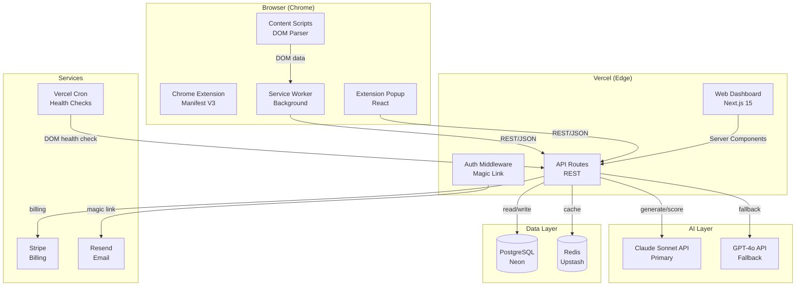
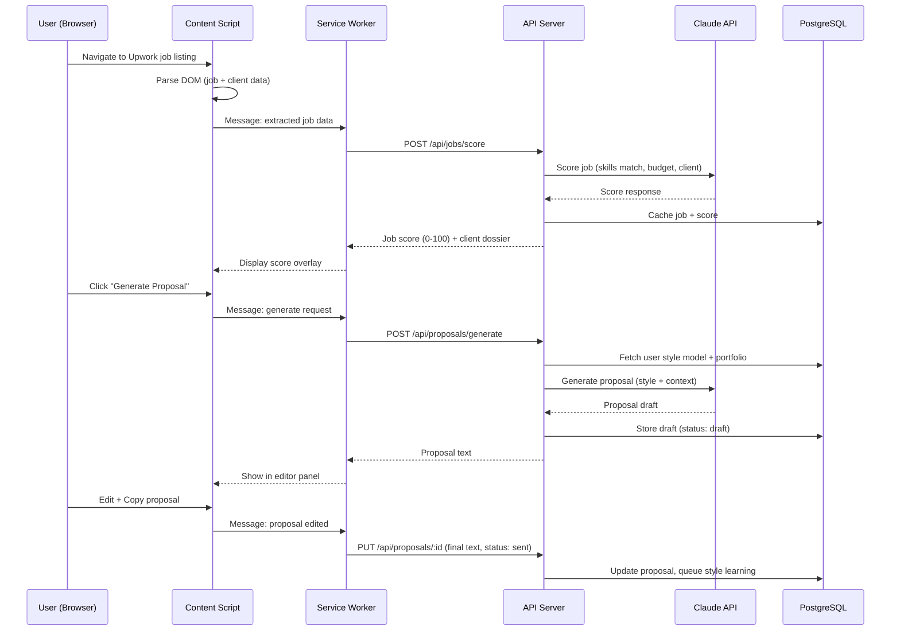
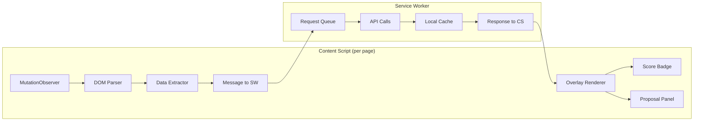
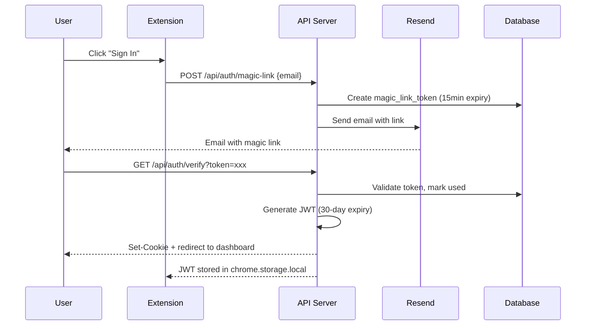
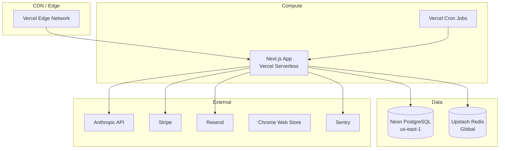
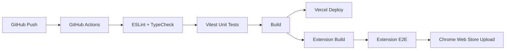

# ProposalForge — Technical Design Document

**Version:** 1.0
**Date:** 2026-05-29
**Status:** Draft

---

## 1. System Architecture

### 1.1 Component Diagram



### 1.2 Data Flow



### 1.3 Deployment Topology

| Component | Host | Rationale |
|-----------|------|-----------|
| Web Dashboard + API | Vercel (Hobby → Pro) | Zero-ops, auto-scaling, edge functions |
| Database | Neon PostgreSQL (Free → Launch) | Serverless Postgres, auto-suspend, branching |
| Cache | Upstash Redis (Free → Pay-as-you-go) | Serverless Redis, per-request pricing |
| Cron Jobs | Vercel Cron | DOM health checks, ghosted proposal detection |
| Email | Resend (Free → Starter) | Developer-friendly, 100 emails/day free |
| Extension | Chrome Web Store | Standard distribution |
| Monitoring | Vercel Analytics + Sentry (Free) | Error tracking, performance |

---

## 2. Data Model

### 2.1 Entity Relationship Diagram

```mermaid
erDiagram
    users ||--o{ proposals : "writes"
    users ||--o{ style_models : "has"
    users ||--o{ portfolio_items : "owns"
    users ||--o{ subscriptions : "has"
    users ||--o{ user_skills : "configures"
    proposals }o--|| jobs : "targets"
    jobs }o--|| clients : "posted by"
    proposals ||--o{ proposal_variants : "tested as"
    proposals ||--|| outcomes : "results in"
    clients ||--o{ retainer_suggestions : "receives"

    users {
        uuid id PK
        string email UK
        string display_name
        jsonb settings
        timestamp created_at
        timestamp last_active_at
    }

    style_models {
        uuid id PK
        uuid user_id FK
        jsonb style_descriptor
        text[] sample_proposals
        int sample_count
        float confidence_score
        timestamp updated_at
    }

    jobs {
        uuid id PK
        uuid user_id FK
        string upwork_job_id UK
        string title
        text description
        string[] required_skills
        string budget_type
        decimal budget_amount
        decimal hourly_rate_min
        decimal hourly_rate_max
        int proposal_count_range
        int score
        string score_tier
        jsonb score_breakdown
        uuid client_id FK
        timestamp posted_at
        timestamp extracted_at
    }

    clients {
        uuid id PK
        uuid user_id FK
        string upwork_client_id
        string name
        string country
        float hire_rate
        float avg_rating_given
        int total_jobs_posted
        int total_hires
        decimal total_spent
        boolean payment_verified
        int repeat_hire_pct
        jsonb red_flags
        timestamp last_fetched_at
    }

    proposals {
        uuid id PK
        uuid user_id FK
        uuid job_id FK
        text generated_text
        text final_text
        string status
        int word_count
        float style_match_score
        string variant_tag
        jsonb generation_params
        int tokens_used_input
        int tokens_used_output
        timestamp created_at
        timestamp sent_at
    }

    outcomes {
        uuid id PK
        uuid proposal_id FK
        uuid user_id FK
        string status
        timestamp viewed_at
        timestamp replied_at
        timestamp interviewed_at
        timestamp hired_at
        timestamp ghosted_at
        decimal contract_value
        string contract_type
        int connects_spent
    }

    proposal_variants {
        uuid id PK
        uuid proposal_id FK
        string variant_type
        string variant_value
        boolean converted
    }

    portfolio_items {
        uuid id PK
        uuid user_id FK
        string title
        text description
        string url
        string[] skills
        timestamp completed_at
    }

    user_skills {
        uuid id PK
        uuid user_id FK
        string skill_name
        int proficiency
    }

    subscriptions {
        uuid id PK
        uuid user_id FK
        string stripe_customer_id
        string stripe_subscription_id
        string plan_tier
        string billing_period
        string status
        timestamp current_period_start
        timestamp current_period_end
    }

    retainer_suggestions {
        uuid id PK
        uuid user_id FK
        uuid client_id FK
        uuid source_proposal_id FK
        text suggested_pitch
        string status
        timestamp created_at
        timestamp dismissed_at
    }
}
```

### 2.2 Key Indexes

```sql
-- Performance-critical queries
CREATE INDEX idx_proposals_user_status ON proposals(user_id, status);
CREATE INDEX idx_proposals_user_created ON proposals(user_id, created_at DESC);
CREATE INDEX idx_jobs_user_score ON jobs(user_id, score DESC);
CREATE INDEX idx_outcomes_user_status ON outcomes(user_id, status);
CREATE INDEX idx_clients_upwork_id ON clients(user_id, upwork_client_id);

-- RLS policy
ALTER TABLE proposals ENABLE ROW LEVEL SECURITY;
CREATE POLICY user_isolation ON proposals
    USING (user_id = current_setting('app.current_user_id')::uuid);
-- (Applied to all tables)
```


---

## 3. API Design

### 3.1 Authentication

All API requests require `Authorization: Bearer <jwt>` header. JWT issued after magic link verification, expires in 30 days.

### 3.2 Endpoints

#### Jobs & Scoring

```
POST /api/jobs/score
```
Request:
```json
{
  "upwork_job_id": "~01abc123def456",
  "title": "Build React Dashboard",
  "description": "We need a senior React developer...",
  "required_skills": ["React", "TypeScript", "Next.js"],
  "budget_type": "fixed",
  "budget_amount": 5000,
  "proposal_count_range": "10-15",
  "client": {
    "upwork_client_id": "client_789",
    "name": "TechCorp",
    "hire_rate": 0.72,
    "total_spent": 45000,
    "payment_verified": true,
    "avg_rating_given": 4.8,
    "country": "US",
    "total_jobs_posted": 23,
    "total_hires": 17
  }
}
```
Response (200):
```json
{
  "job_id": "uuid",
  "score": 82,
  "tier": "green",
  "breakdown": {
    "skills_match": 90,
    "budget_fit": 75,
    "client_quality": 85,
    "competition": 70,
    "red_flags": []
  },
  "client_dossier": {
    "hire_rate": 0.72,
    "hire_rate_vs_avg": "above",
    "repeat_hire_pct": 35,
    "red_flags": [],
    "recommendation": "Strong client — high hire rate, verified payment"
  }
}
```

#### Proposal Generation

```
POST /api/proposals/generate
```
Request:
```json
{
  "job_id": "uuid",
  "tone_override": null,
  "length_preference": null,
  "portfolio_item_ids": []
}
```
Response (200):
```json
{
  "proposal_id": "uuid",
  "text": "Hi [Client Name],\n\nI noticed you're looking for...",
  "word_count": 187,
  "style_match_score": 0.84,
  "variant_tag": "opening_hook_technical",
  "tokens_used": { "input": 1850, "output": 420 },
  "suggestions": [
    "Consider adding a specific timeline estimate",
    "This client responds well to code samples (based on hire history)"
  ]
}
```

```
POST /api/proposals/:id/regenerate
```
Request:
```json
{
  "adjustment": "more_technical",
  "keep_sections": ["opening"],
  "additional_context": "Emphasize my AWS experience"
}
```

```
PUT /api/proposals/:id
```
Request:
```json
{
  "final_text": "Hi TechCorp team,...",
  "status": "sent",
  "connects_spent": 6
}
```

#### Pipeline & Outcomes

```
GET /api/proposals?status=sent,viewed,replied&limit=50&offset=0
```
Response (200):
```json
{
  "proposals": [
    {
      "id": "uuid",
      "job_title": "Build React Dashboard",
      "client_name": "TechCorp",
      "status": "viewed",
      "sent_at": "2026-05-28T10:00:00Z",
      "days_elapsed": 1,
      "score": 82
    }
  ],
  "total": 127,
  "pagination": { "limit": 50, "offset": 0 }
}
```

```
PATCH /api/outcomes/:proposal_id
```
Request:
```json
{
  "status": "hired",
  "contract_value": 5000,
  "contract_type": "fixed"
}
```

#### Analytics

```
GET /api/analytics/summary?period=30d
```
Response (200):
```json
{
  "period": "30d",
  "proposals_sent": 34,
  "win_rate": 0.147,
  "avg_score": 71,
  "connects_spent": 204,
  "connects_per_hire": 41,
  "revenue_from_hires": 12500,
  "revenue_per_connect": 61.27,
  "top_category": "Web Development",
  "best_time_of_day": "09:00-11:00 UTC"
}
```

```
GET /api/analytics/ab-insights
```
Response (200):
```json
{
  "insights": [
    {
      "type": "opening_style",
      "finding": "Technical openings convert 2.3x better than casual for you",
      "confidence": 0.87,
      "sample_size": 67,
      "recommendation": "Lead with a technical observation about the project"
    }
  ],
  "total_proposals_analyzed": 127,
  "minimum_for_insights": 50
}
```

#### Style Model

```
POST /api/style/samples
```
Request:
```json
{
  "proposals": [
    "Hi, I noticed your project requires...",
    "I'd love to help with this. My experience in..."
  ]
}
```
Response (201):
```json
{
  "samples_added": 2,
  "total_samples": 7,
  "confidence_score": 0.62,
  "style_descriptor": {
    "tone": "professional_friendly",
    "formality": 0.6,
    "avg_length": 195,
    "opening_pattern": "direct_reference",
    "closing_pattern": "soft_cta",
    "vocabulary_level": "technical"
  }
}
```

#### Billing

```
POST /api/billing/checkout
```
Request:
```json
{
  "plan_tier": "pro",
  "billing_period": "monthly"
}
```
Response (200):
```json
{
  "checkout_url": "https://checkout.stripe.com/c/pay_..."
}
```

```
GET /api/billing/portal
```
Response (200):
```json
{
  "portal_url": "https://billing.stripe.com/p/session_..."
}
```

### 3.3 Error Response Format

All errors follow:
```json
{
  "error": {
    "code": "VALIDATION_ERROR",
    "message": "Human-readable description",
    "details": {}
  }
}
```

Status codes: 400 (validation), 401 (unauthenticated), 403 (wrong plan tier), 404 (not found), 429 (rate limit), 500 (server error).

### 3.4 Rate Limits

| Endpoint | Limit | Window |
|----------|-------|--------|
| `/api/proposals/generate` | 5 | 1 minute |
| `/api/jobs/score` | 30 | 1 minute |
| `/api/style/samples` | 10 | 1 hour |
| All other endpoints | 60 | 1 minute |


---

## 4. Chrome Extension Design

### 4.1 Manifest V3 Configuration

```json
{
  "manifest_version": 3,
  "name": "ProposalForge",
  "version": "1.0.0",
  "description": "AI-powered proposal intelligence for Upwork freelancers",
  "permissions": [
    "storage",
    "activeTab",
    "alarms"
  ],
  "host_permissions": [
    "https://www.upwork.com/*"
  ],
  "background": {
    "service_worker": "background.js",
    "type": "module"
  },
  "content_scripts": [
    {
      "matches": ["https://www.upwork.com/nx/find-work/*", "https://www.upwork.com/freelance-jobs/*"],
      "js": ["content-job-list.js"],
      "css": ["overlay.css"],
      "run_at": "document_idle"
    },
    {
      "matches": ["https://www.upwork.com/jobs/*"],
      "js": ["content-job-detail.js"],
      "css": ["overlay.css"],
      "run_at": "document_idle"
    }
  ],
  "action": {
    "default_popup": "popup.html",
    "default_icon": { "16": "icons/16.png", "48": "icons/48.png", "128": "icons/128.png" }
  },
  "icons": { "16": "icons/16.png", "48": "icons/48.png", "128": "icons/128.png" }
}
```

### 4.2 Content Script Architecture



### 4.3 DOM Selector Strategy

Each data point uses a priority-ordered selector chain:

```typescript
// selector-registry.ts
export const SELECTORS = {
  jobTitle: [
    '[data-test="job-title"]',                    // data attribute (most stable)
    'h1[role="heading"][aria-level="1"]',         // aria (stable)
    '.job-details-header h1',                      // class-based (moderate)
    'main section:first-child h1',                 // structural (fallback)
  ],
  clientHireRate: [
    '[data-test="client-hire-rate"]',
    '.client-stats [aria-label*="hire rate"]',
    '.cfe-ui-job-about-client .stat:nth-child(2) .value',
    // text-content fallback handled in parser
  ],
  jobBudget: [
    '[data-test="budget-amount"]',
    '[aria-label*="budget"] .amount',
    '.job-details-budget .value',
  ],
  jobDescription: [
    '[data-test="job-description"]',
    '.job-description [role="article"]',
    '.job-details-content .description',
    'main section:nth-child(2) .break-word',
  ],
  requiredSkills: [
    '[data-test="skill-tag"]',
    '.skills-list .badge',
    '.job-details-skills a',
  ],
  proposalCount: [
    '[data-test="proposal-count"]',
    '.applicant-count .value',
    'li:has(.icon-proposals) span',
  ],
} as const;

// Extraction with fallback chain
function extractField(selectors: string[]): string | null {
  for (const selector of selectors) {
    const el = document.querySelector(selector);
    if (el?.textContent?.trim()) return el.textContent.trim();
  }
  return null; // triggers graceful degradation
}
```

### 4.4 Message Passing Protocol

```typescript
// Messages from Content Script → Service Worker
type CSMessage =
  | { type: 'JOB_EXTRACTED'; payload: ExtractedJob }
  | { type: 'GENERATE_PROPOSAL'; payload: { jobId: string } }
  | { type: 'PROPOSAL_EDITED'; payload: { proposalId: string; finalText: string } }
  | { type: 'EXTRACTION_FAILED'; payload: { page: string; failedFields: string[] } };

// Messages from Service Worker → Content Script
type SWMessage =
  | { type: 'JOB_SCORED'; payload: { jobId: string; score: number; tier: string; dossier: ClientDossier } }
  | { type: 'PROPOSAL_READY'; payload: { proposalId: string; text: string; styleMatch: number } }
  | { type: 'DEGRADED_MODE'; payload: { reason: string } }
  | { type: 'AUTH_REQUIRED'; payload: {} };
```

### 4.5 Local Storage (chrome.storage.local)

```typescript
interface LocalStorage {
  auth_token: string;                    // JWT for API calls
  user_settings: UserSettings;           // Cached settings
  job_cache: Record<string, CachedJob>;  // Last 100 scored jobs
  client_cache: Record<string, CachedClient>; // Client dossiers (7-day TTL)
  pending_edits: PendingEdit[];          // Queued style learning signals
  selector_health: SelectorHealth;       // Last known selector status
}
```

### 4.6 Extension UI Components

**Score Badge (injected into job listing):**
- Small colored circle (green/amber/red) with score number
- Click expands to show breakdown + client dossier
- Positioned via CSS relative to job title element

**Proposal Panel (slide-in sidebar):**
- Triggered by "Generate Proposal" button (injected near Upwork's "Submit Proposal" button)
- Contains: generated text editor, style match indicator, regenerate button, copy button
- Does NOT interact with Upwork's form — user copies and pastes manually


---

## 5. AI Integration

### 5.1 Prompt Architecture

Three distinct prompt types, each optimized for token efficiency:

#### Job Scoring Prompt (~800 tokens input, ~200 tokens output)

```
System: You are a job qualification engine for Upwork freelancers.
Score this job 0-100 based on the criteria below. Return JSON only.

User profile:
- Skills: {user_skills}
- Min rate: ${min_rate}/hr
- Preferred categories: {categories}

Job:
- Title: {title}
- Description: {description (truncated to 500 words)}
- Budget: {budget}
- Skills required: {skills}
- Client hire rate: {hire_rate}
- Client total spent: {total_spent}

Score on: skills_match (0-100), budget_fit (0-100), client_quality (0-100), competition (0-100).
Flag red_flags as array of strings.
Return: {"score": N, "tier": "green|amber|red", "breakdown": {...}, "red_flags": [...]}
```

#### Proposal Generation Prompt (~2,200 tokens input, ~400 tokens output)

```
System: You are a proposal writer for an Upwork freelancer. Write in their exact voice and style.

Style profile:
{style_descriptor_json}

Example proposals by this user (for voice reference):
---
{sample_1}
---
{sample_2}
---

Job context:
- Title: {title}
- Description: {description (truncated to 800 words)}
- Client: {client_name}, {hire_rate}% hire rate, ${total_spent} spent
- Budget: {budget}

Relevant portfolio:
{portfolio_items}

Instructions:
- Match the user's tone, structure, and vocabulary exactly
- Reference specific job requirements
- Include 1-2 relevant portfolio items
- Target length: {target_words} words
- Variant instruction: {variant_tag_instruction}

Write the proposal. No preamble, no explanation — just the proposal text.
```

#### Style Extraction Prompt (~1,500 tokens input, ~300 tokens output)

```
System: Analyze these proposal samples and extract a writing style profile. Return JSON.

Samples:
{5+ user proposals}

Extract:
- tone: (professional_friendly | casual | formal | technical)
- formality: (0.0-1.0)
- avg_sentence_length: (short | medium | long)
- opening_pattern: (direct_reference | question | statement | compliment)
- closing_pattern: (soft_cta | direct_cta | availability | question)
- vocabulary_level: (simple | moderate | technical | expert)
- structure: (single_paragraph | multi_paragraph | bullet_points | hybrid)
- unique_phrases: [recurring phrases or patterns]
- avoids: [things this writer never does]
```

### 5.2 Token Budget Per Operation

| Operation | Input Tokens | Output Tokens | Cost (Sonnet) | Frequency |
|-----------|-------------|---------------|---------------|-----------|
| Job scoring | ~800 | ~200 | $0.0054 | 30/day per active user |
| Proposal generation | ~2,200 | ~400 | $0.0126 | 1-3/day per active user |
| Proposal regeneration | ~2,400 | ~400 | $0.0132 | 0.5/day per active user |
| Style extraction | ~1,500 | ~300 | $0.0090 | 1/week per user |
| A/B insight generation | ~3,000 | ~500 | $0.0165 | 1/week per user |

### 5.3 Cost Per User Per Month (Pro tier, active usage)

| Operation | Frequency/Month | Cost/Operation | Monthly Cost |
|-----------|----------------|----------------|--------------|
| Job scoring | 600 (20/day × 30) | $0.0054 | $3.24 |
| Proposal generation | 45 | $0.0126 | $0.57 |
| Regeneration | 15 | $0.0132 | $0.20 |
| Style extraction | 4 | $0.0090 | $0.04 |
| A/B insights | 4 | $0.0165 | $0.07 |
| **Total AI cost/user/month** | | | **$4.12** |

**Optimization: Batch job scoring.** Score jobs client-side with a lightweight heuristic (skills match + budget check) first. Only call AI for jobs that pass the heuristic filter (estimated 40% of viewed jobs).

**Optimized AI cost/user/month: ~$2.10** (scoring only 40% of jobs via AI, rest via local heuristic).

### 5.4 Provider Abstraction

```typescript
interface AIProvider {
  generateProposal(params: ProposalParams): Promise<ProposalResult>;
  scoreJob(params: ScoreParams): Promise<ScoreResult>;
  extractStyle(params: StyleParams): Promise<StyleDescriptor>;
}

class ClaudeProvider implements AIProvider { /* primary */ }
class OpenAIProvider implements AIProvider { /* fallback */ }

// Automatic failover
async function withFallback<T>(
  primary: () => Promise<T>,
  fallback: () => Promise<T>
): Promise<T> {
  try {
    return await primary();
  } catch (e) {
    if (isRetryable(e)) return await fallback();
    throw e;
  }
}
```

### 5.5 Style Model Storage

```json
{
  "version": 2,
  "extracted_at": "2026-05-29T10:00:00Z",
  "sample_count": 12,
  "confidence": 0.84,
  "descriptor": {
    "tone": "professional_friendly",
    "formality": 0.55,
    "avg_sentence_length": "medium",
    "opening_pattern": "direct_reference",
    "closing_pattern": "soft_cta",
    "vocabulary_level": "technical",
    "structure": "multi_paragraph",
    "unique_phrases": ["I'd be happy to", "Based on my experience with", "Let me know if"],
    "avoids": ["Dear Sir/Madam", "I am writing to", "Please find attached"]
  },
  "best_samples": [
    "Hi! I noticed you're looking for...",
    "This project aligns well with..."
  ]
}
```

Stored in `style_models` table as JSONB. ~2KB per user. Included in every generation prompt.


---

## 6. Cost Model

### 6.1 Per-User Monthly Cost Breakdown

| Cost Category | Starter ($29/mo) | Pro ($59/mo) | Agency ($99/mo) |
|---------------|-------------------|--------------|-----------------|
| AI tokens (scoring) | $1.30 (50 jobs scored/mo cap) | $3.24 (unlimited) | $3.24 |
| AI tokens (generation) | $0.63 (50 proposals/mo cap) | $0.77 (unlimited) | $0.77 |
| AI tokens (style/AB) | $0.00 (not included) | $0.11 | $0.11 |
| Database storage | $0.02 | $0.05 | $0.08 |
| Compute (API calls) | $0.10 | $0.20 | $0.25 |
| Cache (Redis) | $0.01 | $0.02 | $0.03 |
| Email (magic links) | $0.01 | $0.01 | $0.01 |
| **Total COGS/user** | **$2.07** | **$4.40** | **$4.49** |
| **Gross margin** | **92.9%** | **92.5%** | **95.5%** |

### 6.2 Infrastructure Cost at Scale

| Users | AI API | Database | Compute | Cache | Email | Monitoring | **Total/mo** |
|-------|--------|----------|---------|-------|-------|------------|-------------|
| 50 | $150 | $0 (free tier) | $0 (Vercel free) | $0 (free tier) | $0 (free tier) | $0 (free) | **$150** |
| 200 | $600 | $19 (Neon Launch) | $20 (Vercel Pro) | $10 | $20 | $0 | **$669** |
| 500 | $1,500 | $69 (Neon Scale) | $20 | $30 | $40 | $29 (Sentry) | **$1,688** |
| 1,000 | $3,000 | $69 | $20 | $50 | $80 | $29 | **$3,248** |

### 6.3 Break-Even Analysis

| Scenario | Users Needed | MRR at Break-Even | Monthly Costs |
|----------|-------------|-------------------|---------------|
| All Starter ($29) | 24 users | $696 | ~$650 |
| Mixed (avg $45) | 16 users | $720 | ~$650 |
| All Pro ($59) | 12 users | $708 | ~$650 |

**Break-even: 12-24 paying users.** Achievable within first month of launch given organic channels.

### 6.4 Cost Per Proposal Generated

| Component | Tokens | Cost |
|-----------|--------|------|
| Input (style + context + job) | ~2,200 | $0.0066 |
| Output (proposal text) | ~400 | $0.0060 |
| **Total per proposal** | | **$0.0126** |

At 45 proposals/user/month (Pro tier): **$0.57/user/month** for generation alone.

---

## 7. Security & Privacy

### 7.1 Data Classification

| Data Type | Sensitivity | Storage | Encryption |
|-----------|-------------|---------|------------|
| User email | PII | PostgreSQL | At rest (AES-256) |
| Proposal text | Business-sensitive | PostgreSQL | At rest (AES-256) |
| Style model | User IP | PostgreSQL (JSONB) | At rest |
| Job listings (extracted) | Public data | PostgreSQL | At rest |
| Client data (extracted) | Public data | PostgreSQL + Redis cache | At rest |
| Auth tokens | Secret | Redis (short-lived) | In transit (TLS) |
| Stripe customer ID | Financial | PostgreSQL | At rest |

### 7.2 What Stays in Browser vs What Leaves

| Data | Stays Local | Sent to API | Sent to AI |
|------|-------------|-------------|------------|
| Raw DOM HTML | ✅ | ❌ | ❌ |
| Extracted job fields | Cached | ✅ (structured) | ✅ (in prompt) |
| Upwork session cookies | ✅ | ❌ | ❌ |
| User's Upwork credentials | ✅ (never accessed) | ❌ | ❌ |
| Generated proposals | Displayed | ✅ (stored) | ❌ (not sent back) |
| User edits | Displayed | ✅ (for style learning) | ✅ (in extraction) |

### 7.3 Authentication Flow



### 7.4 GDPR Compliance

| Right | Implementation |
|-------|---------------|
| Right to access (Art. 15) | `GET /api/account/data-export` — full JSON dump |
| Right to erasure (Art. 17) | `DELETE /api/account` — cascading delete, 30-day processing |
| Right to portability (Art. 20) | Same export endpoint, machine-readable JSON |
| Right to rectification (Art. 16) | User can edit all their data via dashboard |
| Consent | Explicit consent at signup for AI processing of proposals |
| Data processing agreement | Anthropic DPA covers AI processing; Neon DPA covers storage |

### 7.5 Security Headers & Practices

```typescript
// API security middleware
const securityHeaders = {
  'Strict-Transport-Security': 'max-age=31536000; includeSubDomains',
  'X-Content-Type-Options': 'nosniff',
  'X-Frame-Options': 'DENY',
  'Content-Security-Policy': "default-src 'self'",
  'X-XSS-Protection': '1; mode=block',
};
```

- All API inputs validated with Zod schemas
- SQL injection prevented by parameterized queries (Drizzle ORM)
- Rate limiting per user (see §3.4)
- JWT signed with RS256, rotated quarterly
- No secrets in extension bundle (API key stored server-side only)


---

## 8. Deployment Architecture

### 8.1 Infrastructure Diagram



### 8.2 CI/CD Pipeline



**Pipeline details:**
- **Trigger:** Push to `main` (production), push to PR branches (preview)
- **Lint + Type:** `eslint . && tsc --noEmit` (~30s)
- **Test:** `vitest run` — unit tests for API logic, AI prompt construction, selector parsing (~60s)
- **Build:** `next build` for dashboard, `vite build` for extension (~45s)
- **Deploy:** Vercel auto-deploys from `main`. Preview URLs for PRs.
- **Extension:** Separate workflow. Manual trigger for Chrome Web Store upload (requires review).

### 8.3 Monitoring & Alerting

| Signal | Tool | Alert Threshold |
|--------|------|-----------------|
| API errors (5xx) | Sentry | >5 errors in 5 minutes |
| API latency (p95) | Vercel Analytics | >2s for non-AI endpoints |
| AI provider errors | Custom (logged) | >3 consecutive failures |
| DOM selector failures | Cron job + Sentry | Any selector chain fully fails |
| Database connection | Neon dashboard | Connection pool >80% |
| Stripe webhook failures | Stripe dashboard | Any failed webhook |
| Extension errors | Sentry (browser) | >10 errors/hour |

**Alert channels:** Email (primary), PagerDuty (DOM breaks only — requires immediate fix).

### 8.4 Environment Strategy

| Environment | Purpose | Database | AI Provider |
|-------------|---------|----------|-------------|
| `local` | Development | Neon branch | Claude (dev key, low limits) |
| `preview` | PR review | Neon branch | Claude (dev key) |
| `production` | Live users | Neon main | Claude (prod key) |

---

## 9. DOM Resilience Strategy

### 9.1 Detection: Automated Health Checks

```typescript
// Runs daily via Vercel Cron at 06:00 UTC
// Uses Puppeteer/Playwright on a lightweight cloud function

async function domHealthCheck() {
  const browser = await chromium.launch();
  const page = await browser.newPage();

  // Navigate to a known Upwork job listing (bookmarked stable URL)
  await page.goto('https://www.upwork.com/jobs/~known_stable_job_id');

  const results: HealthResult[] = [];

  for (const [field, selectors] of Object.entries(SELECTORS)) {
    let found = false;
    for (const selector of selectors) {
      const el = await page.$(selector);
      if (el) {
        found = true;
        results.push({ field, selector, status: 'ok' });
        break;
      }
    }
    if (!found) {
      results.push({ field, selector: 'all_failed', status: 'broken' });
    }
  }

  const broken = results.filter(r => r.status === 'broken');
  if (broken.length > 0) {
    await alertFounder(broken); // PagerDuty + email
    await setDegradedMode(broken.map(r => r.field));
  }

  await browser.close();
  return results;
}
```

### 9.2 Graceful Degradation Levels

| Level | Condition | User Experience |
|-------|-----------|-----------------|
| **Full** | All selectors working | Normal operation, scores + generation |
| **Partial** | Some fields missing (e.g., client stats) | Score shown with "incomplete data" badge. Missing fields noted. |
| **Manual** | Core selectors broken (title, description) | "Paste job details" textarea shown. User copies job text manually. Scoring + generation still work from pasted text. |
| **Offline** | API unreachable | Extension shows cached scores. No generation. "Service unavailable" message. |

### 9.3 Selector Update Workflow

```
1. Health check detects break → Alert fires
2. Founder opens Upwork in browser, inspects new DOM
3. Update SELECTORS registry in extension code
4. Run local E2E test against live page
5. Push to main → CI builds extension
6. Submit to Chrome Web Store (24hr review for updates)
7. Users auto-update within 24-48hrs
```

**Total time from detection to user fix: 48-72 hours** (dominated by Chrome Web Store review).

**Mitigation for review delay:** Extension fetches selector overrides from API on startup. Critical selector fixes can be deployed server-side without extension update.

```typescript
// On extension startup, check for selector hotfixes
async function loadSelectorOverrides() {
  const response = await fetch(`${API_BASE}/api/extension/selectors`);
  if (response.ok) {
    const overrides = await response.json();
    // Merge overrides into local SELECTORS registry
    Object.assign(SELECTORS, overrides);
  }
}
```

### 9.4 Selector Resilience Techniques

1. **Multi-strategy selectors:** data-test → aria → class → structural → text content
2. **Fuzzy matching:** If exact selector fails, try partial attribute match (`[class*="job-title"]`)
3. **Content validation:** After extraction, validate data shape (e.g., hire rate is 0-100%, budget is numeric)
4. **Version detection:** Check for known Upwork UI version markers to select correct selector set
5. **User reporting:** "Something look wrong?" button in extension sends extraction snapshot to API for diagnosis

### 9.5 Testing Against Live Upwork

| Test Type | Frequency | Method |
|-----------|-----------|--------|
| Selector presence | Daily (cron) | Headless browser visits known job page |
| Data extraction accuracy | Weekly (manual) | Compare extracted data against visual inspection |
| Full flow E2E | Before each extension release | Playwright test: navigate → extract → score → generate |
| Regression suite | On selector changes | Run against 5 saved page snapshots (HTML fixtures) |

---

## 10. Technology Stack Summary

| Layer | Technology | Version |
|-------|-----------|---------|
| Extension | TypeScript, Vite, React (popup) | TS 5.x, Vite 6.x |
| Dashboard | Next.js, React, Tailwind CSS | Next 15, React 19 |
| API | Next.js Route Handlers | Next 15 |
| Database | PostgreSQL (Neon) | PG 16 |
| ORM | Drizzle ORM | Latest |
| Cache | Upstash Redis | - |
| AI | Anthropic SDK, OpenAI SDK | Latest |
| Auth | Custom magic link (JWT) | - |
| Billing | Stripe SDK | Latest |
| Email | Resend SDK | Latest |
| Testing | Vitest, Playwright | Latest |
| CI/CD | GitHub Actions | - |
| Hosting | Vercel | - |
| Monitoring | Sentry, Vercel Analytics | - |

---

*End of Technical Design Document*
