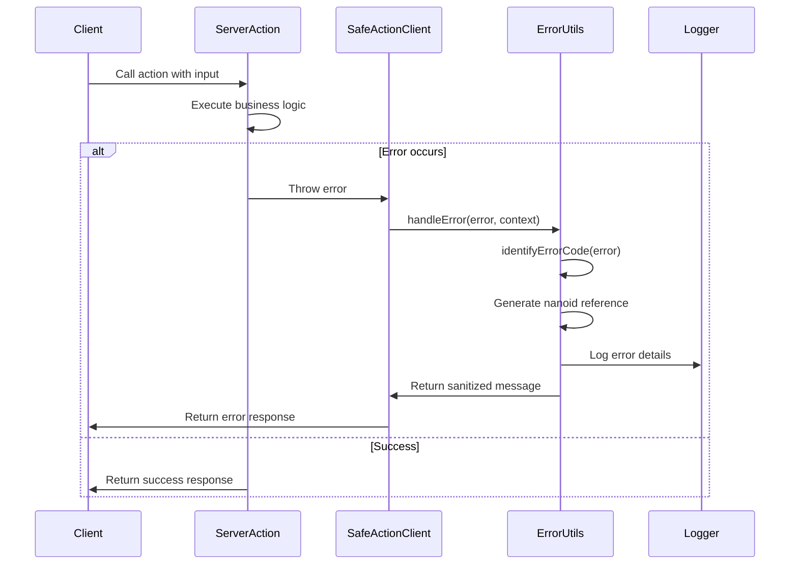
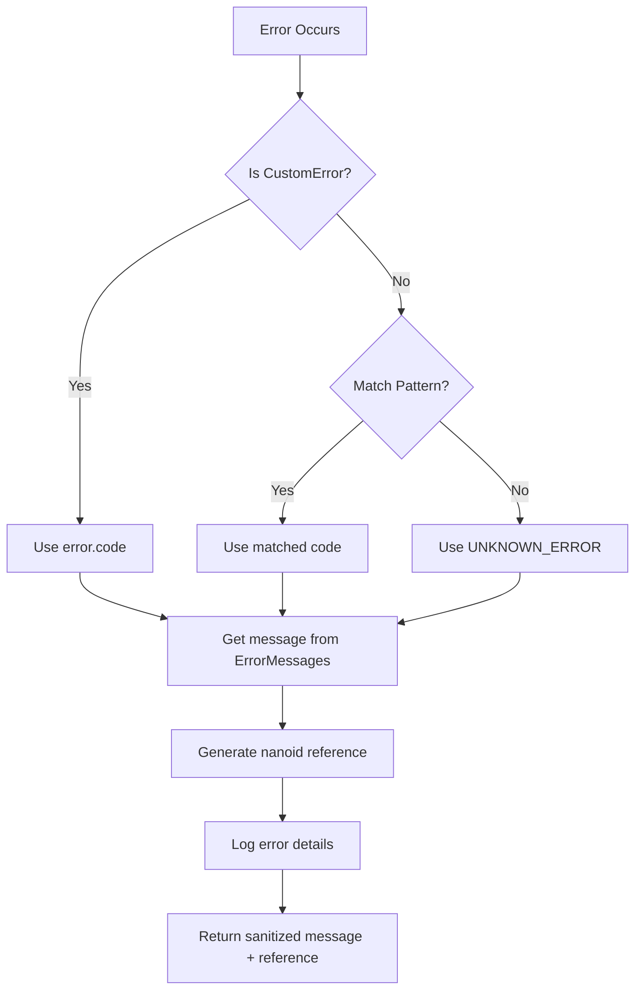

# Design Document: Standardize Error Handling

## Overview

This design standardizes error handling across all Ubiquity WebApps by creating a shared `@monorepo/packages-error-handling` package. The database app currently has comprehensive error handling infrastructure that will be extracted and made reusable. This approach eliminates code duplication, ensures consistent error messages, and provides a safe-action wrapper that automatically sanitizes errors in all server actions.

### Goals

- Create a reusable error handling package that all apps can depend on
- Migrate database app's error handling utilities to the shared package
- Implement standardized error handling in journey-builder and template apps
- Ensure all server actions use the safe-action wrapper pattern
- Maintain backward compatibility during migration
- Provide comprehensive testing and documentation

### Non-Goals

- Changing the error handling behavior or user-facing messages
- Modifying existing server action signatures
- Adding new error codes beyond what exists in the database app
- Implementing error tracking/monitoring services (e.g., Sentry)

## Architecture

### Package Structure

```
monorepo/packages/error-handling/
├── src/
│   ├── errors/
│   │   ├── error-codes.ts       # Centralized error code constants
│   │   ├── error-messages.ts    # User-friendly error messages
│   │   ├── custom-error.ts      # CustomError class and helpers
│   │   └── error-utils.ts       # identifyErrorCode, handleError
│   ├── safe-action.ts           # createActionClient wrapper
│   └── index.ts                 # Barrel exports
├── __tests__/
│   ├── error-codes.test.ts
│   ├── error-utils.test.ts
│   ├── custom-error.test.ts
│   └── safe-action.test.ts
├── package.json
├── tsconfig.json
└── README.md
```

### Dependency Graph

```mermaid
graph TD
    A[@monorepo/packages-error-handling] --> B[nanoid]
    A --> C[next-safe-action]
    
    D[database app] --> A
    E[journey-builder app] --> A
    F[template app] --> A
    
    D --> G[Server Actions]
    E --> H[Server Actions]
    F --> I[Server Actions]
    
    G --> J[Safe Action Client]
    H --> J
    I --> J
    
    J --> A
```

### Migration Strategy

The migration will be performed in phases to minimize risk:

1. **Phase 1: Create Shared Package** - Set up the new package with all utilities
2. **Phase 2: Migrate Database App** - Update database app to use shared package
3. **Phase 3: Implement in Journey Builder** - Add error handling to journey-builder
4. **Phase 4: Implement in Template** - Add error handling to template app

Each phase will be independently testable and deployable.

## Components and Interfaces

### Error Codes Module

**File:** `src/errors/error-codes.ts`

```typescript
/**
 * Centralized error codes for all Ubiquity apps
 */
export const ErrorCodes = {
  // Prefect API errors
  PREFECT_CONNECTION_FAILED: "PREFECT_CONNECTION_FAILED",
  PREFECT_INVALID_RESPONSE: "PREFECT_INVALID_RESPONSE",
  PREFECT_UNAUTHORIZED: "PREFECT_UNAUTHORIZED",
  PREFECT_DUPLICATE_CONNECTOR: "PREFECT_DUPLICATE_CONNECTOR",
  PREFECT_DUPLICATE_FILE_LOCATION: "PREFECT_DUPLICATE_FILE_LOCATION",

  // Azure errors
  AZURE_AUTH_FAILED: "AZURE_AUTH_FAILED",
  AZURE_BLOB_NOT_FOUND: "AZURE_BLOB_NOT_FOUND",
  AZURE_INVALID_CREDENTIALS: "AZURE_INVALID_CREDENTIALS",
  AZURE_INSUFFICIENT_PERMISSIONS: "AZURE_INSUFFICIENT_PERMISSIONS",

  // SFTP errors
  SFTP_CONNECTION_FAILED: "SFTP_CONNECTION_FAILED",
  SFTP_AUTH_FAILED: "SFTP_AUTH_FAILED",
  SFTP_INVALID_PATH: "SFTP_INVALID_PATH",

  // Validation errors
  VALIDATION_ERROR: "VALIDATION_ERROR",
  INVALID_INPUT: "INVALID_INPUT",

  // Session/Auth errors
  SESSION_EXPIRED: "SESSION_EXPIRED",
  UNAUTHORIZED: "UNAUTHORIZED",
  ACCOUNT_NOT_FOUND: "ACCOUNT_NOT_FOUND",

  // Generic errors
  NETWORK_ERROR: "NETWORK_ERROR",
  TIMEOUT_ERROR: "TIMEOUT_ERROR",
  UNKNOWN_ERROR: "UNKNOWN_ERROR",
} as const;

export type ErrorCode = (typeof ErrorCodes)[keyof typeof ErrorCodes];
```

### Error Messages Module

**File:** `src/errors/error-messages.ts`

```typescript
import { type ErrorCode, ErrorCodes } from "./error-codes";

/**
 * User-friendly error messages mapped to error codes
 */
export const ErrorMessages: Record<ErrorCode, string> = {
  [ErrorCodes.PREFECT_CONNECTION_FAILED]:
    "Unable to connect to the service. Please try again later.",
  [ErrorCodes.PREFECT_INVALID_RESPONSE]:
    "Received an unexpected response from the service. Please try again.",
  [ErrorCodes.PREFECT_UNAUTHORIZED]: 
    "You don't have permission to perform this action.",
  [ErrorCodes.PREFECT_DUPLICATE_CONNECTOR]:
    "A connector with this name already exists. Please choose a different name or delete the existing connector first.",
  [ErrorCodes.PREFECT_DUPLICATE_FILE_LOCATION]:
    "This importer is configured to read from the same file as an existing importer. Please change the location or name of the file.",
  
  [ErrorCodes.AZURE_AUTH_FAILED]:
    "Azure authentication failed. Please check your credentials and try again.",
  [ErrorCodes.AZURE_BLOB_NOT_FOUND]: 
    "The specified Azure storage container or blob was not found.",
  [ErrorCodes.AZURE_INVALID_CREDENTIALS]:
    "Invalid Azure credentials. Please verify your account name and SAS token.",
  [ErrorCodes.AZURE_INSUFFICIENT_PERMISSIONS]:
    "Azure credentials lack sufficient permissions. Ensure your service principal or SAS token has required permissions (e.g. 'Storage Blob Data Contributor' role).",
  
  [ErrorCodes.SFTP_CONNECTION_FAILED]:
    "Unable to connect to the SFTP server. Please check your hostname and port.",
  [ErrorCodes.SFTP_AUTH_FAILED]:
    "SFTP authentication failed. Please check your username and password or SSH key.",
  [ErrorCodes.SFTP_INVALID_PATH]: 
    "The specified SFTP path does not exist or is not accessible.",
  
  [ErrorCodes.VALIDATION_ERROR]: 
    "Please check your input and try again.",
  [ErrorCodes.INVALID_INPUT]: 
    "The provided information is invalid. Please review and correct it.",
  
  [ErrorCodes.SESSION_EXPIRED]: 
    "Your session has expired. Please refresh the page and try again.",
  [ErrorCodes.UNAUTHORIZED]: 
    "You are not authorized to perform this action.",
  [ErrorCodes.ACCOUNT_NOT_FOUND]: 
    "Account information not found. Please contact support.",
  
  [ErrorCodes.NETWORK_ERROR]: 
    "Network error occurred. Please check your connection and try again.",
  [ErrorCodes.TIMEOUT_ERROR]: 
    "The request timed out. Please try again.",
  [ErrorCodes.UNKNOWN_ERROR]: 
    "Something went wrong. Please try again or contact support.",
};
```

### Custom Error Class

**File:** `src/errors/custom-error.ts`

```typescript
import type { ErrorCode } from "./error-codes";

/**
 * Custom error class with error code support
 */
export class CustomError extends Error {
  constructor(
    public code: ErrorCode,
    message?: string
  ) {
    super(message || code);
    this.name = "CustomError";
  }
}

/**
 * Type guard to check if an error is a CustomError
 */
export function isCustomError(error: unknown): error is CustomError {
  return error instanceof CustomError;
}

/**
 * Creates a custom error with the specified error code
 */
export function createError(code: ErrorCode, message?: string): CustomError {
  return new CustomError(code, message);
}
```

### Error Utilities Module

**File:** `src/errors/error-utils.ts`

```typescript
import { nanoid } from "nanoid";
import { isCustomError } from "./custom-error";
import { type ErrorCode, ErrorCodes } from "./error-codes";
import { ErrorMessages } from "./error-messages";

/**
 * Identifies error code from error object by checking CustomError
 * or parsing error messages for known patterns
 */
export function identifyErrorCode(error: unknown): ErrorCode {
  if (!error) return ErrorCodes.UNKNOWN_ERROR;

  // If it's a CustomError, use the error code directly
  if (isCustomError(error)) {
    return error.code;
  }

  // For legacy errors or external library errors, parse message
  const errorMessage =
    error instanceof Error ? error.message.toLowerCase() : String(error).toLowerCase();

  // Prefect errors
  if (errorMessage.includes("prefect") && errorMessage.includes("econnrefused")) {
    return ErrorCodes.PREFECT_CONNECTION_FAILED;
  }
  if (
    errorMessage.includes("prefect") &&
    (errorMessage.includes("unauthorized") || errorMessage.includes("401"))
  ) {
    return ErrorCodes.PREFECT_UNAUTHORIZED;
  }

  // Azure errors
  if (errorMessage.includes("azure") && errorMessage.includes("auth")) {
    return ErrorCodes.AZURE_AUTH_FAILED;
  }
  if (
    errorMessage.includes("do not have permissions") ||
    errorMessage.includes("insufficient permissions")
  ) {
    return ErrorCodes.AZURE_INSUFFICIENT_PERMISSIONS;
  }
  if (errorMessage.includes("blob") && errorMessage.includes("not found")) {
    return ErrorCodes.AZURE_BLOB_NOT_FOUND;
  }
  if (errorMessage.includes("sas token") || errorMessage.includes("account name")) {
    return ErrorCodes.AZURE_INVALID_CREDENTIALS;
  }

  // SFTP errors
  if (
    errorMessage.includes("address lookup failed") ||
    (errorMessage.includes("connect") && errorMessage.includes("enotfound"))
  ) {
    return ErrorCodes.SFTP_CONNECTION_FAILED;
  }
  if (errorMessage.includes("sftp") && errorMessage.includes("connect")) {
    return ErrorCodes.SFTP_CONNECTION_FAILED;
  }
  if (errorMessage.includes("sftp") && errorMessage.includes("auth")) {
    return ErrorCodes.SFTP_AUTH_FAILED;
  }
  if (
    errorMessage.includes("no such file") ||
    (errorMessage.includes("sftp") && errorMessage.includes("path"))
  ) {
    return ErrorCodes.SFTP_INVALID_PATH;
  }

  // Network errors
  if (errorMessage.includes("network") || errorMessage.includes("fetch")) {
    return ErrorCodes.NETWORK_ERROR;
  }
  if (errorMessage.includes("timeout") || errorMessage.includes("timed out")) {
    return ErrorCodes.TIMEOUT_ERROR;
  }

  // Session errors
  if (errorMessage.includes("session")) {
    return ErrorCodes.SESSION_EXPIRED;
  }
  if (errorMessage.includes("account") && errorMessage.includes("not found")) {
    return ErrorCodes.ACCOUNT_NOT_FOUND;
  }

  // Generic authorization errors
  if (errorMessage.includes("unauthorized") || errorMessage.includes("401")) {
    return ErrorCodes.UNAUTHORIZED;
  }

  return ErrorCodes.UNKNOWN_ERROR;
}

/**
 * Sanitizes errors and returns user-friendly message with unique reference
 * Logs comprehensive error details server-side for debugging
 */
export function handleError(error: unknown, context?: string): string {
  const errorCode = identifyErrorCode(error);
  const errorReference = nanoid();
  const sanitizedMessage = ErrorMessages[errorCode];

  // Log comprehensive error details server-side for debugging
  console.error(`[${context || "Error"}] Reference: ${errorReference}`, {
    errorCode,
    originalError: error,
    timestamp: new Date().toISOString(),
  });

  // Return user-friendly message with error reference
  return `${sanitizedMessage} Error Reference: ${errorReference}`;
}
```

### Safe Action Client

**File:** `src/safe-action.ts`

```typescript
import { createSafeActionClient } from "next-safe-action";
import { handleError } from "./errors/error-utils";

/**
 * Creates a safe action client with automatic error sanitization
 * All server actions should use this client to ensure errors are
 * properly sanitized before being sent to the client
 */
export function createActionClient() {
  return createSafeActionClient({
    handleServerError(error) {
      // Sanitize all errors before sending to client
      const sanitizedMessage = handleError(error, "SafeAction");
      return sanitizedMessage;
    },
  });
}

/**
 * Default action client instance for convenience
 */
export const actionClient = createActionClient();
```

### Package Exports

**File:** `src/index.ts`

```typescript
// Error codes and types
export { type ErrorCode, ErrorCodes } from "./errors/error-codes";

// Error messages
export { ErrorMessages } from "./errors/error-messages";

// Custom error class and helpers
export { CustomError, createError, isCustomError } from "./errors/custom-error";

// Error utilities
export { identifyErrorCode, handleError } from "./errors/error-utils";

// Safe action client
export { createActionClient, actionClient } from "./safe-action";
```

## Data Models

### ErrorCode Type

```typescript
type ErrorCode = 
  | "PREFECT_CONNECTION_FAILED"
  | "PREFECT_INVALID_RESPONSE"
  | "PREFECT_UNAUTHORIZED"
  | "PREFECT_DUPLICATE_CONNECTOR"
  | "PREFECT_DUPLICATE_FILE_LOCATION"
  | "AZURE_AUTH_FAILED"
  | "AZURE_BLOB_NOT_FOUND"
  | "AZURE_INVALID_CREDENTIALS"
  | "AZURE_INSUFFICIENT_PERMISSIONS"
  | "SFTP_CONNECTION_FAILED"
  | "SFTP_AUTH_FAILED"
  | "SFTP_INVALID_PATH"
  | "VALIDATION_ERROR"
  | "INVALID_INPUT"
  | "SESSION_EXPIRED"
  | "UNAUTHORIZED"
  | "ACCOUNT_NOT_FOUND"
  | "NETWORK_ERROR"
  | "TIMEOUT_ERROR"
  | "UNKNOWN_ERROR";
```

### CustomError Class

```typescript
class CustomError extends Error {
  code: ErrorCode;
  name: "CustomError";
  message: string;
  stack?: string;
}
```

### Error Handling Flow




## Correctness Properties

A property is a characteristic or behavior that should hold true across all valid executions of a system—essentially, a formal statement about what the system should do. Properties serve as the bridge between human-readable specifications and machine-verifiable correctness guarantees.

### Property 1: Complete Error Message Coverage

*For any* error code in the ErrorCodes object, there SHALL exist a corresponding user-friendly message in the ErrorMessages object.

**Validates: Requirements 3.1**

### Property 2: CustomError Type Guard Accuracy

*For any* object, the isCustomError type guard SHALL return true if and only if the object is an instance of CustomError.

**Validates: Requirements 4.4**

### Property 3: Error Code Identification for CustomError

*For any* CustomError instance, the identifyErrorCode function SHALL return the exact error code that was used to construct the CustomError.

**Validates: Requirements 5.1, 5.2**

### Property 4: Error Pattern Recognition

*For any* error message containing known error patterns (Prefect ECONNREFUSED, Azure auth, SFTP connection, etc.), the identifyErrorCode function SHALL return the appropriate specific error code rather than UNKNOWN_ERROR.

**Validates: Requirements 5.1, 5.3**

### Property 5: Error Sanitization with Reference

*For any* error object, when handleError is called, it SHALL return a string that contains both a user-friendly message from ErrorMessages and a unique Error_Reference identifier.

**Validates: Requirements 5.4, 5.7**

### Property 6: Unique Error Reference Generation

*For any* two consecutive calls to handleError (even with the same error), the Error_Reference values in the returned strings SHALL be different.

**Validates: Requirements 5.5**

### Property 7: Safe Action Error Sanitization

*For any* server action created with the action client, when the action throws an error, the error returned to the client SHALL be a sanitized user-friendly message (not the raw error).

**Validates: Requirements 6.3**

## Error Handling

### Error Categories

1. **Known Errors (CustomError)**: Errors with explicit error codes that map directly to user-friendly messages
2. **Pattern-Matched Errors**: External library errors identified by message patterns
3. **Unknown Errors**: Errors that don't match any known pattern, mapped to UNKNOWN_ERROR

### Error Flow



### Logging Strategy

All errors are logged server-side with:
- Error reference (nanoid)
- Error code
- Original error object
- Timestamp
- Context (optional)

This ensures debugging information is preserved while only user-friendly messages are sent to clients.

### Adding New Error Codes

To add a new error code:

1. Add the code to `ErrorCodes` in `error-codes.ts`
2. Add the user-friendly message to `ErrorMessages` in `error-messages.ts`
3. If needed, add pattern matching logic to `identifyErrorCode` in `error-utils.ts`
4. Add tests for the new error code

## Testing Strategy

### Dual Testing Approach

This feature requires both unit tests and property-based tests:

- **Unit tests**: Verify specific examples, edge cases, and integration points
- **Property tests**: Verify universal properties across all inputs

### Unit Testing Focus

Unit tests should cover:
- Specific error code examples (Prefect, Azure, SFTP errors)
- Edge cases (null/undefined errors, empty messages)
- Integration with next-safe-action
- Logging behavior
- Package exports

### Property-Based Testing Focus

Property tests should cover:
- Error message coverage for all error codes
- Type guard accuracy for all inputs
- Error code identification for all CustomError instances
- Pattern recognition for all known error patterns
- Unique reference generation across multiple calls
- Sanitization behavior for all error types

### Test Configuration

- Minimum 100 iterations per property test
- Each property test must reference its design document property
- Tag format: **Feature: standardize-error-handling, Property {number}: {property_text}**

### Testing Tools

- **Unit tests**: Vitest (already used in monorepo)
- **Property tests**: fast-check (TypeScript property-based testing library)
- **Mocking**: Vitest mocks for console.error and nanoid

### Migration Testing

For the database app migration:
- All existing tests must pass without modification
- No changes to test assertions or expectations
- Verify same error messages are returned
- Verify same error handling behavior

### Coverage Goals

- Minimum 90% code coverage for error handling utilities
- 100% coverage for error code identification patterns
- 100% coverage for error message mappings
